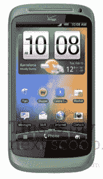

# “女生用安卓？”HTC Bliss 来到威瑞森 TechCrunch

> 原文：<https://web.archive.org/web/http://techcrunch.com/2011/08/10/android-for-girls-htc-bliss-coming-to-verizon/>

威瑞森正准备推出一款面向女性的安卓手机，名为 HTC Bliss。该设备有一种“漂亮”的海泡石般的绿色，并将包括一个悬空的护身符，当你有未接来电或新信息时，它会发光。

哦，这是最棒的部分——据传闻，这款手机还配备了特殊的女性友好应用程序，如卡路里计数器和购物应用程序。

*呻吟*。

如果你不能告诉，我不是一个针对女性的手机爱好者。

**但是首先，新闻:**

 手机存在的事实并不是新信息。该设备的设计早在 5 月份就被泄露了，当时[这是我的下一部……](https://web.archive.org/web/20230205044217/http://thisismynext.com/2011/05/04/htc-bliss-verizon-android-phone-for-women/)援引消息人士的话说，这款手机将是一款中端设备，有点像 HTC Desire S 和 Desire Z 的混合体。

今天，我们有更多关于可能规格的信息，这确实证实了这款手机不是发电站。然而，这些声明的来源是匿名泄露，通过 [YouHTC](https://web.archive.org/web/20230205044217/http://www.youhtc.ru/2011/08/htc-bliss-nemnogo-podrobnostej/) 和 [HTC Inside](https://web.archive.org/web/20230205044217/http://www.htcinside.de/neue-informationen-zum-htc-bliss/) 报告。所以请记住这一点。

据报道，Bliss 将配备高通 MSM7x30 处理器，可能是 MSM7630(由于威瑞森的 CDMA 网络)，运行频率为 800 Mhz。这使它与其他 HTC 手机如 Desire Z 和 T-Mobile G2 保持一致。Bliss 的 GPU 将是 Adreno 205，它将运行 Android 2.3.4(姜饼)。

唯一突出的功能是最新版本的 HTC Sense 3.5，如果你可以这样称呼它的话。HTC Sense 是一个覆盖层，试图为 Android 提供一个更具吸引力和用户友好的界面，也是 HTC 的一个关键卖点，或者说关键缺点，这取决于你的个人看法。我发现速度慢是有道理的，通常会用 LauncherPro 或 GO Launcher 之类的替代软件来代替。你可能不同意。

根据 IGN 在这里发布的泄露的威瑞森路线图[，极乐将于下个月到来。](https://web.archive.org/web/20230205044217/http://gear.ign.com/articles/118/1185976p1.html)

**对女士们有吸引力？**

关于“女孩”安卓手机的想法，让我感到困扰的是，不知何故，在智能手机方面，我的性别与他们的男性同行有着不同的需求和期望。彩色设备和手机饰品不一定是“女性”的东西——它们可能会吸引年轻一代，或者那些关心自己外表的人。但这并不意味着*只有*女性。

我反对的是威瑞森从第一天起就选择参与的性别偏见营销策略，从机器人活动开始，以机器人为特色，[评论](https://web.archive.org/web/20230205044217/http://venturebeat.com/2009/12/04/new-droid-ad-mocks-pretty-girls-iphone/)关于“用胶带绑在飞毛腿导弹上的赛马”如此刻板的男性形象。

为什么 Android 对男性和女性有不同的定位？据我所知，女性对自己设备的要求和男性一样:功能、性能、优秀的硬件、优秀的软件，以及许许多多的应用程序。

不仅仅是节食者。

*图片来源:HTC Bliss 的模型[这是我的下一个](https://web.archive.org/web/20230205044217/http://thisismynext.com/2011/05/04/htc-bliss-verizon-android-phone-for-women/)*