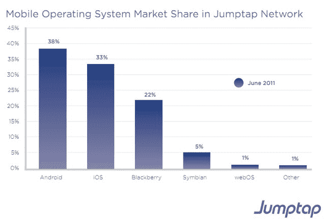
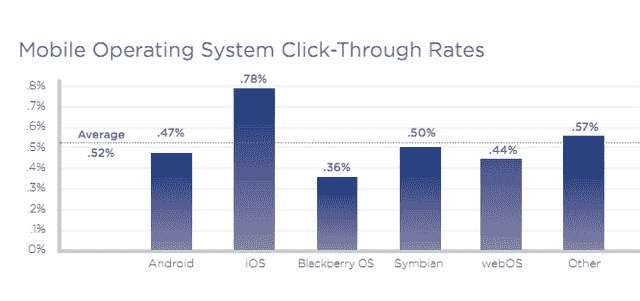

# 你是生活在安卓状态还是 iPhone 状态？TechCrunch

> 原文：<https://web.archive.org/web/http://techcrunch.com/2011/08/05/android-iphone-state/>

# 你是生活在安卓状态还是 iPhone 状态？

现在很明显，Android 正在赢得美国智能手机的整体移动市场份额之战。但是战争是如何按州划分的呢？移动广告网络 [Jumptap](https://web.archive.org/web/20230204230537/http://www.jumptap.com/) 今天早上发布了一份[的报告](https://web.archive.org/web/20230204230537/http://www.jumptap.com/STAT)(嵌入下方)带有一张地图，显示在其覆盖 8300 万移动用户的网络中，哪些州的 Android 活动多于 iOS 活动。

根据 Jumptap 的说法，佛罗里达、德克萨斯、加利福尼亚和俄勒冈等南部和西部各州的 Android 指数过高。而中西部和新英格兰各州则由苹果设备主导。奇怪的是，纽约州两者都不是。这是黑莓仅存的几个据点之一。(不好意思，那只是尴尬，而且我住在纽约)。

截至 6 月份，Android 的整体市场份额为 38%，而苹果 iOS 的份额为 33%。相比之下，comScore 昨天刚刚发布了美国移动用户的[市场份额估计【puts Android 为 40 %,苹果为 26.6%。Android 的数字很接近，iOS 份额的巨大差异可能是因为 Jumptap 计算了 iPod touches，而 comScore 没有。(Jumptap 关注的是移动应用中的广告投放，comScore 只关注智能手机)。](https://web.archive.org/web/20230204230537/https://techcrunch.com/2011/08/04/comscore-android-40-percent/)

显而易见的是，美国的安卓手机比 iPhones 多。但多不一定好。如果你深入到 JumpTap 的点击率，iOS 对 adevrtisers 的表现仍然更好。iPhones、ipad 和 iPod Touches 上的移动广告的点击时间为 0.78%，而 Android 为 0.47%(黑莓为 0.36%)。请记住，这些数据只是基于 Jumptap 自己网络上的活动，可能会有这样或那样的偏差，但听起来差不多是正确的。可悲的是，0.78%的点击率是移动广告行业目前能做到的最好水平。暂时忘掉安卓对苹果。这些数据表明，移动广告正在全面失败。

[scribd id = 61680816 key = key-5 kde 8 zmp 9 BCB 9t 08 he mode = list]