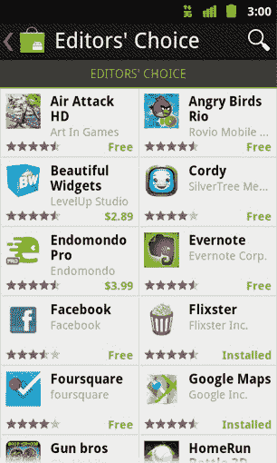

# Android Market 进行了彻底改革:视频、书籍和更多发现选项 TechCrunch

> 原文：<https://web.archive.org/web/http://techcrunch.com/2011/07/12/android-market-overhaul-starts-rolling-out-videos-books-and-more-discovery-options/>

# Android Market 得到了一次彻底的革新:视频、书籍和更多的发现选项

对 Android 用户来说，这是一个好消息:从今天开始，谷歌将向所有运行 Android 2.2 或更高版本的手机(占 Android 用户的绝大多数)推出新版 Android Market。它带来了新的用户界面、性能改进和各种旨在帮助应用程序发现的功能，包括像“票房冠军”和最近热门应用程序这样的新列表(谷歌[在谷歌 I/O 上展示了这些新增功能，但直到现在才在移动客户端推出)。](https://web.archive.org/web/20230203035204/https://techcrunch.com/2011/05/11/android-market-getting-a-major-refresh-better-discovery-a-redesign-and-99-new-countries/)

哦，每个美国人都将获得期待已久的视频应用程序，该应用程序在谷歌 I/O 上展示过，但迄今为止只在少数设备上可用。这个新市场还将图书、视频和应用程序的销售合并成一个单一的市场(在此之前，你需要使用专门的图书应用程序来购买图书)。

我还没有尝试新的应用程序，所以我的印象是基于你在这里看到的视频。这个设计看起来像是从 Android Market 的蜂巢版本中获取了很多线索——这是我非常不喜欢的。但也有一些不错的东西，比如可以水平滑动来在屏幕之间跳转。我会保留我的判断，直到我得到一些时间与应用程序。

新版 Market 将在一个相当长的时间内推出——可能需要长达一个月的时间才能到达你的手机上，尽管听起来美国用户可能会更快看到它。

【YouTube = http://www . YouTube . com/watch？
