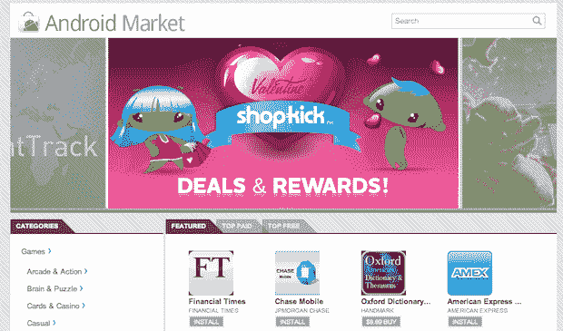
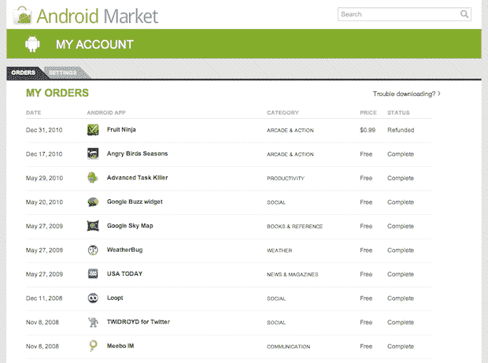
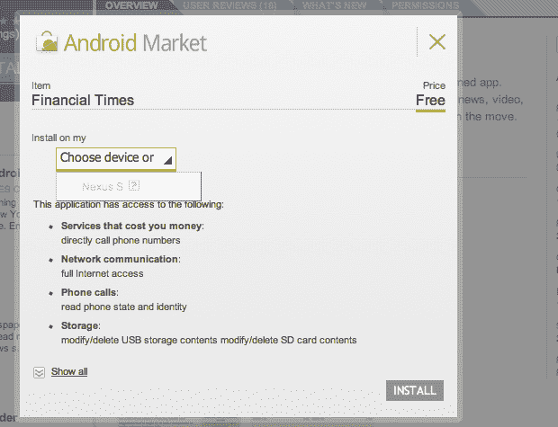

# 谷歌推出安卓市场网上商店。已经直播了！TechCrunch

> 原文：<https://web.archive.org/web/http://techcrunch.com/2011/02/02/android-market-webstore/>

# 谷歌推出安卓市场网上商店。已经直播了！

今天，在他们的山景城总部，谷歌在 T2 举办了一场活动来展示最新版本的 Android 操作系统蜂巢。在操作系统本身的一些演示之后，Android 工程总监 Chris Yerga 上台展示了一个新的大功能:Android Market 网络商店。是的，市场刚刚上线。最后。而且已经直播了。[找到这里](https://web.archive.org/web/20230202235332/http://market.android.com/)。

Yerga 指出，在 know 之前，查找和安装应用程序的唯一途径是通过手机上的市场。但是现在用户可以直接进入他们的浏览器。它比 iTunes 原生应用程序更无缝，因为当你选择一个应用程序时，它可以被设置为自动下载到你的 Android 设备上。"*没有电线，无法与电脑同步。不要胡说八道。耶加说:“一切都是相互关联的。*

还有一个社交元素，用户可以通过电子邮件互相发送市场链接。你可以很容易地在 Twitter 上分享应用程序的链接。

新版 Market 的网页版还提供了更好的应用过滤功能。还有一个不错的设备和应用程序管理器。

**更新**:正如许多人在评论和推特上指出的，虽然市场本身是实时的，但你不能登录。我也试过了——运气不好。所以，它更像是活的。

更新 2 :现在市场似乎完全活跃起来了。你可以登录并查看你的应用下载，以及管理你的帐户。

**相关**:

[蜂巢是沿着苹果之弓打响的第一枪](https://web.archive.org/web/20230202235332/http://www.crunchgear.com/2011/02/02/honeycomb-is-the-first-shot-fired-along-apples-bow/)

[下面是 Pulse 在 Android 蜂巢上的样子](https://web.archive.org/web/20230202235332/https://techcrunch.com/2011/02/02/pulse-android-honeycomb/)

[应用内购买终于来安卓了；迪士尼带来 Tap Tap 报复占便宜](https://web.archive.org/web/20230202235332/https://techcrunch.com/2011/02/02/android-in-app/)

[安卓蜂巢直播正在进行](https://web.archive.org/web/20230202235332/http://www.crunchgear.com/2011/02/02/android-honeycomb-livestream-is-happening-now/)

[谷歌 Android 蜂巢活动现场直播](https://web.archive.org/web/20230202235332/https://techcrunch.com/2011/02/02/live-from-googles-android-honeycomb-event/)