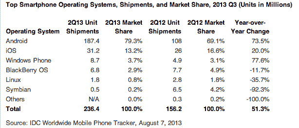

# 据 IDC | TechCrunch 报道，随着 iOS 和黑莓的份额下滑，Android 在全球智能手机出货量中的市场份额接近 80%

> 原文：<https://web.archive.org/web/https://techcrunch.com/2013/08/07/android-nears-80-market-share-in-global-smartphone-shipments-as-ios-and-blackberry-share-slides-per-idc/>

# 根据 IDC 的数据，随着 iOS 和黑莓的份额下滑，Android 在全球智能手机出货量中的市场份额接近 80%

根据研究公司 IDC 的最新数据，从 2012 年第二季度到 2013 年 Q2，安卓智能手机的出货量增长了 73.5%。最近一个季度出货了 1.874 亿部 Android 手机，占该季度出货的所有智能手机的 79.3%。紧随其后的智能手机平台是 iOS，出货量仅为 3120 万部，占整体份额的 13.2%。

苹果的移动操作系统仍然击败了紧随其后的竞争对手 Windows Phone(设备出货量仍同比增长 20%)，Windows Phone 的出货量为 870 万部，占全球市场份额的 3.7%。但 Windows Phone 也以大致相同的速度增长，整体出货量同比增长 77.6%。可以预见的是，黑莓对主要参与者的伤害最大，整体份额从 4.9%降至 2.9%，设备出货量比去年同期减少 11.7%。

IDC 表示，三星 Galaxy S4 是一个强大的驱动力，但 LG、华为、联想和中兴也有非常好的季度出货量达到两位数。然而，Android 平台代表着几乎所有在这个沙盒中游戏的人的胜利，因为即使是小制造商也看到了以廉价智能手机瞄准发展中国家小型利基市场的成功。

 Windows Phone 几乎所有的增长都要归功于诺基亚，该地区占本季度基于微软移动平台的智能手机出货量的 81.6%。从 IDC 跟踪市场份额的历史来看，黑莓创下了历史新低。IDC 表示，不要因为 BB10 的进展而将他们排除在外，但这不是什么秘密，加拿大智能手机先驱的事情看起来很严峻。

就前两大玩家而言，这里的重要信息非常明显:Android 之所以火是因为新兴市场的选择、可用性和价格点，这些市场专注于在有限的预算下从功能手机转向智能手机。这意味着观察苹果今年秋天推出的低成本 iPhone 设备更加重要，据传这款设备将基于 iPhone 5，并配有塑料后盖，生产成本更低。