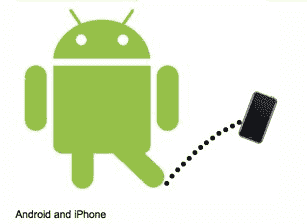

# comScore: Android 在美国用户总数超过 iPhone TechCrunch

> 原文：<https://web.archive.org/web/https://techcrunch.com/2011/01/06/android-passes-iphone/>

# comScore: Android 在美国用户总数超过 iPhone

最新的[移动用户估计](https://web.archive.org/web/20230203000310/http://www.comscore.com/Press_Events/Press_Releases/2011/1/comScore_Reports_November_2010_U.S._Mobile_Subscriber_Market_Share)来自 comScore，2010 年 11 月，Android 在美国智能手机用户总数上首次超过 iPhone。康姆斯克估计美国有 6150 万智能手机用户，其中 26%拥有安卓手机，25%拥有 iPhone。在前一个月——2010 年 10 月— [,苹果仍然以 24.6%对 23.5%的市场份额险胜谷歌](https://web.archive.org/web/20230203000310/https://techcrunch.com/2010/12/03/comscore-android-approaching-ios-in-overall-u-s-smartphone-subscribers/)。

这些数字是针对所有现有智能手机用户的，这不同于新手机的销售——在新手机销售方面，安卓也领先于 iPhone。

黑莓仍然拥有美国最大的智能手机用户群，占据 33%的市场份额。但这一份额在过去三个月中下降了 4%，而安卓的份额增长了 6%。苹果的份额上升了不到 1%，这表明通过其目前的合作伙伴 AT&T，iPhone 在美国已经饱和。一旦[威瑞森开始销售 iPhone，](https://web.archive.org/web/20230203000310/https://techcrunch.com/2010/12/27/apple-verizon/)问题仍然是这是否会有助于提高苹果的整体份额，或者只是蚕食 AT & T 的销售。

| **顶级智能手机平台**
**3 个月平均值。截止 2010 年 11 月与 3 个月平均值的对比截止 2010 年 8 月**
**美国 13 岁以上智能手机用户总数**
**来源:comScore MobiLens** |
|  | **智能手机用户份额(%)** |
| 8 月 10 日 | **11 月至 10 日** | **点变化** |
| *智能手机用户总数* | *100.0%* | *100.0%* | *不适用* |
| 边 | 37.6% | 33.5% | -4.1 |
| 谷歌 | 19.6% | 26.0% | 6.4 |
| 苹果 | 24.2% | 25.0% | 0.8 |
| 微软 | 10.8% | 9.0% | -1.8 |
| 手掌 | 4.6% | 3.9% | -0.7 |

*图片来源:Flickr/ [奎因·东布罗夫斯基](https://web.archive.org/web/20230203000310/http://www.flickr.com/photos/quinnanya/4754719107/)*