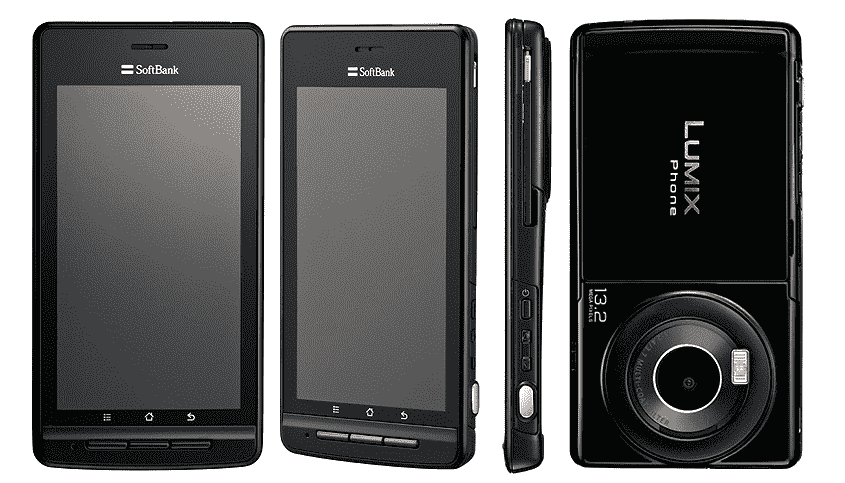
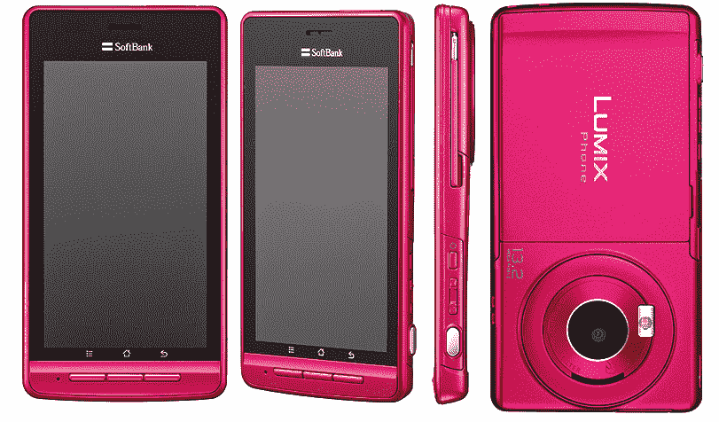

# 安卓手机+ Lumix 摄像头=松下的 Lumix 手机 101P 日本版 TechCrunch

> 原文：<https://web.archive.org/web/http://techcrunch.com/2011/09/29/android-phone-lumix-camera-panasonics-lumix-phone-101p-for-japan/>

# 安卓手机+ Lumix 相机=松下的 Lumix 手机 101P

夏普的 AQUOS PHONE 102SH 并不是今天唯一登陆日本市场的酷安卓手机。当地运营商[软银](https://web.archive.org/web/20230204115400/https://techcrunch.com/tag/softbank)也将在 11 月开始分发所谓的[LUMIX Phone 101 p](https://web.archive.org/web/20230204115400/http://www.softbankmobile.co.jp/ja/news/press/2011/20110929_07-page_03/)【JP】作为其秋冬系列新手机的一部分。

这款由松下制造的安卓设备被设计成手机和数码相机的混合体(看起来确实如此)。

以下是主要规格列表:

*   安卓 2.3
*   分辨率为 960×540 的 4 英寸 QHD 液晶显示屏
*   1320 万像素 CMOS Lumix 传感器，带“移动 [Venus 引擎](https://web.archive.org/web/20230204115400/http://en.wikipedia.org/wiki/Venus_Engine)”
*   防水机身(IPX5/7)
*   TI OMAP4430 双核 CPU (1GHz)
*   兼容软银的“Ultra Speed”高速数据通信服务(max。21Mbps)
*   microSDHC 卡插槽
*   IEEE802.11b/g/n Wifi
*   蓝牙 2.1+EDR
*   红外连接
*   电子钱包功能
*   数字电视调谐器
*   W-CDMA、GSM
*   尺寸:64×123×9.8 毫米重量:128 克

还没有来自松下的关于定价或可能的国际销售计划的消息。