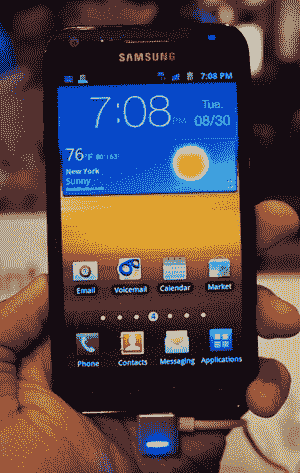
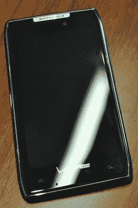
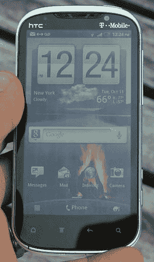
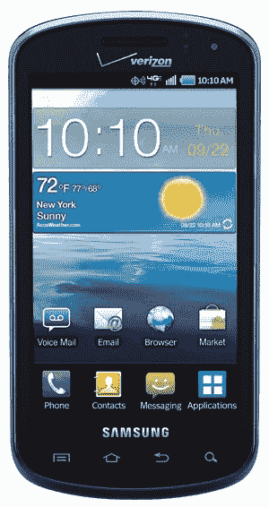

# Android 智能手机综述:十月版 

> 原文：<https://web.archive.org/web/http://techcrunch.com/2011/10/25/android-smartphone-round-up-october-edition/>

即使[冰淇淋三明治即将上市](https://web.archive.org/web/20230203060956/https://techcrunch.com/2011/10/18/a-quick-ice-cream-sandwich-feature-rundown/)，Android 姜饼设备仍然一如既往地火爆。也就是说，市场上有太多的 Android 手机，无法一一解析，但这就是我们在这里的原因。我们已经浏览了所有最新的 Android 智能手机，给你一些我们的想法。这些不是完整的评论，而是让你轻松比较我们认为本月发布的功能最全的 Android 手机的一种方式。希望你的购物研究不再那么深入。

在这个辉煌而诡异的 10 月，我们将推出以下手机:三星 Galaxy S II(美国电话电报公司、T-Mobile、Sprint)、摩托罗拉 Droid RAZR(威瑞森，以及[可能在& T](https://web.archive.org/web/20230203060956/https://techcrunch.com/2011/10/24/motorolas-droid-razr-or-something-like-it-likely-headed-for-att-soon/) )、HTC Amaze 4G (T-Mobile)和三星平流层(威瑞森)。虽然这些手机都运行 Android 2.3 姜饼，但它们都有不同的东西，以及不同的价格标签。

让我们仔细看看，好吗？

三星 Galaxy S II 是世界上最畅销的手机之一，这是有充分理由的。规格和设计都非常完美，但 S II 并不全是彩虹和阳光。由于它比我们的其他选择更早推出，它可能比其他选择更“过时”(至少在智能手机领域)。

 **特性:**

*   4.5 英寸 480×800 Super AMOLED Plus 显示屏(美国电话电报公司为 4.3 英寸)
*   1.2GHz 双核处理器
*   800 万像素后置摄像头(1080p 视频捕捉)，200 万像素前置摄像头
*   TouchWiz
*   $199.99

**优点:**

*   运营商灵活性:Sprint、T-Mobile 和美国电话电报公司都在使用 S II
*   综合考虑价格和规格，这是我们选项中你能找到的最好的交易
*   我们为所有网飞/Hulu+粉丝准备的最大屏幕

**缺点:**

*   每个运营商都有不同的型号——有些比其他的好
*   Galaxy Nexus 和 Droid RAZR 已经窃取了它的荣耀
*   脆弱的电池盖——混乱的手机用户，小心了

如果你的合同快到期了，这里有一些关于三种运营商变体的事情需要考虑。

Sprint 的一大优势是数据无限。它的模型基本上保持了与全球版本相同的设计，除了四个电容按钮，这里曾经有一个光学触控板。另一方面，T-Mobile 决定在设计层面上与众不同，这是我通常不赞成的。在这种情况下，T-Mo 将背面和边角都变圆了，这(在我看来)让手机看起来不那么“Galaxy S II”了。美国电话电报公司的 S II 屏幕更小，像素密度更高，与众不同。

* * *

## 摩托罗拉 Droid RAZR

RAZR 是我们 10 月份产品系列中的最新产品，也是摩托罗拉称的世界上最薄的智能手机。这种规格肯定会让你的内啡肽激增，但你应该知道威瑞森和摩托罗拉已经给这种形式的快乐贴上了相当高的价格标签。

 **特性:**

*   4.3 英寸 540×960 qHD Super AMOLED 显示屏
*   1.2GHz 双核处理器
*   800 万像素后置摄像头(1080p 视频捕捉)，130 万像素前置摄像头
*   7.1 毫米腰线
*   威瑞森的 4G LTE 支持
*   $299.99

**优点:**

*   耐用性:不锈钢核心，凯夫拉纤维外壳，防溅技术
*   LTE 速度
*   RAZR 已经被许诺冰淇淋三明治

**缺点:**

*   如今，299 美元一部智能手机(甚至是这款智能手机)已经很贵了
*   它采用了经典的 Droid bump，这在如此薄的手机上并不那么热
*   威瑞森扼杀了 Moto 的 bootloader 解锁方案

总的来说，Droid RAZR 有很多优点。规格说明了一切，但除此之外，RAZR 还有一种感觉，即坚固又超轻，这似乎是一个很难达到的平衡。唯一真正吸引人的是价格标签，尤其是在一个“世界上最薄的手机”或“世界上最耐用的手机”的头衔在大约一个月内被新的东西夺走的世界里。

* * *

Amaze 4G 因其糟糕的摄像头而闻名，但就外观而言，它坐在 Droid RAZR 或 Galaxy S II 旁边肯定会不安全。它非常重，重 6 盎司，有一个厚实的设计，只有白色的外壳才能放大它。大家都知道想看起来苗条就不要穿白色，对吧？不过，Amaze 4G 也有它的好处，它有一个敏捷的处理器和 T-Mobile 4G 网络的支持(理论速度为 42Mbps)。

 **特色:**

*   4.3 英寸 540×960 S-LCD 显示屏
*   1.5GHz 双核处理器
*   800 万像素后置摄像头(支持 1080p 视频拍摄)，200 万像素后置摄像头
*   T-Mobile 上的 4G (HSPA+)
*   $259.99

**优点:**

*   很棒的相机
*   我们产品系列中速度最快的处理器
*   Sense 3.0 UI 是目前 Android 皮肤中最有吸引力的

**缺点:**

*   笨重，笨重，笨重
*   几乎和上面的 RAZR 一样贵，但感觉不像
*   提取指纹和污垢，再次被白色外壳放大

归根结底，令人惊叹的 4G 真的应该只出现在 photogs 的口袋里。它基本上可以充当任何傻瓜相机的角色，但如果你正在寻找一部可以做所有事情的手机，Amaze 4G 可能不会令人惊讶。它实在是太重太贵了，以至于不能证明它是一款出色的全能手机，尤其是与我们 10 月份推出的其他选择中的全面功能集相比。

* * *

平流层是我们产品系列中最便宜的，也是唯一一款我们认为适合 10 月份精选的带物理键盘的智能手机。它的规格不一定能跟上上面的野兽，但对于文字迷、速度恶魔和吝啬鬼来说，这可能正是你要找的。

 **特色:**

*   4 英寸 480×800 Super AMOLED 显示屏
*   1GHz 单核处理器
*   500 万像素后置摄像头，130 万像素前置摄像头
*   威瑞森的 4G LTE 支持
*   五行滑动 QWERTY 键盘
*   $149.99

**优点:**

*   4G LTE 速度
*   宽敞的键盘
*   最便宜的手机在这个综述

**缺点:**

*   1GHz 处理器比竞争对手慢
*   TouchWiz 可能会进一步减慢速度
*   没有 1080p 录制

与每一款智能手机一样，三星同温层是为特定类型的消费者打造的。如果你在飞行中拍摄大量视频，大部分时间进行多任务处理，或者观看大量移动视频，那么平流层可能不适合你。另一方面，如果你不能忍受缓慢的连接和心脏物理键盘，这款中档三星产品正是你所需要的。

* * *

好了，这就是我们 10 月份的 Android 综述，但请确保为下个月的宝藏保持警惕。