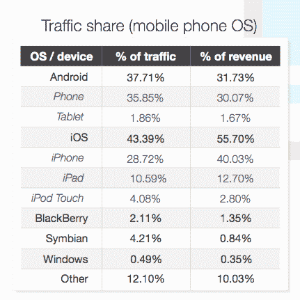

# 第四季度，Android 智能手机在 Opera 的广告印象中首次超过 iPhone，iPhone 在收入方面仍然领先 TechCrunch

> 原文：<https://web.archive.org/web/https://techcrunch.com/2014/01/21/android-smartphones-passed-iphone-for-first-time-in-operas-ad-impressions-in-q4-iphone-still-leads-in-revenue/>

# 在第四季度 Opera 的广告印象中，Android 智能手机首次超过 iPhone，iPhone 仍在收入方面领先

正如我们今天早些时候听到的，移动广告市场在 2014 年将价值【2014 亿美元，看起来 Android 越来越接近统治这个市场。在第四季度，基于安卓系统的智能手机在 [Opera Mediaworks](https://web.archive.org/web/20221206184414/http://operamediaworks.com/) 广告网络上的移动广告浏览量首次超过了 iPhone，份额为 36%，而 iPhone 为 28.7%。

Opera 的网络每月覆盖 600 亿次展示，4.25 亿用户和 14，000 个网站和应用程序，因此它是移动平台相互之间表现如何的晴雨表。

一方面，鉴于 Android 手机数量超过任何其他平台，最终击败 impressions 并不太令人惊讶。事实上，当你想一想，这是一个标志，表明 iPhone 设备的所有者使用了多少 iPhone 设备，他们已经设法在印象中领先了很长时间。

从收入和平板电脑的印象来看，这一优势依然存在。就印象而言，iOS 在所有印象中的比例也略高于 43%，相比之下，Android 设备的这一比例不到 38%。
在金钱方面，苹果平台在三个月内占据了智能手机和平板电脑近 56%的收入，相比之下，安卓为 32%。如果你单独列出手机，差距缩小到 40%的 iPhone 和 30%的 Android 手机。

这意味着 iOS 仍然是更具盈利性的平台——用户使用它的频率更高，时间更长。但是，正如手机上的印象平衡已经改变一样，现在的问题是，Android 是否或何时会在收入方面与 iOS 平起平坐。拥有一个更小、更难赚钱的平台的意义不仅仅是告诉媒体买家在哪里投放广告:它还向开发者和更广泛的生态系统传达了一个信息，告诉他们在制作新的应用程序、硬件等时应该优先考虑什么。

鉴于过去几年设备购买和出货量的表现，其他移动平台明显落后也就不足为奇了，黑莓、Windows Phone 和 Symbian 的流量和收入都低于 5%。也许更令人惊讶的是，他们的百分比实际上很小，甚至与出货量成比例，这意味着微软和黑莓可能有双重担忧:让人们购买他们的设备，T2 和创造粘性服务的 T3。

收入和印象之间的差距一直延续到移动网络上消费的内容种类。

虽然社交网站是目前最大的流量驱动因素，占所有印象的 34.25%，但就收入而言，音乐、视频和媒体被证明更具货币化，占所有收入的 20.6%。

这表明，在优质内容与用户生成内容的持续较量中，优质内容将继续在获得更高收入方面胜出。(这也指出了为什么像脸书和推特这样的网站想要找到消费这类内容的方法。)

图片: [Flickr](https://web.archive.org/web/20221206184414/http://www.flickr.com/photos/newtown_grafitti/4825543379/sizes/l/)