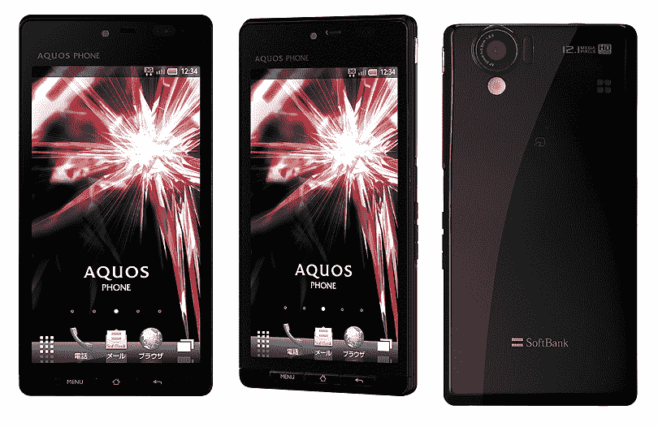
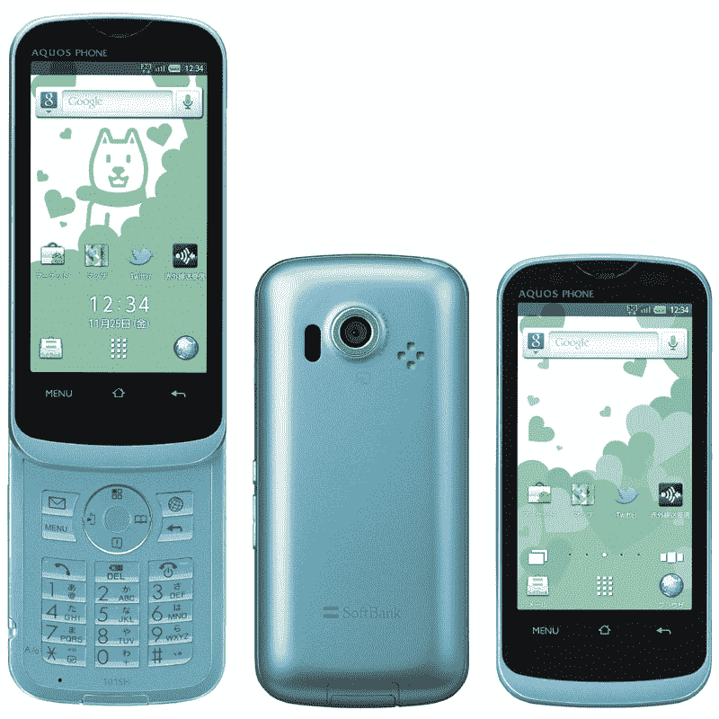
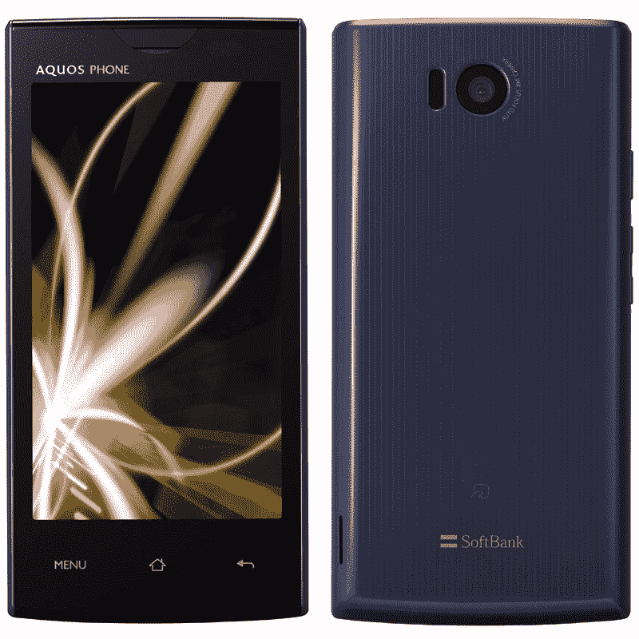
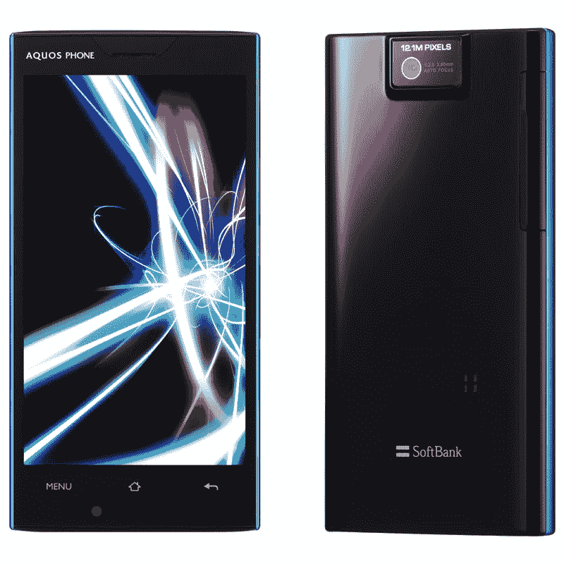
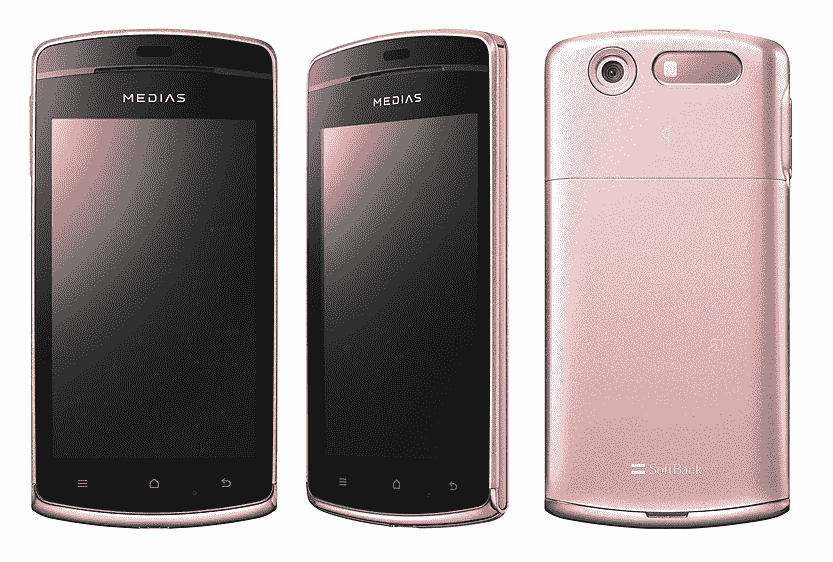
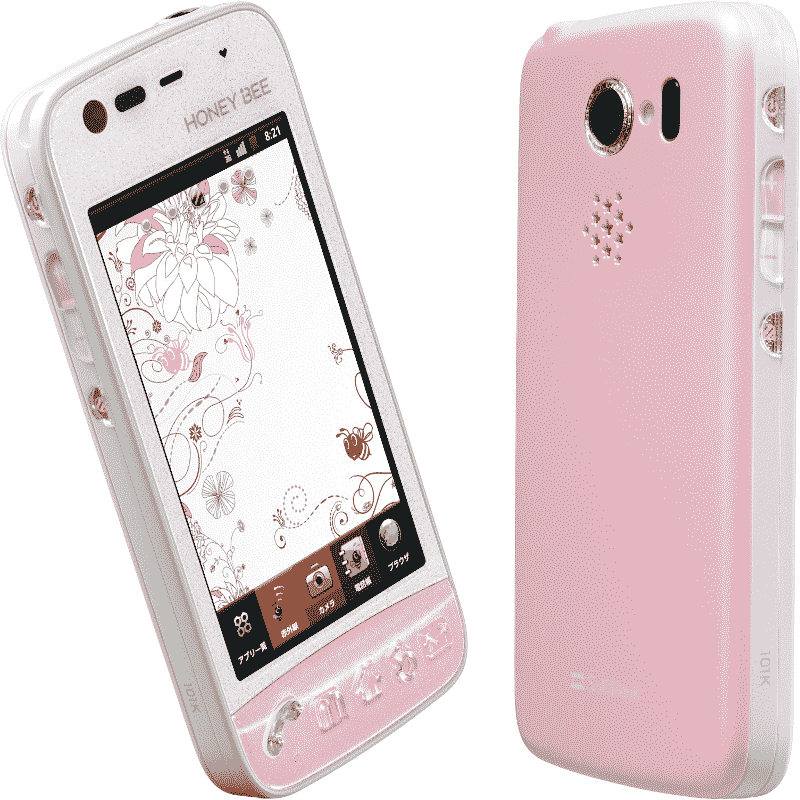
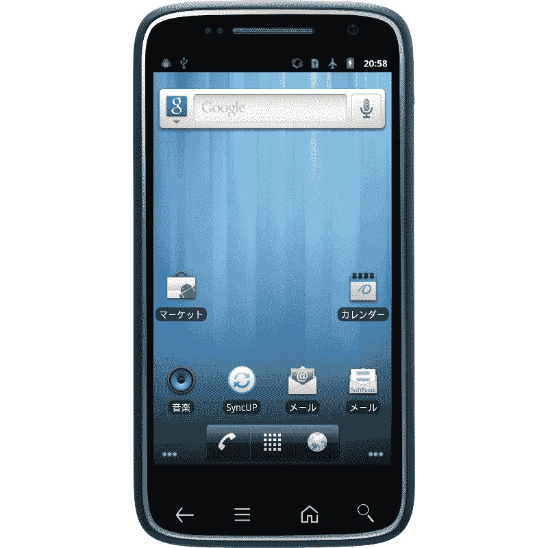
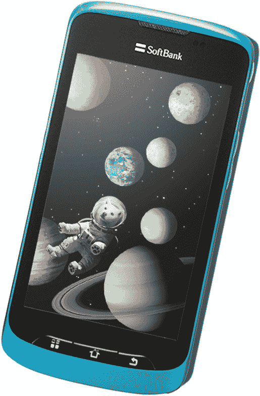
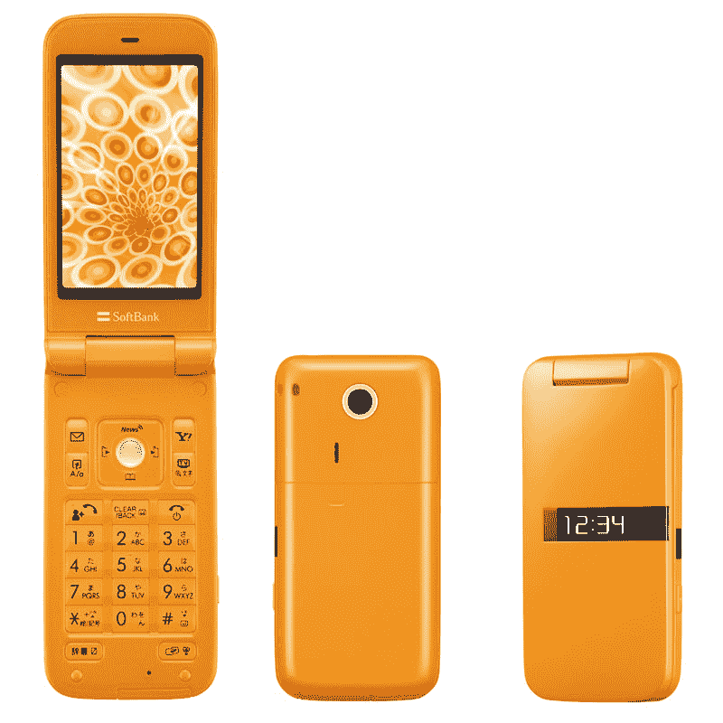

# 面向日本的 9 款安卓手机:软银整个秋冬系列 TechCrunch

> 原文：<https://web.archive.org/web/http://techcrunch.com/2011/09/29/android-softbank-fall/>

我们已经向你展示了日本运营商[软银](https://web.archive.org/web/20230203061102/https://techcrunch.com/tag/softbank)今天宣布在本土市场推出的三款最酷的智能手机，松下的 [LUMIX Phone 101P，](https://web.archive.org/web/20230203061102/https://techcrunch.com/2011/09/29/android-phone-lumix-camera-panasonics-lumix-phone-101p-for-japan/)[夏普的 AQUOS PHONE 102SH](https://web.archive.org/web/20230203061102/https://techcrunch.com/2011/09/29/sharps-new-android-phone-waterproof-body-4-5-inch-3d-qhd-display-12mp-cam-dlna/) ，以及[戴尔 STREAK PRO 101 DL](https://web.archive.org/web/20230203061102/https://techcrunch.com/2011/09/29/dell-streak-pro-101dl-an-android-phone-with-super-amoled-display-to-hit-japan-2012/) 。但软银今天实际上一共推出了 9 款新的 Android 机型(外加一款功能手机)。

以下是该航空公司在日本市场的整个秋冬系列:

[夏普 AQUOS PHONE 102SH](https://web.archive.org/web/20230203061102/https://techcrunch.com/2011/09/29/sharps-new-android-phone-waterproof-body-4-5-inch-3d-qhd-display-12mp-cam-dlna/)

[松下 LUMIX 手机 101P](https://web.archive.org/web/20230203061102/https://techcrunch.com/2011/09/29/android-phone-lumix-camera-panasonics-lumix-phone-101p-for-japan/)

夏普 AQUOS PHONE THE HYBRID 101 sh
(Android 2.3 in 防水功能手机机身，3.4 英寸触摸显示屏，8MP CMOS 摄像头，蓝牙 3.0，Wi-Fi，红外，数字电视调谐器，电子钱包功能，microSDHC 插槽)

夏普 AQUOS PHONE 103SH
(安卓 2.3m，4 英寸显示屏，540×960 分辨率，8MP CMOS 摄像头，防水机身，红外，数字电视调谐器，电子钱包功能，支持 DLNA)

夏普 AQUOS PHONE 104SH
(安卓冰淇淋三明治，4 英寸显示屏，720×1280 分辨率，12.1MP 摄像头，防水机身，红外，数字电视调谐器，电子钱包功能，1.5GHz OMAP4460 双核 CPU)

NEC MEDIAS CH 101N
(Android 2.3，4 英寸有机发光二极管，480×800 分辨率，专为女性用户设计，防水机身，8MP CMOS 摄像头，Wi-Fi，红外，数字电视调谐器，电子钱包功能，1.4GHz MSM8255 骁龙 CPU)

京瓷小蜜蜂 101K
(Android 2.3，3.5 英寸屏幕，480×800 分辨率，专为女性用户设计，防水机身，5MP CMOS 摄像头，Wi-Fi，红外，数字电视调谐器，电子钱包功能，1.2GHz MP5225 CPU)

[戴尔 STREAK PRO 101 dl](https://web.archive.org/web/20230203061102/https://techcrunch.com/2011/09/29/dell-streak-pro-101dl-an-android-phone-with-super-amoled-display-to-hit-japan-2012/)
(Android 2.3，4.3 英寸 AMOLED，540×960 QHD 分辨率，8MP CMOS 摄像头，1.3MP 副摄像头，Wi-Fi，1.5GHz 双核 MSM8260 CPU)

中兴 STAR7 009Z
(Android 2.3，3.8 英寸屏幕，480×800 分辨率，防水机身，5MP CMOS 摄像头，Wi-Fi，数字电视调谐器)

PANTONE 4 105SH
(功能手机，分辨率为 400×240 的 2.9 英寸 LCD，0.7 英寸有机发光二极管副显示屏，320 万像素 CMOS 摄像头，microSDHC 卡插槽)

