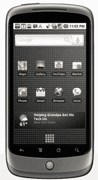

# Android 团队“高度关注”下一版本的用户体验 

> 原文：<https://web.archive.org/web/https://techcrunch.com/2010/06/16/android-team-laser-focused-on-the-user-experience-for-next-release/>

# Android 团队“高度关注”下一版本的用户体验

自 2008 年第一款安卓设备上市以来，谷歌的安卓团队一直在以[疯狂的步伐](https://web.archive.org/web/20221208005459/https://beta.techcrunch.com/2010/06/01/android-chief-andy-rubin-updates-will-eventually-come-once-a-year/)推进新版操作系统。在过去的几年中，已经添加了许多功能。但是用户体验并没有太大的变化。

这一切都将在下一个版本中改变，我们已经从多个接近谷歌的消息来源那里听说了。

我们的消息来源说，这个团队或多或少已经有了他们想要的核心特性，尽管更多的调整肯定会到来。但谷歌希望结束手机制造商和运营商在谷歌之上添加自己的 UI 层的愿望——比如 Sense、Motoblur、Ninjablur 等。

大多数时候，它们的外壳并不都那么好(见 HTC EVO)，而且它们往往会降低设备的速度。

谷歌正在为即将发布的姜饼版本将大部分精力集中在用户体验上，以应对这一点。他们想让 Android 体验更接近 iPhone。

第三方不太可能完全抵制住诱惑，不去干涉区分他们的产品，并获得对用户的更多控制。但是谷歌的目标是让这些“皮肤”尽可能的没有意义。

这是一个很大的目标，特别是因为 Android 是一个灵活的操作系统，旨在处理各种硬件选项。如果你不锁定硬件，就很难让用户界面变得完美。这就是为什么苹果的 MAC 电脑，锁定了硬件，总是比非常灵活的 Windows 操作系统有更好的体验。