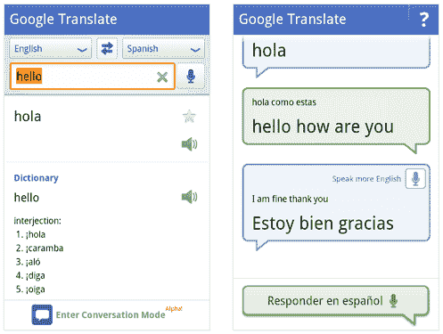

# 难以置信！谷歌将你的安卓手机变成即时对话解释器 

> 原文：<https://web.archive.org/web/http://techcrunch.com/2011/01/12/android-translations/>

# 难以置信！谷歌把你的安卓手机变成一个即时对话解释器

谈到翻译，你过去要么需要一名翻译，要么需要一本书来浏览另一种语言。这要么成本高，要么麻烦。然后互联网出现了，让事情变得简单多了。除了你必须被拴在你的电脑上翻译一些东西。一年前，谷歌发布了 Android 版翻译应用，让事情变得更加简单。但和他们今天发布的相比，这根本不算什么。

为庆祝一周年，最新版本的谷歌安卓翻译进行了一些更新。其中大部分是针对用户界面的。但是他们也在 alpha 模式下预览了一个新功能。而且很牛逼:对话模式。

本质上，这可以让你用一种语言对着手机说话，应用程序会大声读出，并翻译成你与之通话的人的语言。然后那个人可以回应，它会把它翻译回你的语言。是的，太神奇了。

谷歌实际上在去年九月柏林的一次会议上在舞台上演示了这个。在那里，经过一些小的打嗝，一场英语到德语的对话很快就开始了。当时，他们指出，希望它能在几个月后提供给消费者。现在它在这里——有一些限制。

首先，谷歌很快注意到这是一个非常重要的 alpha 功能。换句话说，预计会有很多打嗝。他们指出，背景噪音、浓重的口音和快速的语速都会让应用出错。此外，它目前只适用于英语和西班牙语。但我不在乎——这仍然很神奇。你知道他们会很快改进的。

谷歌还指出，整个应用程序现在每天都有来自全球 150 多个国家的用户使用。目前，它支持 53 种语言的文本输入和 15 种语言的语音输入(尽管这与这种对话模式不同)。他们还表示，目前大部分使用来自美国以外，鉴于它的用途，这可能不应该太令人惊讶。

再说一次，这个功能目前只适用于 Android 的 alpha 版本。它应该很快就会出现在最新的谷歌翻译应用程序更新中。

