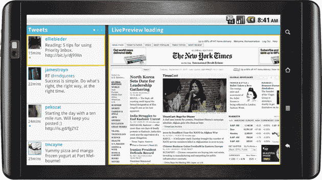

# 比如#NewTwitter？Twidroyd 将双窗格浏览引入 Android 

> 原文：<https://web.archive.org/web/https://techcrunch.com/2010/09/21/android-twitter-app/>

# 比如#NewTwitter？Twidroyd 为 Android 带来了双窗格浏览

如果你尝试过[的新 Twitter](https://web.archive.org/web/20221231012632/https://techcrunch.com/2010/09/14/new-twitter-tips/) ，你可能已经迷上了该网站光滑的双窗格浏览体验:点击一条推文，你将能够查看任何链接的 YouTube 视频、Flickr 照片和各种其他内容，而不必离开页面。今天，流行的 Android 客户端 Twidroyd 正在给手机带来类似的体验，从某种意义上说，它做得更好——该应用程序还允许你阅读链接的文章，而不必打开单独的浏览器窗口。

要进入这种实时预览模式，你可以将手机翻转过来——推文将填充左侧边栏，点击其中一个将在右侧窗格中打开相关链接或图像。显然，你不会有太多的空间来消费内容，但它在我的 Nexus One 上似乎足够好了(我想它在大屏幕手机上更好，比如 EVO)。这是一个非常巧妙的功能，但并不完美——我发现当我试图在推文之间切换时，性能受到了一些影响，所以导航不如我希望的那样流畅。尽管如此，这是一个好的开始。

Twidroyd 已经存在了一段时间，并在早期成为该平台最受欢迎的 Twitter 客户端之一。 [PostUp](https://web.archive.org/web/20221231012632/http://www.postup.com/) ，前身为 [Tweetup](https://web.archive.org/web/20221231012632/https://techcrunch.com/2010/04/11/twitter-idealab-tweetup-adsense-bill-gross/) 的公司，在 7 月收购了 Android 应用程序——该应用程序前身为 Twi *droid* ，但 PostUp 决定调整名称，以避免任何可能的法律问题。

该应用程序预装在五款手机上，包括一些三星型号，但许多安装在国外(PostUp 的史蒂夫·查迪马解释说，美国运营商有时会推翻与手机制造商达成的协议)。Chadima 说，到目前为止，该应用程序已经安装了大约 100 万次，其中 90%是免费的(其余的是 3.99 美元的专业版)。