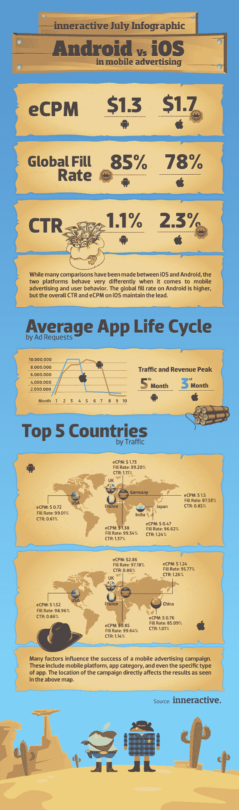

# Android vs. iOS:关于移动广告的激烈战斗[信息图] | TechCrunch

> 原文：<https://web.archive.org/web/http://techcrunch.com/2011/07/22/android-vs-ios-the-heated-battle-over-mobile-advertising-infographic/>

# Android vs. iOS:移动广告大战白热化[信息图]

据 BIA/凯尔西公司称，到 2015 年，美国移动广告收入预计将达到 28 亿美元，很明显，移动广告正在如火如荼地发展。这在很大程度上要归功于智能手机的日益普及，正如 comScore 在 5 月份的报告中显示的那样，其中包括一个引人注目的事实，即 7680 万美国人现在拥有一部智能手机。

当然，移动操作系统的大玩家，Android，iOS，RIM，Symbian 和 Windows，继续争夺市场份额，[Android 目前领先](https://web.archive.org/web/20230406045537/https://techcrunch.com/2011/05/06/comscore-android-continues-to-top-rim-and-apples-ios-for-u-s-smartphone-share/)。然而，最激烈的战斗发生在 Android 和 iOS 之间，感谢移动广告中介平台 [inneractive](https://web.archive.org/web/20230406045537/http://inner-active.com/) 的一张漂亮的信息图，我们可以一窥谁将赢得移动广告之战。

…看起来在这一点上很难宣布谁是赢家；两个平台都在不同的领域向前推进。该信息图比较了 iOS 和 Android，只是为了澄清一些术语:每千分之有效成本(eCPM)，衡量开发者在其应用程序中每展示 1000 次广告获得的收入，点击率(CTR)，即产生点击的广告展示的百分比，以及全球填充率，即广告填充的广告展示的百分比。

谈到效率，两者很接近，但 iOS 击败了 Android，就像它在 CTR 中一样——而 Android 在全球填充率和平均应用生命周期方面都占据了优势。

inneractive 最近还发布了一张关于诺基亚试图复出的信息图，你可以在这里看到。

但事不宜迟，Android vs. iOS:

