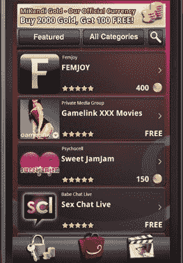
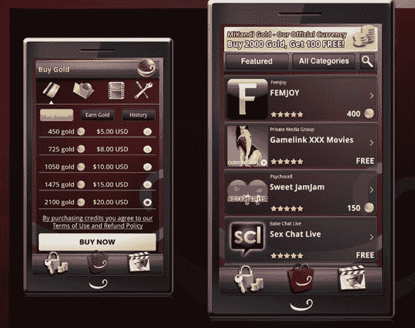

# Android 的色情应用商店 MiKandi 增加了对付费应用的支持 

> 原文：<https://web.archive.org/web/http://techcrunch.com/2010/11/23/androids-app-store-for-porn-mikandi-adds-support-for-paid-applications/>

# Android 的色情应用商店 MiKandi 增加了对付费应用的支持

是的，正如史蒂夫·乔布斯[喜欢指出](https://web.archive.org/web/20230202220046/https://techcrunch.com/2010/04/08/steve-jobs-on-why-the-iphone-doesnt-allow-unsigned-apps-they-dont-want-a-porn-store/)的那样，安卓至少有一个第三方应用商店，专门提供色情和其他‘成人’内容。不，它与谷歌没有任何关系——它是由一家名为[米坎迪](https://web.archive.org/web/20230202220046/http://www.mikandi.com/) (NSFW)的公司制造的。虽然它吸引了很多苹果忠实用户的窃笑和嘲笑，但它利用了生活中的一个事实:很多人看色情片。他们中的一些人愿意为此付出代价。

今天，MiKandi 发布了其成人应用商店的新版本。该公司表示，它已经从头开始重建，它还包括一个主要的新功能:支持付费应用程序。以前，MiKandi 应用程序是免费的；现在，开发商将能够通过广告以外的渠道创收。

MiKandi 不是单独销售应用程序(并为每个应用程序进行不同的交易)，而是销售一种虚拟货币，可用于购买高级应用程序。这意味着费用可以合并到信用卡账单上一个听起来无害的项目下，这也让 MiKandi 利用了一个类似于在脸书非常成功的“优惠”系统。目前还没有报价，但米坎迪说他们很快就会来。

是的，我肯定你们中的一些人在摇头，但是请记住，网络上有很多高级色情网站，它们的无处不在似乎表明它们在赚钱。结合 iPhone 的应用商店和 Android Market 驱动的冲动购买心态，不难想象这些应用程序中的一些可以做得很好。到目前为止，MiKandi 已经安装了 30 万个，这是不容小觑的。

如果你*渴望尝试一下新的 MiKandi，你需要从他们的[网站](https://web.archive.org/web/20230202220046/http://www.mikandi.com/)安装它(由于显而易见的原因，它不在 Android 市场)。你可以在下面的视频中了解到这家商店的样子，视频中不包含裸体，但仍可能被视为 NSFW。*

【YouTube = http://www . YouTube . com/watch？v = qk 7 KBC 8s 12 I & fs = 1 & HL = en _ US]
