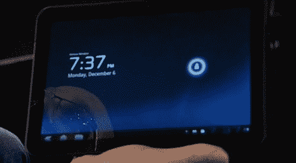
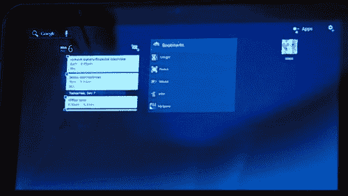
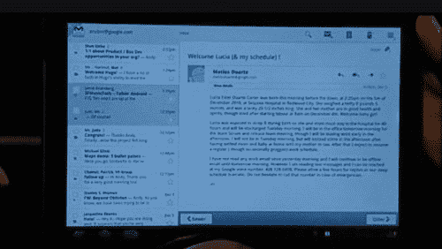

# 安迪·鲁宾在原型摩托罗拉平板电脑上展示 Android 3.0 

> 原文：<https://web.archive.org/web/http://techcrunch.com/2010/12/06/andy-rubin-shows-off-android-3-0-on-prototype-motorola-tablet-at-dive-into-mobile/>

# 安迪·鲁宾在原型摩托罗拉平板电脑上展示 Android 3.0

当我写这篇文章的时候，安迪·鲁宾正在 Dive Into Mobile 上演示 Android 3.0(又名 Honeycomb)。他演讲的其余部分我已经在别处写过了，但这实在太酷了，不能错过。该软件运行在一个原型 [MOTOPAD](https://web.archive.org/web/20230202223420/http://www.crunchgear.com/2010/11/15/motopad/) 上，它看起来真的很光滑，尽管它只是推出了一会儿，目前只有很少的图片。随着更多信息的披露，我将会更新这篇文章。

他展示的第一件东西是一个新的锁屏，然后是一个全新的“桌面”,角落里有小工具和按钮。不同于 Android 早期版本的用户界面美学。然后，他推出了新的基于 3D 和矢量的谷歌地图版本，应该会在几天后出现在你的手机上。

Honeycomb 将在“明年”推出，这是一个非常模糊的截止日期，但如果我没记错的话，我们听说过 Q2 的 Moto 平板电脑。他指出，另一个改进是将应用程序分成多个“片段”的能力，即邮件应用程序将有两个邮件和收件箱窗格，可以在手机上顺序查看，但在平板电脑上可以同时查看。有了一个新的应用程序网格，Gmail 似乎有了一个更好的版本，我敢打赌，money 很像他们明天在 Chrome 上展示的东西。

在我看来，平板电脑本身比我们不久前听到的 7 英寸要大，但如果不在现场，真的很难判断。从这些照片来看，我猜是 16 点 10 分 9 秒。我不知道安迪·鲁宾到底有多大，所以我的参照系有点偏。

我一直认为我们现有的 Android 版本不适合平板电脑。这看起来是另一个故事。我很期待蜂巢。

**更新** : [视频在此。](https://web.archive.org/web/20230202223420/http://www.crunchgear.com/2010/12/07/video-and-screenshots-of-the-motopad-with-android-3-0/)

[header image: Asa Mathat/ [万物 D](https://web.archive.org/web/20230202223420/http://mobilized.allthingsd.com/20101206/googles-andy-rubin-dives-into-android/)