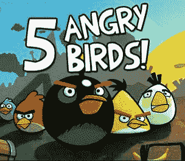

# 愤怒的小鸟即将登陆 PlayStation 3 和 PSP 

> 原文：<https://web.archive.org/web/http://techcrunch.com/2011/01/03/angry-birds-is-coming-to-playstation-3-and-psp/>

# 愤怒的小鸟即将登陆 PS3 和 PSP

 在过去的几个月里，我们在[愤怒的小鸟](https://web.archive.org/web/20230202232200/http://angrybirds.com/)上花了不少[帖子](https://web.archive.org/web/20230202232200/https://techcrunch.com/tag/angry-birds/)，现在这款超受欢迎的智能手机游戏[将通过本周的 PlayStation store 更新](https://web.archive.org/web/20230202232200/http://blog.us.playstation.com/2011/01/02/the-drop-week-of-jan-3rd-2011-new-releases/)到索尼 PlayStation 3(和 PlayStation Portable)上。没错，你可以在高清游戏机或便携式游戏系统(没有触摸屏)上玩《愤怒的小鸟》。

《愤怒的小鸟》的索尼版本是一个所谓的“Playstation mini”游戏，这意味着买家可以在他们的 PS3 和 PSP 上下载该游戏。缺点是 Playstation 版本将只提供 63 个级别(至少最初是这样)，与售价 0.99 美元的 iPhone 原版所宣称的 210 个级别相去甚远。

制造商 Rovio 既没有透露索尼下载的价格，也没有计划可能的附加级别包。但是现在我们知道了制作这本书的 40 个人最近在做什么。看到《愤怒的小鸟》在不久的将来也会出现在脸书，不要感到惊讶。