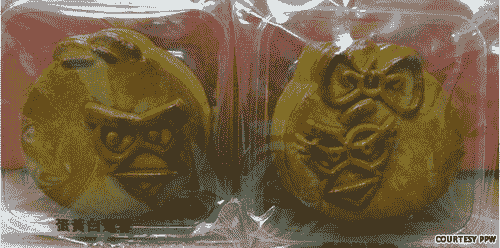

# 愤怒的小鸟现已推出奶油色和不那么致命的月饼形 TechCrunch

> 原文：<https://web.archive.org/web/http://techcrunch.com/2011/08/15/angry-birds-now-available-in-creamy-and-not-so-deadly-moon-pie-form/>

# 愤怒的小鸟现在有奶油和不那么致命的月饼形式

没错。愤怒的小鸟正式进入公众视野。它现在是世界文化的一部分。没有什么比这些愤怒的小鸟官方月饼更能证明这一点了。根本无法逃脱飞鸟的攻击——即使这个游戏很累，已经结束了。

这种美味的馅饼是 Rovio 为中国中秋节发布的新商品的一部分。几周前，这家游戏公司还发布了《愤怒的小鸟》的中国主题更新。但谁会在乎一个应用呢，对吧？月亮馅饼是更大的故事。

 
这些零食成对出售，售价 38 HKD 美元(约合 4.90 美元)，而且似乎装在一个有趣的手提袋里！多好的交易啊！不幸的是，它们似乎只在中国的愤怒的小鸟/Rovio 商店出售。它们甚至可能只在节日期间有售。我只是担心这些月饼，因为它们是月饼，不会是有效的杀猪药。

【YouTube = http://www . YouTube . com/watch？v=ri7F9ZzMjd0&w=640&h=390]