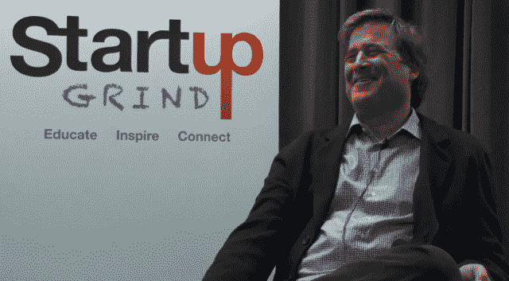

# 宾·戈登的创始人清单:动物能量、盲目自信和假发。

> 原文：<https://web.archive.org/web/https://techcrunch.com/2013/03/30/animal-energy-blind-confidence-and-a-toupee-what-bing-gordon-says-your-startup-needs-for-success/>

 ** 编者按:** [德里克·安德森](https://web.archive.org/web/20221205133611/http://twitter.com/derekjandersen) *是* [创业研修](https://web.archive.org/web/20221205133611/http://startupgrind.com/about-us/) *的创始人，这是一个拥有 40 个城市的社区，在教育、激励和连接企业家* *的同时，将全球创业界聚集在一起。*

八年前，当我在艺电实习的时候，我问了当时的首席创意官宾·戈登(Bing Gordon)一个关于愿景的问题，他是唯一一位早期创始团队成员。"我怎么知道冰球会在哪里？"虽然他给出了令人满意的答复，但两周后我收到了 Bing 的一封电子邮件，邮件中写道:“我有几周回答这个问题很糟糕，我想再试一次。”几周前，Bing 和我一起参加了硅谷的 Startup Grind，在那里他提出了一些很棒的建议，这些建议已经成为他的一个标志。

2010 年，马克·平卡斯(Mark Pincus)将 KPCB 的总合伙人宾·戈登(Bing Gordon)称为世界上“伟大的首席执行官教练”之一，在亚马逊、Zynga、Klout 和 Zazzle 等公司的董事会中支持创始人。以下是我们最近的[访谈](https://web.archive.org/web/20221205133611/http://startupgrind.com/2013/03/bing-gordon-partner-kpcb-startup-grind-interview-full-transcript/)中的一些例外。

**德里克:告诉我们你的家庭和你在哪里长大？**

所以我在底特律的郊区长大。我爸爸是第一代苏格兰人，他爸爸是看门人。他是一个相信草总是更绿的人，没有任何背景和资源。谢谢，爸爸！我们是第一个搬进底特律周边农田建造的小区的人，所以我在小河里长大。我哥哥记得在*疼痛之家*长大，和他一起运动。所以我有一个良好的中西部成长环境。在去斯坦福商学院之前，我并没有在办公室工作，但我确实认为我是一个非常棒的青少年球童。我在大学时打过曲棍球和长曲棍球，在我成年后的大部分时间里，两者都打过。

[YouTube http://www.youtube.com/watch?v = dl0xw0bf 7s]

德里克:你上大学的计划是什么？

**BING** 嗯，我去了耶鲁，以为我会成为一名数学专业的学生和作家，但我到了那里，耶鲁的数学很差，而且似乎与社会无关，所以我有点像一名即将大学辍学的运动员。我意识到我三分之一的课都不及格，进入了期末考试。除了体育成就，我在大学里引以为傲的成就是写诗。有点轻松的诗句，在咖啡店里，彼得·福尔克在做《哥伦比亚》的时候来了，非常喜欢，那天晚上他带我出去喝酒。那很有趣。我的另一个故事是，当我还是大学生的时候，我搭便车去了美国的 49 个州。我没能搭便车去夏威夷。

**德里克:大学毕业后你做了什么？**

宾:我是纽约市的一名演员。与此同时，我在 [Max's Kansas City](https://web.archive.org/web/20221205133611/http://en.wikipedia.org/wiki/Max's_Kansas_City) 当餐馆工，这是纽约第一家伊基·波普和纽约娃娃表演的闪亮酒吧……我干了一年，意识到专业剧院有点糟糕，因为你不能在你想去的时候去工作，你会在糟糕的戏剧中成名。从那以后，我一直想成为一名作家。我仍然认为写书是最光荣的业余爱好。我认为这是一个非常糟糕的行业。即使越来越少的人想一直阅读，我仍然认为这是我心目中最有荣誉的产品。所以我开始做各种各样的零工，试图赚到足够的钱来写作。经过几年的商业捕鱼和植树，我有了足够的钱，我有了一辆 56 年的粉红色庞蒂亚克酋长牌汽车和一台电动打字机，当我坐下来写作时，我意识到，我讨厌写作。我这么做只是因为老师在学校需要它。这比在学校做其他事情要好，但是你们任何一个作家都知道这就像一个字一个字地撕扯你的心。

**你是如何认识特里普·霍金斯的，电子艺界是如何成立的？**

BING :我在斯坦福大学商学院，我去那里是因为我擅长数学，否则我就没戏了。决策科学教授彼得·基恩问道:“好吧，斯坦福的 MBA 们，让我们来做一个真正的决定:如果钱不是问题，你们会怎么做？”我说，“你知道那部电影 *[西部世界](https://web.archive.org/web/20221205133611/http://www.youtube.com/watch?v=LcL3eP0Hfy4)？*我想在电脑里创建一个成人迪斯尼乐园，在那里你可以播放真实的故事。”房间里鸦雀无声，MBA 们有点尴尬。一会儿，教授走过来对我说，“在我的另一堂课上，有人的回答听起来像这样，你应该见见他。”那是特里普·霍金斯。我和他一起参加了大学冠军足球队，但我从来没有和他说过话，因为他在我所在的班级中排名第二。他不是 SAT 满分的 MBA。所以我们去斯坦福谈了谈。我们最终住在一起，在我们的免费频道 F 上一起玩了很多游戏，我钓鱼赚了很多钱，所以我买了一个热水浴缸，所以我们有一个热水浴缸和一个频道 F。让我告诉你，我们是斯坦福商学院的派对中心！

德里克:当你加入一家视频游戏公司时，你的家人是怎么想的？

宾:你知道，这并不比我已经做的更糟。我离开了斯坦福商学院……在商学院的时候，我在英特尔工作了一半时间……另一半时间，我开车去了摩尔恩德，去和那个后来成为我妻子的女人约会。我公开宣布的目标是，在五年内创办一家消费科技广告公司，取代里吉斯·麦肯纳。里吉斯·麦肯纳是个很棒的公关人员。但我想，好吧，不管怎样，获得几年的经验，吃他们的午餐，因为他们做什么都是错的。然后 Trip 说:“五年后我要开一家软件公司。”六年后，我真的开了一家广告公司——它叫古德比-银色啤酒杯乐队，位于三藩市——我让他们放下工作，加入他们一天，然后我意识到广告业的成年商人在 40 岁左右放弃了自尊，我打算活过那个时候。但是 80 年代的游戏行业是相当缺乏创造力的。我很早就意识到，我喜欢和世界级的创意人士在一起，而他们在 80 年代并不从事电子游戏行业。

德里克:你从什么时候开始意识到自己正在做一件大事？

宾:我们做了一百万台的销售，我第一次意识到它的不同是在纽约的一辆出租车上。这是稍晚一点的，但那是纽约的一辆出租车，上面有 EA sports 的标志，那人转向我说，“EA Sports。就在游戏里！”在这里，我不好意思地数着 25 美分的硬币，以确保我有足够的钱给这位老兄——我不知道在纽约 15%够不够——他转向我，喜欢这个标志；给了我一个充满感情的熊抱。所以那时一百万看起来无处不在。甚至在五年前，当我创办一家风险投资公司时，如果有 50 万人访问一个网站，这似乎是一个转折点。坏消息是，新的临界点是一千万。在当时，一百万是一个闻所未闻的数字。在分配上有太多的摩擦。

**德瑞克:这个团队怎么能如此有远见地预见到 30 年后的事情？**

冰:我跟你说过那种盲目的自信。我们相信互动，我们相信边做边学，而不是坐在那里听边学。我们认为会有从电影的魔力到游戏的交叉。游戏具有互动性。我们不知道具体是怎么做到的。我们认为它将更多地基于视觉保真度和听觉保真度，也许还有故事。但是游戏将会成为一种新的艺术形式。你可以从一个让人们兴奋的大愿景开始，让你周围的人帮助你实现它，然后检查。如果你有一个愿景，你必须检查:你是否以新的方式实现它？你还专注于它吗？你还在冒险尝试去那里吗？

**德里克:为什么创始人需要“动物能量”**

宾:你需要魅力和活力。比智力和记忆力更重要。动物能量是一种站起来就能弯曲他人意志的能力。我想史蒂夫·巴尔默明白了。很多领导就像一个音叉——让每个人都有相同的波长。努力工作和保持好心情的能力是无可替代的。所以，当我在工作场所看到有人忍不住微笑并赞美别人时，我会告诉他们，“永远不要失去这一点。”创业和创造过程是如此艰难。你不想要紧张的 Nellies 和刻薄的 Sam。令人振奋的人——相当于 20 个智商点。如果你已经有了 20 分的智商，你应该为自己感到真正的快乐，因为这样你就多了 20 分。我和约翰·多尔一起工作，在 KPCB，他在大峡谷跑来跑去。听起来有点疯狂。我和马克·平卡斯一起工作，他每个周末都去冲浪。我在这里共事的大多数领导者都有非凡的能量。

【YouTube http://www.youtube.com/watch?v=ZWRZv291_PE]

德里克:你是世界上最好的首席执行官教练之一。向我们提出你最好的建议。

宾:大部分的商业活动都可以在高中阶段得到解释。如果你是高中时代事情如何运作的粉丝，无论你是否处于事情如何运作的过程中，你知道，同样的紧张和争夺注意力，难以满足自己的需求，过度劳累和过度社交——这仍然是驱动你做生意的人的原因。所以任何时候你遇到复杂的情况，想象这是*合唱团*，这一切都是可以解释的。接下来的事情是——对 20 多岁的人来说最重要的事情——我的经验是每个 20 多岁的人都会浪费一年时间。你这样做是因为错误的选择。有点像在本地的 maxima 工作。每个 20 多岁的人都应该有一个导师——他们想要从你那里得到的只是感谢和工作时的反馈，他们必须相信他们心中有你的最佳利益。投资者很难做到这一点。很难相信，甚至很难测试一个投资者会把你的需求放在他们的前面。大多数不会。金钱是非常腐败的。所以找个导师吧。接下来，我相信有很多成功的途径。如果人们在做他们热爱的事情，他们成功的可能性更大。几乎在各行各业，机会都是创造出来的。做自己喜欢的事情的人只会更加关注。因此，如果你做一些事情——这对企业软件来说是一种负面影响——但是如果你做的事情符合你的爱好，你将会有加倍的时间和注意力。