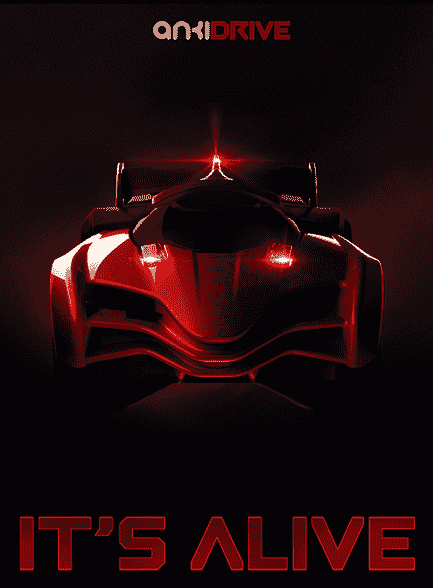

# Anki 在 WWDC 以有趣的赛车游戏推出严肃的机器人人工智能，由 A16Z | TechCrunch 领投融资 5000 万美元

> 原文：<https://web.archive.org/web/https://techcrunch.com/2013/06/10/anki-debuts-at-wwdc-with-an-ai-car-racing-game-raises-50m-from-a16z-and-others/>

还记得 WWDC 可爱的 Anki Drive 演示吗？你可能错过的是，玩具赛车游戏只是硬核机器人人工智能初创公司的一个幌子，它可以让机器准确了解它们在物理世界中的位置。安德森·霍洛维茨、指数风险投资公司和两个适马看到了潜力，因为他们已经投资了总计 5000 万美元的 A 轮和 B 轮资金来帮助 Anki 在秋季推出。

视频游戏很早就有电脑控制的玩家了。他们是你射击、运球或比赛的机器人。但它们只存在于数字世界。Anki 通过机器人技术将这种人工智能带入肉空间。首先，这将成为有趣的游戏。你驾驶一辆遥控汽车与人工(或实际上)智能的对手比赛，对手可能试图阻止你超越他们——使用人脑在驾驶时进行的相同算法计算。

然而，在未来，Anki 将不仅仅是一个玩具。也许它会让机器人避开工厂里的人类工人，或者让机械化的助手在家里不会被你的脚绊倒？还有更多手机控制的 IRL Anki 产品即将推出。到目前为止，没有人透露更多的细节。

“这是非常复杂的软件，”投资者[马克·安德森](https://web.archive.org/web/20230305215140/http://en.wikipedia.org/wiki/Marc_Andreessen)在今天早上的电话采访中说，“比其他任何东西都更接近谷歌无人驾驶汽车。而且非常快。我们认为它指向了未来的方向，将 AI 带入客厅。”

来自[安奇博客](https://web.archive.org/web/20230305215140/http://anki.com/blog):

> 乍一看，这是一款让真实汽车与玩家和彼此竞争的赛车游戏——但在玩了几分钟后，你会看到 Anki Drive 的特别之处:我们正在制作真实世界中的第一款视频游戏，我们的团队在机器人和人工智能挑战方面不知疲倦地工作。
> 
> 每辆车都配备了传感器和智能软件，每秒钟可以做出数千次决定。我们使用移动设备不是作为遥控器，而是作为身临其境的真实世界体验的驱动力。我们非常小心地确保，尽管一切都在引擎盖下，但最终的体验是直观和有趣的。"

虽然这肯定有一些物联网的元素，但安德森告诉我，他认为 Anki 是一种全新的低成本机器人，这是 iPhone 上的一种低能耗蓝牙更新，现在可以让手机成为几十种设备的控制单元。Anki 是最早利用这项技术的创业公司之一，这解释了为什么 catbird 会在苹果开发者大会的舞台上推出，并在 27，000 多名观看苹果直播的人面前推出。

“机器人和人工智能进入市场的方式就是计算机进入市场的方式，非常昂贵，”安德森解释说，“这些家伙正在做完全相反的事情，以尽可能最低的成本。他们追求数量，追求规模。有点像智能手机对大型机。”

苹果首席执行官蒂姆·库克(Tim Cook)在台上支持这家初创公司的崇高目标:“当我们看到 Anki Drive 时，我们看到了机器人和人工智能未来实现的第一步。我们看到今天的娱乐体验发生了转变，我们也看到了未来的无数可能性。”

除了有一个朋友蒂姆·库克，安奇显然还吸引了安德森，他将在这家初创公司的董事会中占据一席之地，还有 Index Ventures 的投资者[丹尼·里默](https://web.archive.org/web/20230305215140/http://www.indexventures.com/blog/index/category/11#post/697)，他附和库克，称这项技术为“全面机器人革命的第一基地”这是 RapGenius 的玩法:带着有趣、吸引人的消费品进入市场，然后用你的深度、令人印象深刻的技术和远见卓识让每个人感到惊讶。

这个团队是一群来自卡内基梅隆大学的机器人学博士，这没有什么坏处。“从历史上看，像这样的人不会生产低价产品。他们都在忙着打造百万美元的产品，而不是 200 美元的产品，”安德森强调道。“我们认为这是一个新的类别。人工智能和机器人技术已经成为主流。”

虽然 Andreessen 没有透露他们的下一个产品是什么或一个确切的价格点，但他证实了整个 Anki Drive kit 最终将售价数百美元。

那么，下一款 Anki 产品会是像升级版 Roomba 那样的家用联网设备吗？"他们有比这更有趣的想法。"

**