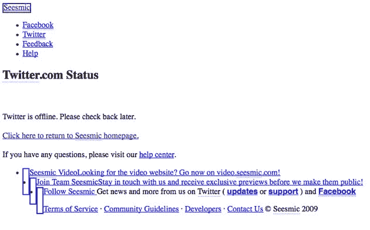
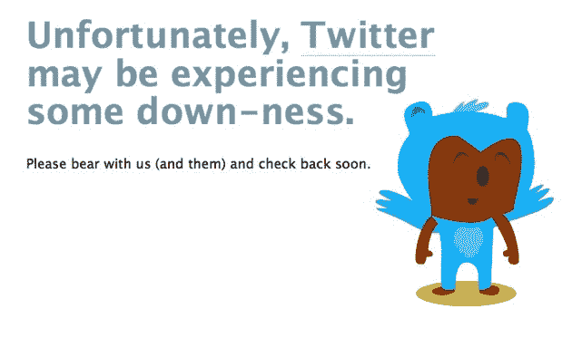

# 又是一天，又是一次 Twitter 宕机 

> 原文：<https://web.archive.org/web/https://techcrunch.com/2009/08/11/another-day-another-twitter-outage/>

# 又是一天，又是一次 Twitter 宕机

就在用户和整个 Twitter 开发者生态系统在上周的多日中断后重新站起来的时候，Twitter [再次关闭](https://web.archive.org/web/20230216122355/http://status.twitter.com/post/160693237/responding-to-site-downtime)。

上周的中断是由 [DDOS 攻击](https://web.archive.org/web/20230216122355/https://techcrunch.com/2009/08/06/oooh-dramatic-twitter-gets-ddosed/)引起的，从加州时间周五早上 6 点左右[开始，持续到周末](https://web.archive.org/web/20230216122355/https://techcrunch.com/2009/08/06/serious-twitter-outage-ongoing/)[到](https://web.archive.org/web/20230216122355/https://techcrunch.com/2009/08/07/twitter-outage-moves-into-day-2/)。即使 Twitter 定期正常运行，第三方应用程序仍然关闭。

像往常一样，我们提供了一份方便的清单，列出了在为 Twitter 烦恼时要做的事情。当然，你可以选择工作，因为这是一个工作日的中间，但我们先不要发疯。

**更新:**又回来了！尽管如此，第三方应用程序仍然处于关闭状态。他们总是遭受重创。Twitter 称这是一次“攻击”——*“更新(12:17p):我们正在备份和分析流量数据，以确定这次攻击的性质。”*

