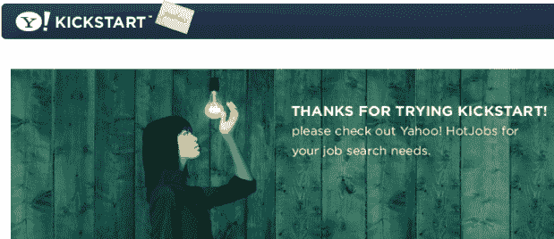

# 又一家倒闭了:雅虎百叶窗 Kickstart 

> 原文：<https://web.archive.org/web/https://techcrunch.com/2008/12/17/another-one-bites-the-dust-yahoo-kickstart-shutters/>

# 又一家倒闭了:雅虎百叶窗 Kickstart

在关闭了这两个网站之后，雅虎无疑正在疯狂裁员。直播和[跳投](https://web.archive.org/web/20230305215220/https://techcrunch.com/2008/12/17/yahoo-putting-jumpcut-in-the-deadpool/)，以及[抛售 Kelkoo](https://web.archive.org/web/20230305215220/https://techcrunch.com/2008/11/21/yahoo-finally-sells-kelkoo-and-brings-cash-in/) ，现在是[雅虎 Kickstart](https://web.archive.org/web/20230305215220/http://kickstart.yahoo.com/) 拜访[死池](https://web.archive.org/web/20230305215220/https://techcrunch.com/tag/deadpool/)的时候了。

Kickstart 由该公司的高级产品部门于去年 4 月~~和 11 月~~推出，旨在联系特定学院和大学的学生和校友，并帮助他们在专业层面上建立联系。

当它首次亮相时，许多人想知道 Kickstart 是否有空间，因为脸书和 LinkedIn 已经基本覆盖了这个领域，而且这项服务并没有真正带来任何新的东西。它实际上是伪装成社交网络的求职板(该网站现在建议访问者去雅虎的 Hotjobs)。

关闭并不令人惊讶，因为服务已经[处理停机](https://web.archive.org/web/20230305215220/http://yahoovibes.com/2008/11/yahoo-live-to-be-phased-out-kickstart-to-follow/)和大量[错误消息](https://web.archive.org/web/20230305215220/http://www.centernetworks.com/yahoo-live-kickstart-closed)好几周了，但是我们猜测下面的图片使它正式。

(谢谢丹的提示)