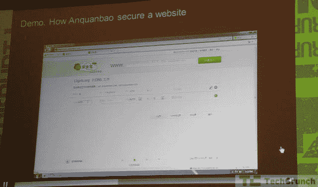

# 安全宝让互联网更安全、更快捷、更智能 TechCrunch

> 原文：<https://web.archive.org/web/http://techcrunch.com/2011/10/31/anquanbao-makes-the-internet-safer-faster-and-more-intelligent/>

# 安全宝让互联网更安全、更快捷、更智能

[Anquanbao](https://web.archive.org/web/20230204120313/http://www.anquanbao.com/)

是一种基于云的软件程序，有助于保护网站免受恶意软件和拒绝服务攻击等安全侵害。它的产品可以很容易地安装在任何网站上。管理员需要做的只是更改他或她的域设置。由于滥用的机器人和爬虫会浪费带宽和服务器资源，安全宝的产品还可以帮助网站更快地加载。

安全宝服务是 freemium，面向对安全和性能有更多需求的中高端用户，提供免费服务和增值服务。它类似于 CoudFlare，但更侧重于中文网站。
“中国有超过 200 万个网站，其中 1%可能需要为安全服务付费，”安全宝的创始人在 TechCrunch 的战地北京上说，“有超过 20 万个政府网站必须受到保护。”据创始人称，市场规模预计超过 30 亿人民币(约 5 亿美元)。

问与答(Question and Answer)

问:谁是你的客户？

答:企业，从小到大。

问:你如何用自己的信誉和信任说服客户的 IT 人员？

答:我们不会在客户的系统中安装任何软件，我们会请专家来帮助那些 IT 人员解决难题。