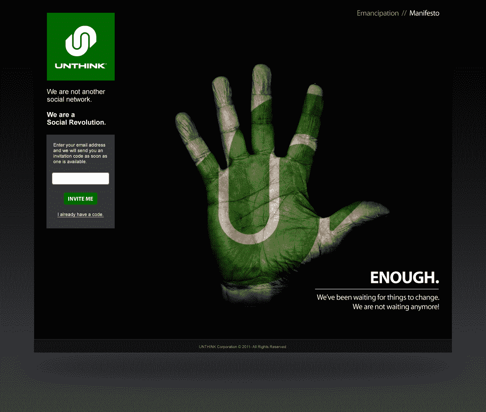
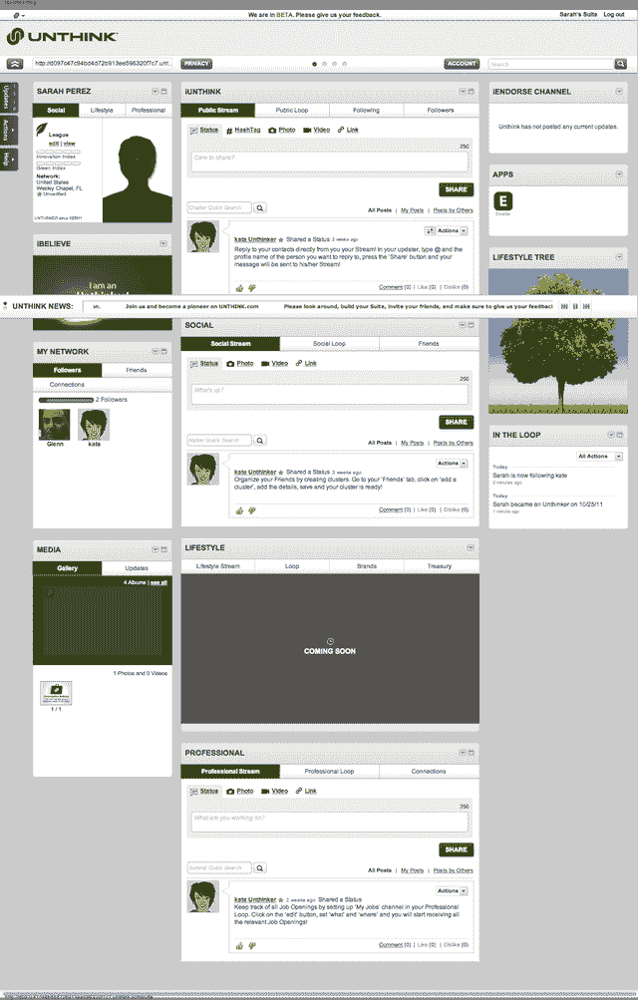

# 反脸书社交网络“不思考”向公众发布 

> 原文：<https://web.archive.org/web/http://techcrunch.com/2011/10/25/anti-facebook-social-network-unthink-launches-to-public/>

好斗的局外人创业公司[Unthink.com](https://web.archive.org/web/20230210023017/http://unthink.com/)，标榜自己为“反脸书”，今天敞开大门，允许第一轮测试人员进入。这家总部位于坦帕的公司从 [DouglasBay Capital](https://web.archive.org/web/20230210023017/http://www.douglasbaycap.com/default.aspx) 获得了 250 万美元的资金，它认为自己是一种更开放、更诚实的社交网络形式——在这种形式中，用户是他们数据的所有者，而不是出售给广告商的产品。

[Unthink](https://web.archive.org/web/20230210023017/http://unthink.com/) 是那种只能来自硅谷或纽约等传统科技热点之外的创业公司，因为你需要一定程度的勇气，甚至可能是无知，才能认为你有机会取代社交网络巨头脸书及其全部 8 亿用户。

扳倒脸书是 Unthink 营销活动的核心。事实上，Unthink 的大部分信息是关于它是什么，而不是什么:它不是另一个社交网络，而是一场社会革命。不思考者不是用户，他们是所有者。不思考是*不是*在控制，是你在控制。诸如此类。它甚至有自己的宣言、契约和契约。

“如果我们想要自由，我们必须控制我们自己的通信……我们必须要求这种权力，”首席执行官 Natasha Dedis 在 9 月的[坦帕湾酒吧营地](https://web.archive.org/web/20230210023017/http://barcamptampabay.org/)(联合国会议)上对人群尖酸刻薄地喊道，然后深入探讨脸书对其用户的所有错误。

她解释说，当她的儿子想报名参加脸书时，她产生了创办 Unthink 的想法，她阅读了服务条款。她不想同意这些，因为它们随时都可能改变。但对她的儿子来说，这个决定引起了很多焦虑。“他对此感到非常紧张，好像他别无选择——他*不得不*去脸书。”她说，要么上脸书，要么成为学校里的贱民。无论德迪斯做了什么决定，她都觉得自己是个不称职的母亲。

*(上图:注册后的简介)*

在脸书，你的个人数据、你的帖子、你的喜欢——简而言之，你所有的社交网络活动——被用来为广告商提供一种直接锁定精确人口统计数据的方式。有些人可能称之为天才，但对其他像德迪斯这样的人来说，这感觉像是剥削。

“关于社交媒体，必须‘不加思考’的第一件事是，它属于谁？我们需要拥有我们放在页面上的所有东西。只要是我们自己的选择，我们可以公开也可以保密，”她说。

在 Unthink 上，用户数据不会出售给品牌。相反，用户选择一个品牌来赞助他们的页面，通过一个被称为“iEndorse”的广告这个想法是，用户会选择一个他们觉得有亲和力的品牌，然后成为这个品牌的拥护者。不想选择品牌的用户可以选择支付服务费用(2 美元/年)。

[品牌](https://web.archive.org/web/20230210023017/http://unthink.com/UnthinkForBrands)也有不同于脸书的与粉丝沟通的方式，在那里信息被拼接成用户的新闻。在 Unthink 上，用户资料页面上有一个单独的部分，专门用于与企业交流。用户决定他们想要与哪些公司通信，他们想要接收什么类型的消息以及他们想要多长时间接收一次。然后，当他们选择与一个品牌互动时，他们会因参与而获得奖励，这些积分可用于该品牌的折扣和优惠。

像我今天一样，注册了 Unthink 之后，你会得到一个可以从脸书导出照片和视频的应用。你还需要填写标准的社交网络问题(姓名、出生日期、性别等)。)，然后进入您自己的个人资料页面。

这些页面分为几个部分，每个部分都有专门的用途和易于定制的隐私控制。最上面的版块，“iUnthink”是你的公众微博，中间，你的社交版块，第三，你的生活方式版块，用于连接品牌(这部分将在几周后推出)，最下面，你的专业版块，用于连接业务同事。

哦，没错。我忘了说了吗？

尽管发表了反脸书宣言，但 Unthink 实际上也想取代 Twitter、Groupon 和 LinkedIn。然而，如果有什么不同的话，那就是[散居](https://web.archive.org/web/20230210023017/https://techcrunch.com/2010/09/15/diaspora-revealed/)做得对。嘿，如果你打算诉诸*“我不希望公司控制我的数据！”*人群，不妨全押。

不思考会搞垮脸书吗？不太可能。但是看着有人如此大规模的尝试是很吸引人的。

Unthink 今天发布了一个有限的测试版。如果你知道谁在里面，他们可以给你发邀请。TechCrunch 的读者可以发电子邮件给 techcrunch@unthink.com，以获得该榜单的第一名。

*(上图:整版简介。请注意，股票通常会在底部)*