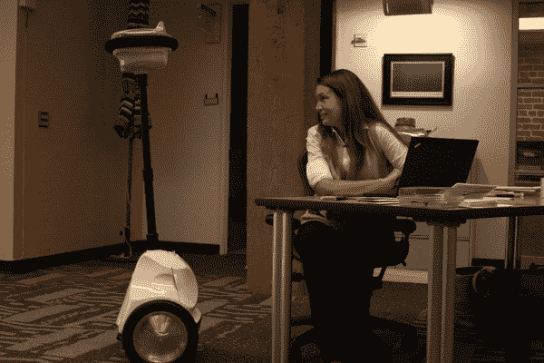

# 最后，一个我们能忍受的阿林顿。我们可以拔掉的阿林顿 TechCrunch

> 原文：<https://web.archive.org/web/https://techcrunch.com/2010/07/08/anybots-arrington-robot/>

# 最后，一个我们能忍受的阿林顿。一个我们可以拔掉的阿林顿

 好了，未来正式到了。几天前，来自总部位于山景城的初创公司 [Anybots](https://web.archive.org/web/20221207201657/http://www.anybots.com/) 的团队来到 TechCrunch 总部，为我们的办公室带来了一个特殊的新成员:QB 型 Anybots 机器人，它大约 5 英尺高，可以在一对坚固的轮子上以每小时 3.5 英里的速度在办公室穿梭。它看起来像是赛格威和外星人的混合体，一些光学传感器和摄像头组成了它的“脸”。哦，它目前由我的老板迈克尔·阿灵顿控制，他一直用它来远程漫游 TechCrunch 的办公室，以确保我们在西雅图时努力工作。至少，这是他应该做的——他大部分时间都在欢快地从我们脚下跑过，用绿色激光束弄瞎我们。未来真的很神奇。

在上面的视频中，迈克通过互联网浏览器控制 QB，帮我采访 Anybots 机器人工程师[丹尼尔·卡斯纳](https://web.archive.org/web/20221207201657/http://www.crunchbase.com/person/daniel-casner)。通过帮助，我的意思是他向我们展示了当你驾驶机器人直接撞到墙上，并反复撞向丹尼尔，试图让他泄露任何机器人的秘密时会发生什么(没有成功)。请注意，从机器人头部垂下的小电线实际上是一个麦克风，它向我们的摄像机传输信号。

Anybots 机器人已经开发了多年——该公司由特雷弗·布莱克威尔(他也是 Y Combinator 的合伙人)于 2001 年创立，不断壮大的团队已经迭代了几个模型。旗舰机型 QB 定于今年秋季发布，售价为每台 1.5 万美元。这听起来可能有点夸张，但请记住，机器人可以由多人使用，尽管一次只能有一个人登录。不，我们不能留着这本书——它已经借出一周了。

使用机器人实际上非常简单:创建帐户后，你安装一个 Firefox 插件，然后前往 Anybots 主页，在那里你会看到一个你有权控制的 Anybots 列表。点击一个，你就在飞行员的座位上——QB 将把它“看到”的视频流传输到你的显示器上，它配有麦克风和扬声器，所以你可以与办公室周围的人交谈。

四处移动也很直观:向上箭头使机器人向前移动，向左和向右箭头移动到旁边，等等。您也可以点击视频流上的任何地方来激活和指向内置的激光指示器。迈克花了整整两分钟才弄明白如何在我们的办公桌之间穿行。

其他一些关键数据:Anybots 表示，该机器人一次充电可持续 6-8 小时。当它死亡或手动关闭电源时，一个小支架会从它的后部弹出来，使它保持直立。这个设备只有 35 磅重，所以不会伤害任何人。