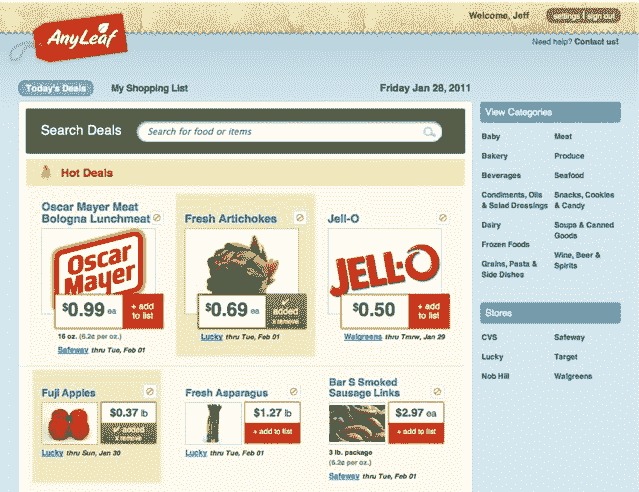

# AnyLeaf 聚合并提供个性化的杂货店交易 

> 原文：<https://web.archive.org/web/http://techcrunch.com/2011/01/28/anyleaf-aggregates-and-delivers-personalized-grocery-store-deals/>

# AnyLeaf 聚合并交付个性化的杂货店交易

几十年来，我的母亲和祖母都虔诚地浏览周末报纸上的每周优惠券和传单。虽然剪优惠券可能会很乏味，但杂货店的每周交易往往会拿走每周食物账单中的很大一部分。当然，随着印刷优惠券变得过时，许多消费者开始在网上寻找当地杂货店的交易。今天， [Y Combinator](https://web.archive.org/web/20230203043707/http://ycombinator.com/) 支持的 [AnyLeaf](https://web.archive.org/web/20230203043707/http://www.anyleaf.com/) 向公众推出其智能杂货交易聚合器。

AnyLeaf 搜索旧金山湾区的当地杂货店网站，并汇总这些商店的所有交易，包括 CVS、Lucky、Nob Hill、Raley's、Safeway、Target 和 Walgreens。你只需输入你的邮政编码和电子邮件地址，AnyLeaf 就会每周给你发一封电子邮件，介绍你附近当地杂货店的商品。

AnyLeaf 与其他杂货店交易聚合器的区别在于，它应用了一种智能算法来为用户寻找交易。你可以指定不想看到特定食品和产品的交易，在你开始与 AnyLeaf 的网站互动后，该服务将开始向你选择查看交易的人推荐类似的商品。AnyLeaf 收集食品的历史价格，还会向您展示与杂货店过去的折扣相比，折扣有多高。

目前 AnyLeaf 仅限于海湾地区，但计划在不久的将来扩展到其他城市。对于任何一个 Joe 的粉丝来说，AnyLeaf 并不汇总这家流行的连锁杂货店的交易，因为该公司不会在 Joe 的网站上公开发布销售额。

就我个人而言，如果我通过电子邮件收到全面的每周交易清单，我会更加关注我购物的商店的杂货交易。我祈祷芝加哥是 AnyLeaf 的下一个扩张点！

