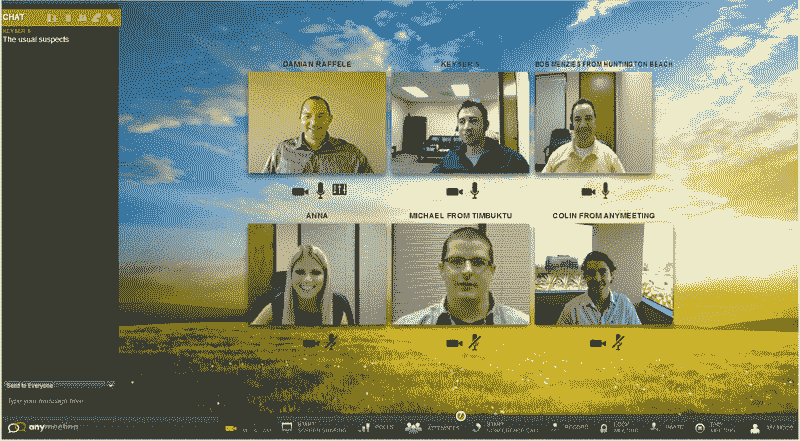

# 免费网络研讨会服务 AnyMeeting 推出重新设计的六路视频会议 

> 原文：<https://web.archive.org/web/http://techcrunch.com/2011/10/07/anymeeting-the-free-webinar-service-launches-redesign-six-way-video-conferencing/>

# 免费网络研讨会服务 AnyMeeting 推出了重新设计的六路视频会议

满足您在线会议和会议需求的免费网络会议服务 AnyMeeting 今天推出了其用户界面的重新设计，该服务带来了一个升级的界面，使您更容易与您的同事会面，而不必亲自见到他们。如果这还不能让你兴奋，我不知道还有什么能让你兴奋。

该公司还增加了同步视频聊天和广播功能——类似 Google+Hangouts——允许最多六名参与者在计划接管世界时相互交谈并实时合作。

这些更新还包括更快的屏幕共享和更清晰的会议体验，改进的屏幕管理和网络会议功能都在易于访问的菜单栏中提供。

SaaS 会议服务于 2009 年底推出，允许用户主持多达 200 名与会者的会议，没有时间限制，屏幕共享，应用程序共享，录制和社交媒体集成。该公司真正的目标是小型企业和独立专业人士，他们希望提供如何操作的视频、演示或主持小组和研讨会。( [Vokle 是该领域另一家提供类似功能的酷公司。](https://web.archive.org/web/20230203141551/https://techcrunch.com/2011/04/18/vokle-raises-767k-for-its-live-video-conferencing-platform/))

该公司已经从投资者那里筹集了种子资金，这些投资者包括 Tech Coast Angels、Pasadena Angels 和 Maverick Angels。

8 月，AnyMeeting 增加了 PayPal 集成，允许任何拥有经过验证的 PayPal 商家帐户的人出售现场和录制的网络研讨会的门票。该功能被集成到这家初创公司的网络研讨会系统中，希望让用户的货币化变得简单——他们所要做的就是设定票价(或提供折扣代码)，观众可以使用信用卡或 PayPal 账户支付。资金将直接支付给安排研讨会的 AnyMeeting 用户，在这一点上，该服务将从每张购买的门票中扣除少量费用。

少量的服务费，加上一些非侵入性的广告和战略合作伙伴关系，是这家初创公司的赚钱计划。

我有机会试用了视频会议工具，它运行得很流畅，一切都是在我的浏览器中完成的。对于创业公司来说，这是一个很棒的小工具，所以去看看吧。

关于任何会议的更多信息，[请点击](https://web.archive.org/web/20230203141551/http://www.anymeeting.com/)查看。