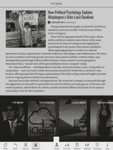

# AOL Editions 向您的 iPad 发送每日简报 

> 原文：<https://web.archive.org/web/http://techcrunch.com/2011/08/02/aol-editions-ipad/>

专为你定制的个性化杂志的梦想不断在 iPad 上显现。今天的版本来自 [AOL Editions](https://web.archive.org/web/20230203041847/http://itunes.apple.com/us/app/editions-by-aol/id447687307?mt=8) ，经过多次微调和一个[傻视频](https://web.archive.org/web/20230203041847/https://techcrunch.com/2011/01/19/aol-editions/)后终于出来了。(披露:TechCrunch 也归 AOL 所有)。Editions 每天从各种在线新闻来源和博客中为您收集一份数字杂志——The Atlantic、Businessweek、CNNMoney、Forbes、TechCrunch、Cnet、Business Insider、Wired。它正试图在 *[《每日新闻》](https://web.archive.org/web/20230203041847/https://techcrunch.com/2011/02/02/daily-demo-video/)* 的全原创(且昂贵)报道和 [Flipboard](https://web.archive.org/web/20230203041847/http://flipboard.com/) 的美化 RSS 源和社交流的无尽页面之间占据一席之地。

AOL Editions 设计为一次完成。它包含 30 到 50 个不同板块的故事，如顶级新闻、科技、商业、娱乐、体育、当地新闻和旅游。你选择你想要的部分，输入你的邮政编码，剩下的事情就交给它了。你可以在每次阅读文章时，通过点击你想要关注或隐藏的来源和主题来进一步训练应用程序。该应用程序提取出与每个故事相关的几个主要主题标签，你可以通过点击复选标记或 x 来有效地表示赞成或反对。下一版将显示更多来自这些来源或关于这些主题的故事。你也可以通过每个版块起始页上的搜索框添加博客或新闻来源(但只能来自没有付费墙的来源，例如，不会出现《纽约时报》的文章)。

每天早上，只要你等上一分钟左右，你的版本就能很快组装好，设计和导航就足够令人满意了。迎接读者的是一张大大的封面图片，上面有一个旧式杂志邮寄标签，标明了他们的名字、城镇和温度。部分以大照片和标题字体开始。当你翻阅文章时，版面会随着不同栏目配置中的标题和摘录而变化。当你点击一个故事时，一个应用内浏览器会打开并带你到原始网页。如果来源是美国在线(如 TechCrunch 或本地新闻的 Patch)所有，你会得到这种不错的效果，允许你在应用程序内滑动所有文本，但只有一半的页面是移动的，因为照片和标题保持不动。

除了按顺序翻阅版本之外，你还可以直接跳转到相应的章节或文章的完整列表。文章可以被收藏或通过电子邮件、推特或脸书分享。

这是由美国在线西海岸办公室的大卫·特姆金和索尔·李普曼领导的移动团队付出的坚实努力。但我对它有一个主要的问题，那就是它的页面中的新闻的及时性。对于我的实时口味，它们可能有点陈旧。

为了提供完整和可完成的内容，AOL Editions 每天在相同的指定时间将您的个性化故事汇集在一起。如果那是早上 8:00，在那之后发生的任何新闻都必须等到你的下一个版本第二天早上“到达”(尽管有一种方法可以覆盖它并立即汇编下一个版本)。如果我打开 AOL Editions，阅读我认为是昨天甚至今天早上的新闻，与我在网上能得到的相比，我只会坚持上网。

不可否认，我是一个新闻迷，我的生活依赖于每一个科技头条的最新消息，但我不认为只有我这样。人们互相抽查新闻应用和网站。新闻应用需要和网络一样流行。那些只是桌上的赌注。

虽然能够完成一个版本(或至少浏览每个标题和摘录)会有一定的满足感，但在一天中给每个部分添加一些更新不会太难。每次我打开应用程序时，版本都可以重新组装，而不是在一天中的某个预定时间。选择报道内容的算法是基于热门新闻来源中相似文章的聚类。没有像 Flipboard 中那样的社交流组件，可以提取推文或共享链接背后的图像和文本。这样做的好处是 Editions 没有 Flipboard 那么吵，但它也错过了社交新闻的及时性。同样，有一种不同的方法可以做到这一点。版本可以只显示达到一定点赞和转发阈值的故事，而不是显示我的 Twitter 和脸书流中的所有分享故事。

随着新闻搜索算法的改进，整体体验也会随之改善。