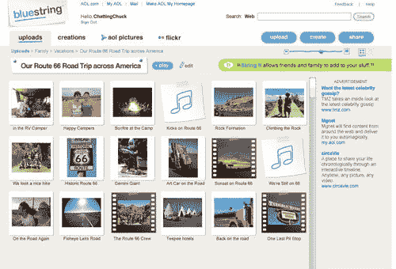
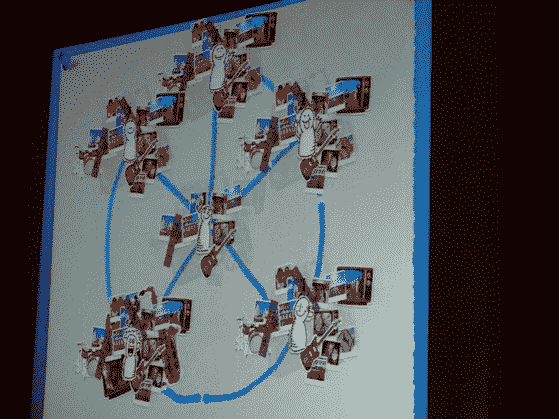

# 美国在线推出 BlueString 

> 原文：<https://web.archive.org/web/https://techcrunch.com/2007/09/17/aol-launches-bluestring/>

 美国在线在 TechCrunch 40 上推出了一项新的合作多媒体讲故事服务，名为 [BlueString](https://web.archive.org/web/20230306024818/http://bluestring.com/) 。该网站是一个 Flex 应用程序，它允许你从网络上获取所有的图像、视频和音频内容，并将它们混合成多媒体幻灯片演示。你的朋友可以嵌入、分享和编辑这些节目。

有许多用户生成的图片、视频和音乐内容网站。在所有这些开放的 API 之上运行 BlueString，而不是试图在 Xdrive 上保持一个封闭的花园，这对 AOL 来说是一个明智的举动。他们向我们保证，他们希望保持一个开放的系统，但 AOL 肯定会从频繁的用户那里受益，他们会发现在 AOL 上存储他们的内容比通过第三方网站更容易。

AOL 将通过混合一些与音乐同步的公路旅行照片和视频来演示该产品。节目中的所有内容要么直接上传到网站，由 AOLs Xdrive 提供，要么从 Flickr 的公共 feed 上搜索。他们计划在未来加入更多的 API。如果您下载了照片的同步程序，照片也可以自动同步到您的帐户。您保存的所有文件都组织在文件夹中，您可以在其中轻松地拖动、放下和重新排列幻灯片放映时间线中内容的缩略图。这些节目可以与音乐同步，音乐会在视频播放时淡出，并支持幻灯片之间的一些基本过渡。

完成后，您可以通过电子邮件向朋友发送永久链接、将其嵌入网站或授予他们写权限以将他们自己的内容添加到节目中来与他们分享节目。该网站甚至允许你创建一个网站白名单，你的嵌入可以出现在上面。

[http://public . blue string . com/players/blue string-media player . swf？p _ id = XDPC-95244267 txt 3 kectpqcdt 9 kzotvovbuj](https://web.archive.org/web/20230306024818/http://public.bluestring.com/players/BlueString-MediaPlayer.swf?p_id=XDPC-95244267Txt3KECTPQcdt9KzOtvoVbUj)

