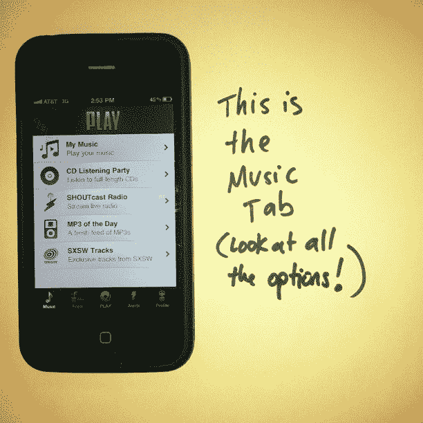
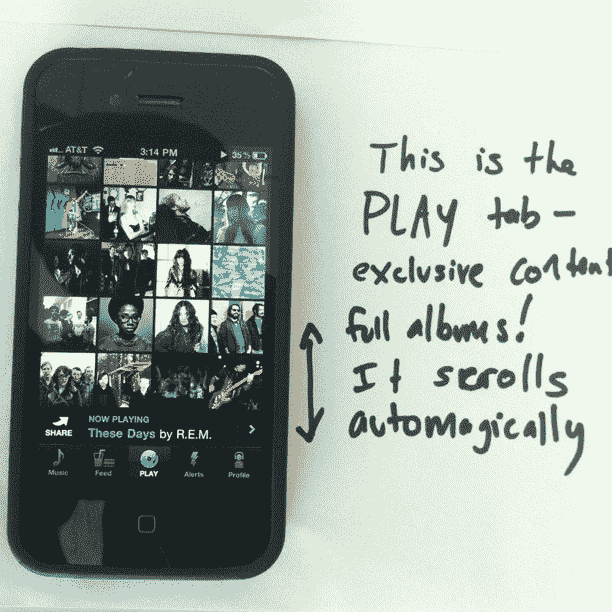
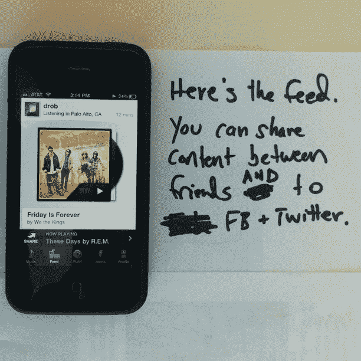
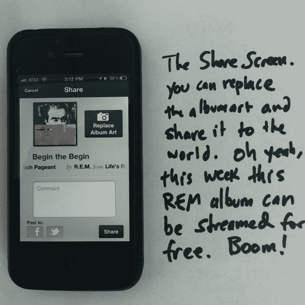
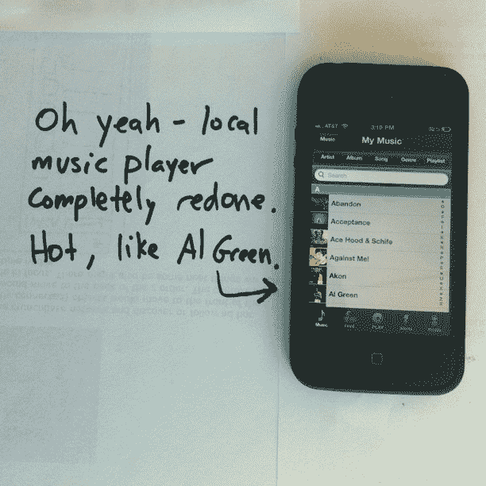

# 为明天到来的 iPhone 而战，AOL 在 insta gram TechCrunch 上向我推销

> 原文：<https://web.archive.org/web/https://techcrunch.com/2011/07/12/aol-play-for-iphone/>

# 为明天到来的 iPhone 而战，AOL 在 Instagram 上向我推销

早在 3 月份，我们就注意到 AOL 内部的移动优先团队正在推进一个非常好的新音乐应用程序“Play”。时机很好，他们在 SXSW 开始的时候发布了它。不幸的是，它只支持 Android——这意味着我和数百万其他人不太可能使用它，而是喜欢像竞争对手[的声音跟踪](https://web.archive.org/web/20221129202725/http://soundtracking.com/)这样的东西。好了，明天 Play 终于要来 iPhone 了。

据我所知,《为 iPhone 而玩》看起来很棒。但是“长相*”*才是关键词。我自己实际上没有用过这个应用程序。相反，我只看过它，因为 AOL 决定通过 Instagram 向我推销它。是的，知道[我不发邮件的立场](https://web.archive.org/web/20221129202725/https://beta.techcrunch.com/2011/07/06/i-wouldnt-say-ive-been-missing-it/)，AOL 聪明地在另一个我一直在线并高度参与的网络上找到了我。玩得好，也很聪明。AOL 一直将他们的应用程序标榜为一种“音乐的 Instagram”。到目前为止，这似乎是[在为他们](https://web.archive.org/web/20221129202725/https://beta.techcrunch.com/2011/04/05/play-aol-250000/)工作。

AOL 的移动项目高级总监 Sol Lipman 准备并向我发送了(当然是公开的)以下一组 Instagram 图片，以展示和解释新的应用程序。

同样，这个应用程序看起来很棒。迫不及待地想尝试一下。

**更新**:看哪，Play for iPhone 正在[直播](https://web.archive.org/web/20221129202725/http://itunes.apple.com/us/app/play-by-aol-music/id447805948?mt=8)！

*thesolster:那么@parislemon 我们明天将为 iPhone 推出 PLAY 这是音乐标签。*

*thesolster:这个@parislemon 是播放标签——太棒了。*

*the solster:feed @ Paris lemon，rules*

*thesolster:嘿@parislemon 看这里多棒啊*

*thesolster:我们有一个完全的本地音乐播放器@parislemon*

*thesolster:希望你喜欢@ Paris lemon——对于其他人来说，很抱歉弄乱了你的信息流，只是想照顾好生意*

