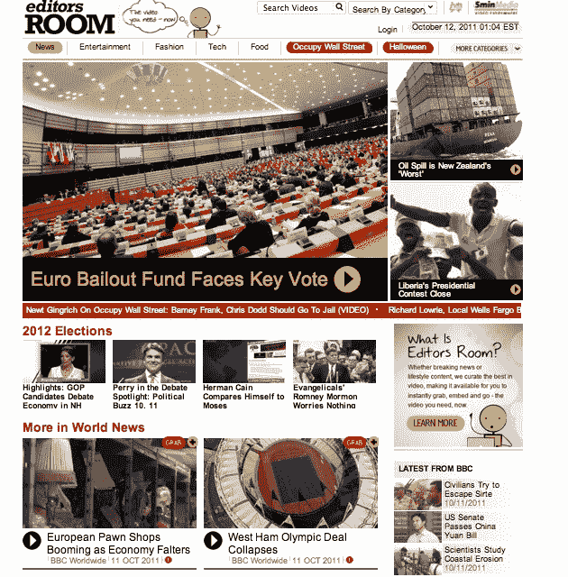

# AOL 想成为在线视频的 AP；为视频嵌入提供“编辑空间”

> 原文：<https://web.archive.org/web/http://techcrunch.com/2011/10/11/aol-wants-to-be-the-ap-for-online-video-offers-editors-room-for-video-embeds/>

# AOL 想成为在线视频的 AP；为视频嵌入提供“编辑空间”

在线视频的问题在于，大规模生产高质量的内容既昂贵又困难。但是，如果网上有一个地方许可体面的视频，并提供给其他网站呢？这就是[编辑室](https://web.archive.org/web/20230205002747/http://editorsroom.5minmedia.com/)(原文如此)背后的想法，这是 AOL 的 [5min](https://web.archive.org/web/20230205002747/http://www.5min.com/) 的一项新服务(和 TechCrunch 一样，[一年前被 AOL](https://web.archive.org/web/20230205002747/https://techcrunch.com/2010/09/28/aol-5min/) 收购)。“我们想成为视频的 AP，”AOL Video 的高级副总裁 Ran Harnevo 说。

编辑室展示了 5 分钟图书馆中超过 250，000 个在线视频，包括来自 BBC 新闻、赫斯特、梅雷迪斯、GigaOM、blip.tv、Scripps、Revision3、Next New Networks、IGN 和路透社的视频。它们的质量各不相同，从广播新闻剪辑到低成本的网络制作。编辑室是一个中心目的地，网络出版商可以在这里阅读任何主题的视频，并将其免费嵌入他们的网站。如果他们想从视频广告收入中分一杯羹，他们可以申请与 5Min 签约成为出版合作伙伴。今天，这是一个手动的业务开发流程，但它很快就会变成自助服务。

“如果你没有和我们达成协议，”哈内沃解释道，“我们不会播放广告，直到有人去审查你的网站。它与 Google AdSense 正好相反。”AOL 希望将高质量的视频与高质量的网站结合起来，并对广告收取额外费用。多达四分之一的网络视频是通过嵌入式观看的，AOL 认为它可以成为其他 sies 优质视频的一大来源。

编辑室是为新闻网站和博客的编辑设计的，他们没有预算制作大量的视频，但希望用热门视频来扩充他们的网站。主页上有新闻视频，每个分类页面也是如此，比如科技、娱乐、时尚和美食。所有的视频都来自内部制作和授权厂商。你不能上传你自己的。它被认为是“品牌安全”的，因为在不可预测的用户生成的视频旁边不会播放广告，并且发布者网站也被检查过。AOL 将与发布网站分享广告收入(发布网站通常可能获得三分之一)，然后与视频制作商对半分享剩余收入。

