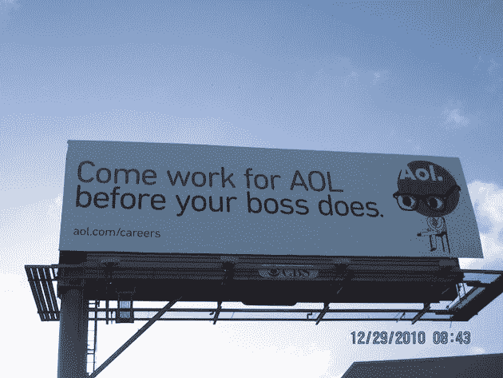

# 美国在线关于你老板 TechCrunch 的尴尬广告牌广告

> 原文：<https://web.archive.org/web/http://techcrunch.com/2011/01/01/aols-awkward-billboard-ad-about-your-boss/>

# 美国在线关于你老板的尴尬广告牌广告

*“比你的老板先来美国在线工作。”*

我仍然不明白为什么[我们的](https://web.archive.org/web/20230202224945/https://techcrunch.com/2010/09/28/why-we-sold-techcrunch-to-aol-and-where-we-go-from-here/)母公司把 Aol 拼在所有的大写字母上，却在它的标志上使用“AOL”。这里的某个地方可能会有一份备忘录[来解释这件事。但这不是这篇文章的内容。](https://web.archive.org/web/20230202224945/https://techcrunch.com/2010/09/30/i-cant-work-under-these-conditions/)

这是一张新的广告牌广告的照片，它最近贴在硅谷 101 号高速公路上，在帕洛阿尔托以北几英里的惠普尔出口附近，南行的车辆都能看到。我们最初是从一个线人那里听说的，他称之为“奇怪”我同意。

这并不是说 AOL 在一段时间内不是超级棒的。他们在帕洛阿尔托有一个很棒的新办公室，我们实际上不必去，人力资源部的莫莉非常乐于助人，效率也很高。将 AOL 比作在雅虎工作的香格里拉。

但至少据我所知，人们并没有逃离他们的工作去那里。如果你想在老板之前去硅谷的某个地方工作，那就是脸书、Twitter 或 Zynga。上市前的初创公司。

这似乎有点，我不知道，过于自信。

尽管如此，他们还是在招人。因此，如果你和你的老板都无法在这些热门的上市前公司中找到工作，你可能会考虑在美国在线从事一份令人兴奋和有益的职业。红头特别大的人优先。