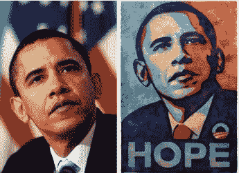

# 美联社声称谢泼德·费尔雷承认撒谎并试图毁灭证据；他的律师退出(更新)

> 原文：<https://web.archive.org/web/https://techcrunch.com/2009/10/16/ap-claims-shepard-fairey-admits-to-lying-and-trying-to-destroy-evidence-his-counsel-quits/>

美联社刚刚发布了一份声明，声称谢泼德·费尔雷(Shepard Fairey)已经“向美联社承认，他捏造并试图销毁其他证据，以支持他的公平使用案例，并掩盖他之前的谎言和疏漏。”谢泼德·费尔雷因其标志性的“希望”海报而被[指控](https://web.archive.org/web/20221005183314/http://www.beta.techcrunch.com/2009/02/05/once-again-the-ap-tries-to-redefine-fair-use-goes-after-shepard-fairey-for-obama-poster/)侵犯版权，该海报在奥巴马竞选期间变得无处不在。

根据这份声明，费尔雷还承认使用了美联社拍摄的奥巴马总统的特写作为他的形象模特，而不是他声称使用的另一张照片，其中也包括乔治·克鲁尼，后来他裁剪了这张照片。声明还说，费尔雷的法律顾问“现在承认，费尔雷试图销毁可能会暴露他实际使用的图像的文件”，并且“他制作了假文件，作为他隐瞒哪张照片是源图像的努力的一部分，包括克鲁尼照片的修改版本的硬拷贝打印件和希望与进步海报的假模板图案。”最后，美联社注意到谢泼德·费尔雷的律师正在退出此案。

值得指出的是，今晚的新闻稿是由 Fairey 在此案中的竞争对手美联社发布的——我们将联系 Fairey，密切关注他的回应。即使这些指控是真的，那也不一定意味着费尔雷的案子已经水落石出，因为他仍然有合理使用辩护。他可能没有把乔治·克鲁尼从照片中去掉，但他很可能在画这张照片时把它变成了一个图标。我们会看到法庭的判决。

同样值得注意的是:谁真正拥有这张照片仍然存在争议。摄影师曼尼·加西亚(Mannie Garcia)声称，他拥有这张照片，因为照片拍摄时他只是一个临时替身，没有和美联社签合同。更多详情，请看我们的帖子[这里](https://web.archive.org/web/20221005183314/http://www.beta.techcrunch.com/2009/02/05/once-again-the-ap-tries-to-redefine-fair-use-goes-after-shepard-fairey-for-obama-poster/)。美联社证实，该图像的所有权仍有争议，声称其拥有版权，加西亚确实是一名受薪雇员。

**更新**:费尔雷已经[给了我们](https://web.archive.org/web/20221005183314/http://www.beta.techcrunch.com/2009/10/16/shepard-fairey-responds-to-the-ap-yes-i-lied-but-it-was-still-fair-use/)他自己的声明，证实了美联社所说的话，尽管该案件将继续进行，费尔雷引用合理使用作为他的辩护。

**更新** : Fairey 的法律顾问发布了一份声明，称他们实际上并没有退出，但是他们会在“适当的时候”退出，他们的决定与案件的“潜在价值”无关。听起来他们仍然想支持公平使用，但鉴于 Fairey 决定销毁/伪造证据，他们不想再与 Fairey 有任何瓜葛。

> 合理使用项目执行董事托尼·法尔宗的声明
> 
> “我们没有退出谢泼德·费尔雷的辩护，他的其他律师也没有退出。我们已经表示打算在适当的时候这样做。律师可能无法继续代理的原因有很多，但在本案中，潜在的优点与此无关。我们一如既往地坚信公平使用和自由表达问题是本案的核心，并相信谢泼德将在这些问题上占上风。我们希望这种不幸的情况不会掩盖这些问题。”

以下是美联社的完整报道:

> 美联社副总裁兼总法律顾问 Srinandan R. Kasi 的声明
> 
> 谢泼德·费尔雷(Shepard Fairey)在针对美联社的公平使用案件中受到了打击，他现在被迫承认，他以虚假的借口起诉了美联社，谎报了他用哪张美联社照片制作了《希望与进步》海报。费尔雷现在也向美联社承认，他捏造并试图销毁其他证据，以支持他的公平使用案例，并掩盖他以前的谎言和疏漏。
> 
> 在他 2009 年 2 月 9 日对美联社的宣告式判决的投诉中，Fairey 错误地声称使用了美联社的乔治·克鲁尼坐在当时的参议员巴拉克·奥巴马旁边的照片作为艺术家的希望和进步海报的来源。然而，正如美联社在 2009 年 3 月 11 日的回应中正确声称的那样，费尔雷使用了同一新闻发布会上奥巴马的特写照片，这与费尔雷的海报完全吻合。在回应中，美联社还正确地推测，Fairey 试图隐藏原始照片的真实身份，以帮助他的案件，辩称他必须对原始照片进行比他实际做的更多的修改，即他至少必须裁剪它。
> 
> 提交投诉后，费尔雷继续发表了几份公开声明，他坚持认为与乔治·克鲁尼的照片是源图像，“美联社显示的照片是错误的。”看来这些陈述也是错误的，就像费尔雷描述他如何从照片中剪去克鲁尼并做出其他改变来创作海报的陈述一样。
> 
> 在美联社花了几个月时间向费尔雷的律师询问有关海报创作的文件，包括费尔雷使用的任何原始图像的副本后，费尔雷关于哪张照片是原始图像的谎言被发现。费尔雷的律师现已承认，费尔雷曾试图销毁那些会暴露他实际使用了哪张照片的文件。费尔雷的律师也承认，他制作了假文件，作为他隐瞒哪张照片是源图像的努力的一部分，包括克鲁尼照片修改版的硬拷贝打印件和希望与进步海报的假模板图案。最近，在 10 月 15 日，费尔雷的律师通知美联社，他们打算寻求法院的许可，以撤回担任费尔雷和他的相关实体的律师。
> 
> 美联社打算大力开展反诉，指控 Fairey 故意侵犯了美联社对时任参议员奥巴马的特写照片的版权，未经许可使用该照片制作了“希望与进步”海报和相关产品，包括带来大量收入的 t 恤和运动衫。据美联社的内部律师劳拉·马龙称，“费尔雷在过去曾许可美联社的照片用于类似用途，在本案中也应该这样做。作为一家非营利新闻机构，美联社依靠许可收入维持业务。过去使用照片所获得的收入将由美联社捐赠给美联社紧急救援基金，该基金用于帮助世界各地遭受自然灾害和冲突的员工及其家人。