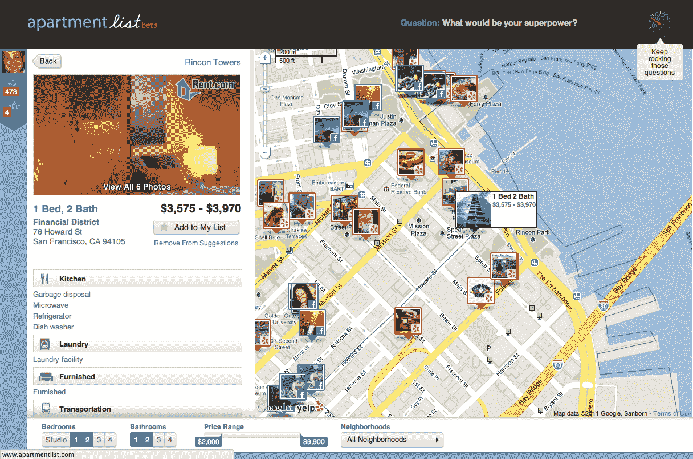

# ApartmentList 推出推荐引擎，为您找到合适的公寓 TechCrunch

> 原文：<https://web.archive.org/web/http://techcrunch.com/2011/09/12/apartmentlist-launches-recommendation-engine-to-match-you-with-the-right-apartment/>

找公寓太糟糕了。这很伤脑筋，很疯狂，搜索者经常发现自己只能满足于更少的搜索。7 月份，我们报道了年轻的 TechStars 毕业生 Nestio 的种子期，该公司允许用户在一个地方保存来自各种网站的公寓列表，并通过共享列表、照片和笔记，在公寓搜索过程中与室友实时协作。TechCrunch Disrupt today 的测试版是另一家年轻的初创公司，旨在改变我们寻找和租赁公寓的方式，使这个过程稍微少一点痛苦——甚至可能是愉快的。

[ApartmentList](https://web.archive.org/web/20230203053226/http://www.apartmentlist.com/#suggestions) 是一个公寓匹配引擎，它使用社交网络及其专有的匹配技术(也称为深度数学)来使公寓搜索成为更个性化的体验。租房者将他们的社交网络连接到创业公司的平台，回答一系列有针对性的问题，然后引擎就可以从数千套公寓列表中筛选出符合个人搜索者需求的，比如网飞和亚马逊。

通过提供公寓推荐和发现引擎，ApartmentList 基本上试图成为公寓搜索的潘多拉——或者在其社交和匹配功能方面，成为公寓搜索的 Match.com。你挑吧。这家初创公司已经增加了一些有趣的顾问和董事会成员，包括 Rent.com 的创始人 Bills.com，以及 StumbleUpon 的董事长等人，以帮助引导它进入一个创新成熟的空间。

简而言之，ApartmentList 提供脸书集成，根据用户及其朋友的活动自动个性化公寓推荐，使用户能够定制他们选择的生活方式。这项服务还会问一些有趣的问题，比如“你最喜欢的生日蛋糕是什么？”以及“你在股市里有钱吗？”创始人兼首席执行官约翰·考布斯(John Kobs)说，尽管它们看起来有点开玩笑，但实际上对完善它所服务的公寓推荐大有帮助。

到目前为止，这家初创公司从超过 100 万套公寓清单(还在增加)中提取信息，它在地图界面上提供这些信息，让用户可以看到公寓周围的兴趣点，如餐厅、购物和公共交通选择，旨在帮助公寓搜索者做出更明智的决定。该引擎还提供一致的列表，以及每个列表中各个城市和社区的编辑内容，以及数以千计的公寓和地点的照片，以便用户可以仔细阅读视觉数据，找到他们选择的公寓。

另一个关键功能是:ApartmentList 提供通过脸书与朋友合作寻找公寓的功能，例如，如果你正在考虑的街道严重缺乏无障碍停车位，同行可以通知你。

随着美国租赁市场的持续增长，世界迫切需要能够提供一致、可信的房源和租赁数据的公寓搜索选项，以及为通常令人头疼的过程增添一些娱乐的服务。ApartmentList 引擎的视觉元素，包括交互式地图和图像以及简单的搜索，为 craiglist 和其他房源的黑白列表添加了急需的改进。

由于许多当代网络企业正在为旧模式的个性化和社交发现构建推荐引擎，公寓租赁应该有自己的推荐引擎是很自然的。就像之前的网飞、潘多拉和亚马逊一样，ApartmentList 的引擎会变得更智能(并提供更好的推荐)，你回答的问题越多，它就越了解你的兴趣和偏好。从测试版发布时的情况来看，ApartmentList 已经提供了一个很好的工具，但如果它希望与这个领域的巨头长期竞争，它还需要继续增加公寓列表的数量。但到目前为止，这家初创公司开局不错。

欲知更多公寓列表，请观看以下视频:

【YouTube = https://www . YouTube . com/watch？v=gSQanbwFPjc]