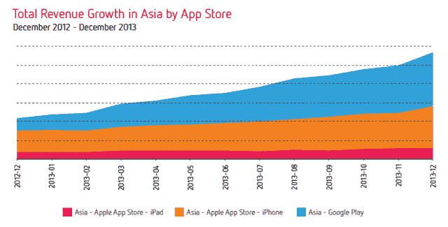
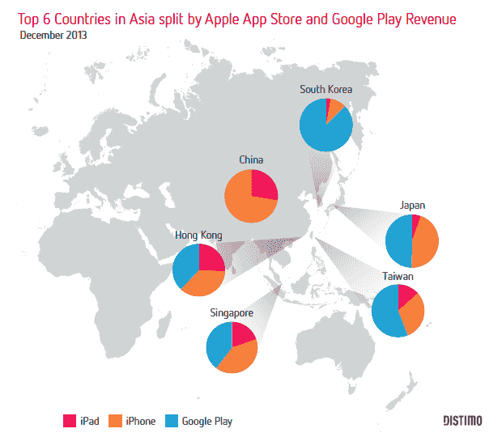
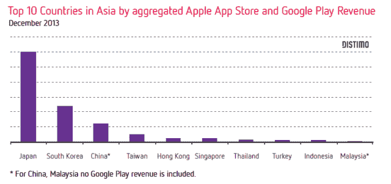

# 在 Google Play TechCrunch 的推动下，2013 年亚洲的应用收入大幅增长了 162%

> 原文：<https://web.archive.org/web/https://techcrunch.com/2014/01/23/app-revenue-in-asia-grew-a-massive-162-in-2013-driven-by-google-play/>

在过去的两年里，亚洲已经成为世界上最大的应用市场，并且还在增长。根据 Distimo 的一份新报告，2013 年亚洲的收入大幅增长了 162%,“抵消”了所有其他大洲的增长。此外，这一增长在很大程度上是由 Google Play 推动的，2013 年来自亚洲的收入增长了四倍多。

相比之下，App Store 在亚洲的增长要慢得多:iPhone 应用的收入增长了 94%，iPad 应用的收入增长了 64%。但这仍然比 App Store 在欧洲或北美的总增长速度要快，如下图所示。

Distimo 在报告中研究了应用商店和 Google Play 的每日下载量。2013 年 12 月，亚洲占全球应用收入的 41%，相比之下，北美和欧洲分别占 31%和 23%。

亚洲整体应用收入现在几乎平均分配给了 Google Play 和苹果应用商店。相比之下，应用商店在北美仍然领先，占应用收入的 75%，Google Play 占剩下的 25%(这一比例在欧洲类似)。

Distimo 分析师 Anne Hezemans 写道:“显然，亚洲与北美和欧洲的情况不同。”

中国的另类安卓应用商店引起了广泛关注，这在一定程度上要归功于互联网巨头百度以 19 亿美元收购 91 无线。但日本仍是亚洲应用开发者最赚钱的国家，其次是韩国和中国。尽管整个非洲大陆，尤其是东南亚的移动渗透率正在迅速上升，但不同地区的应用收入仍存在巨大差距。

海兹曼斯写道:“从亚洲头号国家日本和马来西亚的收入差距来看，日本的收入是马来西亚的 77 倍。”。“亚洲国家之间极不相称的收入份额让我们相信，市场并没有平均分配。”

尽管日本是去年应用收入的领头羊，但韩国的增幅最高。中国的应用收入飙升了 271%。据 Flurry 称，韩国的大部分收入来自 Google Play，这并不奇怪，因为苹果在韩国仅占有 14%的市场份额。

免费增值仍然是亚洲领先的商业模式。在中国，应用程序 96%的收入来自应用内购买，而日本和韩国的这一比例分别为 94%和 91%。相比之下，应用内购买[在美国](https://web.archive.org/web/20221207142706/https://beta.techcrunch.com/2013/03/28/in-app-purchase-revenue-hits-record-high-accounts-for-76-of-u-s-iphone-app-revenue-90-in-asian-markets/)创造了约 76%的收入

和世界其他地方的用户一样，大多数手机用户把他们的应用时间花在玩游戏上。Rovio 的愤怒的小鸟去吧！是去年 12 月亚洲下载量最大的游戏，紧随其后的是中国游戏《极地探险 2》。

在中国，只有 3.5%的设备安装了 Google Play，Distimo 与该国最大的替代安卓应用商店之一[万豆家](https://web.archive.org/web/20221207142706/http://www.wandoujia.com/)合作，从超过 3 亿用户那里获取数据。

根据万豆家的说法，外国开发商的游戏“有很大的机会接触到中国的数百万游戏玩家，”正如《神庙逃亡 2》(Temple Run 2)、《地铁冲浪者》(Subway Surfers)、《愤怒的小鸟》(Angry Birds)和《水果忍者》(Fruit Ninja)等游戏的受欢迎程度所证明的那样，这些游戏去年都在中国的前七名之列。

但本土开发者仍主导着非游戏应用，就像本土软件主导着 PC 互联网一样。

“中国的国内市场如此之大，足以支撑一个完全独立于世界其他地区的生态系统，”该报告称。

事实上，在手机上安装了 Google Play 的 3.5%的中国用户是一个相对国际化的群体。他们购买的应用程序中只有 65%是由本地开发者开发的，相比之下，碗豆家的用户有 87%是由本地开发者开发的。

许多西方游戏制造商最初对打入中国应用市场持怀疑态度，因为盗版和游戏赚钱的困难。但万豆家的数据显示，手机游戏玩家现在更愿意在应用内购买上花钱。从 2013 年 4 月到 11 月，大型多人在线游戏每位付费用户的平均收入增长了 400%，超过了日本(同比增长 282%)和韩国(同比增长 342%)。

“安卓用户对游戏内购买有着强烈的兴趣，打破了中国用户不会花钱购买服务的古老神话，”海兹曼斯写道。

更多数据见[完整报告](https://web.archive.org/web/20221207142706/http://www.distimo.com/report/download-latest)。

[[图片由[新港地理](https://web.archive.org/web/20221207142706/http://www.flickr.com/photos/newportgeographic/3646491813/) ]]