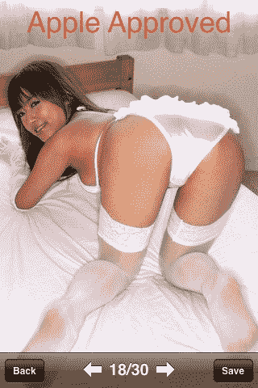
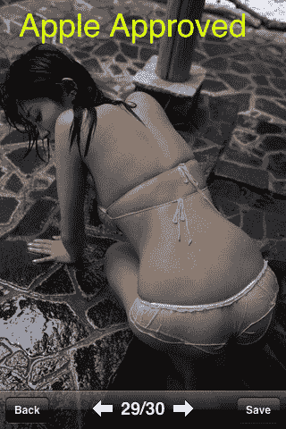

# 应用商店虚伪更新:“亚洲胸部”罚款，最畅销。讽刺类 App，被禁。

> 原文：<https://web.archive.org/web/https://techcrunch.com/2009/10/23/app-store-hypocrisy-update-asian-boobs-fine-top-seller-satirical-app-banned/>

# 应用商店虚伪更新:“亚洲胸部”罚款，最畅销。讽刺类 App，被禁。

还记得吗，本月早些时候，我们写了一篇关于苹果认为符合犹太教规的 [upskirt 应用程序，同时](https://web.archive.org/web/20221225071733/http://techcrunch.com/2009/10/07/satirical-iphone-apps-not-cool-upskirt-iphone-apps-cool/)[禁止一个讽刺性的 Someecards 应用程序](https://web.archive.org/web/20221225071733/http://techcrunch.com/2009/10/07/apple-rejects-someecards-app-for-being-full-of-someecards-content/)出现在 App Store 上？是的，我们可能已经找到了一个更好的例子来说明苹果的滑稽虚伪。

事实是，并不难找到。这款名为“亚洲咪咪”的应用程序目前在应用商店里卖得很好。那是什么呢？好吧，这个名字说明了一切:这是一款以亚洲女性胸部为特色的应用。很多人。超过 2500 个。实际上，你可以把每张照片上的每个乳房的数字翻倍。胸部真大。

对这款售价 0.99 美元的应用的描述也很经典:

> 性感大胸亚洲女生照片，100+图库，2500+照片，定期更新。日本女孩，韩国女孩，中国女孩，台湾女孩，模特，空姐，护士，学校女孩，老师，比基尼女孩，性感女孩等等。

很高兴他们把最重要的“性感女孩”挤在那里。

再次声明:我完全支持苹果在应用商店中允许这样的应用程序，前提是它们被恰当地标注为 17 岁以上(这个就是)。女孩们没有裸体(苹果仍然不允许裸体，除非它[不小心做了](https://web.archive.org/web/20221225071733/http://techcrunch.com/2009/06/24/yep-iporn-is-here-for-the-iphone/))，但是胸部无处不在——屁股和胯部的照片也是。纯粹的 iPhone 乐趣。

问题是苹果拒绝了一些应用程序，比如 Someecards，这些应用程序也被标为 17 岁以上——为了讽刺。苹果似乎不喜欢这个应用程序取笑公众人物，比如罗曼·波兰斯基和是的，希特勒。

可笑的是，upskirt 应用程序和专用于胸部的应用程序都很好，但讽刺却不行。可能大多数的 app 测试者都是脾气暴躁但令人毛骨悚然的老男人，我不知道。

[在这里找到 0.99 美元的亚洲咪咪](https://web.archive.org/web/20221225071733/http://itunes.apple.com/WebObjects/MZStore.woa/wa/viewSoftware?id=324187335&mt=8)。无处可寻。因为苹果用这些[规则](https://web.archive.org/web/20221225071733/http://techcrunch.com/2009/06/29/heres-how-iphone-app-store-ratings-work-hint-they-dont/)很可笑。

 

