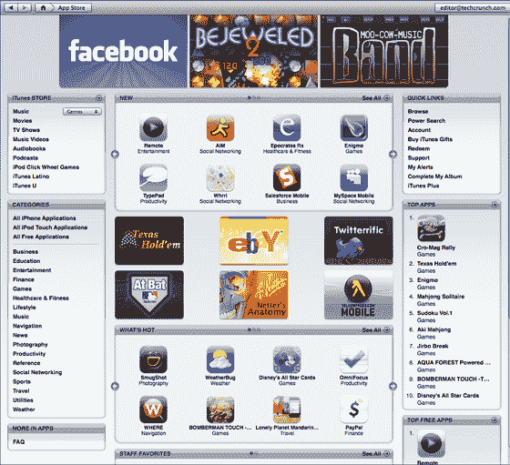
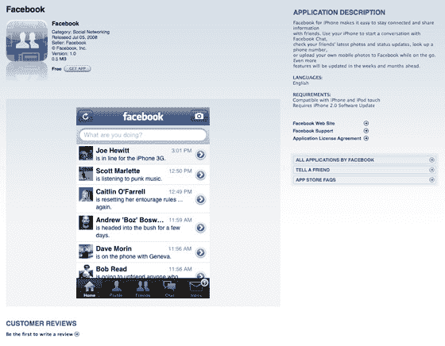
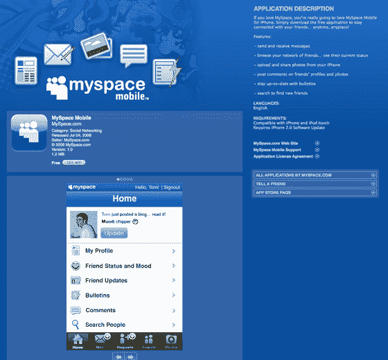
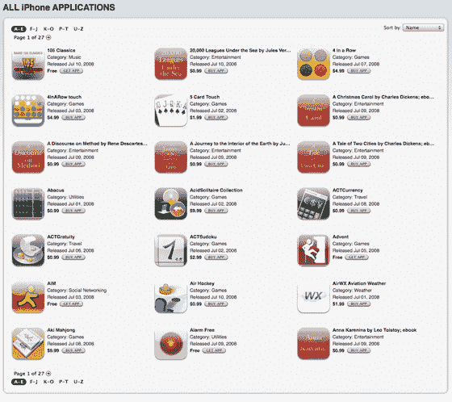

# iPhone App Store 已推出(更新)| TechCrunch

> 原文：<https://web.archive.org/web/https://techcrunch.com/2008/07/10/app-store-launches-upgrade-itunes-now/>

# iPhone 应用商店已推出(更新)

**更新:**[iPhone 2.0 软件现已上市](https://web.archive.org/web/20230323205340/https://techcrunch.com/2008/07/10/ok-iphone-users-we-are-ready-to-roll-with-20/)。
**更新二:** [下载量排名靠前的应用在这里。](https://web.archive.org/web/20230323205340/https://techcrunch.com/2008/07/10/iphone-app-store-the-early-list-of-top-downloads/)

苹果的 iPhone 应用程序商店现已上线，比传闻中太平洋时间上午 9 点发布的[早了几个小时。要访问它，请在这里下载 iTunes 7.7。iTunes 升级后，你可以在这里访问应用商店](https://web.archive.org/web/20230323205340/https://techcrunch.com/2008/07/09/apple-notifies-developers-iphone-app-store-to-launch-thursday-morning/)。

你现在可以在 iTunes 上“获得应用程序”，但你需要 iPhone 2.0 软件才能在 iPhone 上实际使用它们，而 iPhone 2.0 软件目前还不可用。

目前有 27 页的应用程序可用。我们现在已经用更有趣的应用程序更新了我们的目录。乍一看，非英语应用非常少。另一个有趣的趋势——很多书都被列为应用程序，大部分售价 0.99 美元(比如我刚买的《黑暗之心》)。

根据 [Pinch Media](https://web.archive.org/web/20230323205340/http://www.pinchmedia.com/iphone-application-price-distribution/) 的数据，App Store 在发布时有 552 个应用程序。这些应用中有 135 个是免费的，其余 417 个价格从 0.99 美元到 69.99 美元不等，绝大多数在 0.99 美元到 9.99 美元之间。

有些人说，即使下载了 iTunes 的 7.7 版并点击上面的链接，他们也看不到应用商店。如果你不能亲自访问，这是我在商店拍摄的 qik 视频:

[http://qik.com/player2.swf?stream name = 74 fac 02 a 773 C4 b5 c 99 af 8 a 8 db df 24 cf 8&vid = 125826&playback = false&polling = false&user = TechCrunch&display name = TechCrunch&safe link = TechCrunch&user lock = true&is live =&username = anonymous](https://web.archive.org/web/20230323205340/http://qik.com/player2.swf?streamname=74fac02a773c4b5c99af8a8dbdf24cf8&vid=125826&playback=false&polling=false&user=techcrunch&displayname=TechCrunch&safelink=techcrunch&userlock=true&islive=&username=anonymous)

以下是 iTunes 上脸书和 MySpace 应用程序的屏幕截图，以及其中一个目录页面:

