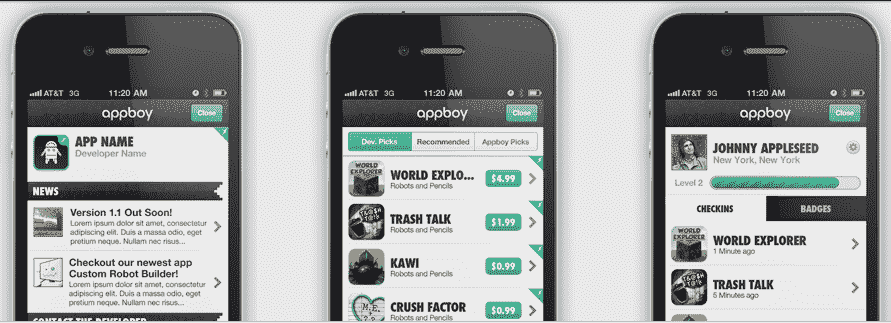

# AppBoy 筹集了 100 万美元，让应用开发者更好地参与和了解他们的用户群 

> 原文：<https://web.archive.org/web/https://techcrunch.com/2011/11/23/appboy-raises-a-cool-million-to-let-app-developers-better-engage-and-understand-their-user-base/>

除了开发出色的应用程序，应用程序开发人员的主要关注点是找到真正有效的方法来利用这些应用程序赚钱，无论是通过有针对性的定位广告解决方案、游戏内购买还是激励性下载。随着免费增值模式的激增，这种东西变得越来越重要。另一个难题是帮助应用程序创建者管理和了解他们的用户群，因为有了关于谁在使用应用程序、他们在哪里、他们如何使用应用程序等更精细的图片，开发人员可以设计更好的用户体验，进而打开新的赚钱机会。

为开发者提供免费移动软件开发工具包(SDK)的初创公司 Appboy 正试图这么做。简单地说，AppBoy 希望让应用开发者能够扩大、参与并更好地了解他们的用户群。为了帮助完成这一使命，这家初创公司今天宣布，它已经筹集了 100 万美元的种子资金。投资由[布隆伯格资本](https://web.archive.org/web/20221007191549/http://www.crunchbase.com/financial-organization/blumberg-capital)领投，参与方有[变质风险投资](https://web.archive.org/web/20221007191549/http://metamorphic.vc/)、[加速器风险投资](https://web.archive.org/web/20221007191549/http://www.acceleratorventures.com/)、[牛棚资本](https://web.archive.org/web/20221007191549/http://bullpencap.com/)和 [T5 资本](https://web.archive.org/web/20221007191549/http://www.triplefive.com/en/pages/venture-capital)。

直到最近，AppBoy 团队一直由创始人兼首席执行官 Mark Ghermezian 组成，但随着新一轮资金的到来，团队已经扩大到七人，包括两名新的技术联合创始人 Bill Magnuson 和 Jon Hyman，他们在 2011 年纽约市 Disrupt Hackathon 上因 Gilt-ii 获得最高奖项后不久加入 AppBoy，Gilt-ii 是一个浏览器书签工具，允许用户围绕 Gilt 销售创建拍卖。有了资金保障，这家初创公司现在正在对其解决方案进行测试。目前，它纯粹是 iOS，但 Ghermezian 表示，Android 集成正在进行中。

当然，这一切都很好，但 AppBoy 到底打算如何改善应用程序的发现，提高用户智能，并鼓励参与？在实践中，AppBoy 覆盖在开发人员的应用程序上，这样他们就不必离开他们的应用程序来访问它的功能。从那里，该解决方案允许开发人员为他们的个人应用程序创建档案，交叉推广他们的应用程序，并通过新闻和警报更新用户，并使游戏机制能够实现状态级别和徽章，以提高参与度和奖励使用。

AppBoy 然后允许应用程序用户自己创建个人资料，以及获得徽章和签入应用程序的能力，所有这些开发者都可以从应用程序或 AppBoy 的开发者仪表板轻松跟踪。从那里，开发者可以控制新闻和推荐的应用程序，在不久的将来，将能够使用基于网络的后端来查看分析并与他们的用户交流，通过 CRM 工具接收反馈等。

对于应用程序发现，消费者有很多方法来发现新的应用程序，从 Chomp 到 Stamped 这样的新应用程序，但目前大多数解决方案都专注于根据用户的下载历史向他们提供推荐。AppBoy 希望为开发者提供一个基于实际使用情况的解决方案——让用户可以轻松地在应用程序中建立丰富的档案。AppBoy 希望首先与开发者合作，首先在应用程序制造商中创建一个强大的生态系统，然后再瞄准最终用户，简单地成为另一个应用程序搜索引擎。

这个想法是能够将用户细分到特定的细分市场，看到一个来自艾伯塔省的 21 岁男性正在使用这个应用程序，每天花 20 分钟在这个应用程序上，有 5 个徽章。有了 AppBoy，这些徽章就变成了 URL，然后可以被跟踪，所以通过一个简单的覆盖和签入系统，这家初创公司正试图建立一个解决方案，让跟踪使用变得轻而易举。如果用户在社交网络上分享应用，AppBoy 也有一个唯一的分享网址，目的也是为了更容易追踪。

对于希望尽早接触 AppBoy 以进行测试并提供反馈的读者来说，这家初创公司提供了 50 个免费邀请。要利用这一点，只需点击进入 AppBoy 的主页，在“邀请代码”框中使用“techcrunch”即可。然后在这里插话，让我们知道你的想法。

