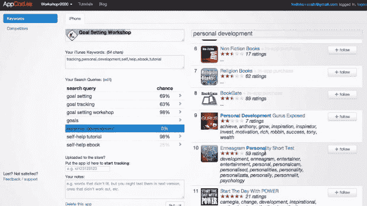
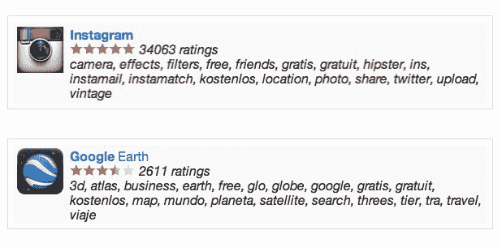

# AppCod.es 推出应用商店预测工具，告诉开发者哪些关键词有效 

> 原文：<https://web.archive.org/web/https://techcrunch.com/2012/03/12/appcod-es-launches-app-store-prediction-tool-tells-developers-which-keywords-work/>

总部位于华沙的三人初创公司 [AppCod.es](https://web.archive.org/web/20221207000737/http://www.appcod.es/) 刚刚发布了新的[工具](https://web.archive.org/web/20221207000737/http://www.appcod.es/register)，将吸引移动应用程序开发者，这两家公司都致力于帮助开发者实现更好的 ASO，即应用程序商店优化。ASO 基本上是一种新形式的 SEO，但它不是提高搜索引擎的排名，而是提高你的移动应用在 iTunes、Android Market(我指的是 Google Play……*叹气*)或另一个应用商店的排名。

今天 AppCod.es 在 iTunes 中推出了 ASO 的两个实用工具:一个是关键字预测工具，旨在猜测你的应用程序的竞争对手使用的关键字，另一个是预测你在给定关键字的应用程序商店中的位置的工具。

AppCod.es 联合创始人 Tomasz Kolinko 解释说:“传统上，开发者必须向应用商店提交一组新的关键词，然后他或她必须等待一周才能获得批准。”"一天左右之后，他将会看到他的 ASO 行动是否奏效."

使用新的预测工具，目标是在几秒钟内提供类似的分析，而不是一周。

当然，这种工具还是非常新的，但是 Kolinko 说，在测试中，结果是有希望的。要使用这项服务，开发者需要输入应用的名称和他们的 iTunes 关键词，结果会显示使用给定组合进入应用搜索结果首页的几率。

在一个视频中(见下文)，该公司使用一个名为“目标设定研讨会”的应用程序演示了这一点当他们尝试不同的名字和关键词时，进入热门搜索结果的几率会实时更新。

[工具](https://web.archive.org/web/20221207000737/http://www.appcod.es/register)不是基于苹果提供的公开数据构建的，因为这样的东西是不可用的。相反，它是基于 AppCod.es 自己对 app store 查询和行为的观察和分析。该公司开发了一些算法，试图对苹果自己的加权机制进行逆向工程，其中的一般原理已经为人所知。

Kolinko 解释说:“在名称、开发者名称或应用内购买名称中包含搜索查询的应用程序会获得更多的权重分数，而在关键字中包含搜索查询的应用程序会获得更少的分数。然后，会给与搜索查询完全匹配的应用程序一个特殊的偏好，给那些下载量高的应用程序一些偏好，”他说。

当然，细节决定成败。为了确定它是如何工作的，该团队分析了与他们自己的应用程序、他们对关键词的知识以及竞争对手的关键词相关的数据，然后试图猜测准确的权重函数。

“我们没有做到 100%正确，因为我们没有苹果拥有的所有数据，但它或多或少是正确的，”Kolinko 谈到该实用程序。

即使它是一个漫无目的的产品(这需要更多的开发人员进行测试才能确定)，它也是对许多开发人员现在使用的 ASO 技术的改进——也就是说，没有改进。

今天还有一个新的工具，作为一个关键字预测工具。这个旨在帮助开发者找出他们的竞争对手可能使用的关键词。

例如，该工具可以告诉你，像 Instagram 这样的东西使用“相机、效果、滤镜、免费、照片、分享、复古和潮人”等关键词。(还有，LOL 在《潮人》。).了解竞争对手在 App Store 中的定位是了解你应该选择或避免哪些关键词的第一步。

【T2

Kolinko 表示，该公司有一个包含 45 万个 iOS 应用程序和 15 万个关键词的数据库，很容易检查它们是否是正确的。“例如，根据我们的数据库，对于应用程序‘愤怒的小鸟’，其中一个关键词是‘弹弓’。”“如果你进入美国应用商店，输入搜索‘愤怒的小鸟弹弓’，你会找到应用程序愤怒的小鸟，”他解释道。这只有当愤怒的小鸟真的“弹弓”了他们的列表时才会发生。"

然而，他指出，苹果也使用近似匹配，所以在某些情况下，AppCod.es 猜测是单词的近似匹配。这意味着一个使用“免费”的应用程序，例如，可能会出现“gratii”、“gratuit”、“gristics”和其他拼写错误。

AppCod.es 承认，在网站设计质量方面，他们有点落后，尤其是与 MobileDevHQ(通过 AppStoreHQ)提供的更专业的产品相比。上个月 *我们报道了 MobileDevHQ 的 ASO 工具[。(是的，AppCod.es 劫持了评论区，链接到他们自己的产品。但这次没关系——这个市场需要更多关注。)](https://web.archive.org/web/20221207000737/https://beta.techcrunch.com/2012/02/28/aso-app-store-optimization-is-the-new-seo-and-heres-a-tool-to-do-it/)*

目前，像这样的工具相对容易建立，因为只有少数几个参数用于对应用结果进行排名，不像谷歌及其数以千计的信号用于对网页进行排名。然而，随着时间的推移，尤其是在[团队](https://web.archive.org/web/20221207000737/https://beta.techcrunch.com/2012/02/23/apple-chomp/)参与搜索改进之后，ASO 将变得更加复杂。

AppCod.es 工具集是一项付费服务(每月 15 美元)，仅适用于美国 iTunes 应用商店。然而，TechCrunch 的读者可以[使用代码**TC1**来获得他们的第一个月，只需一美元。而前 50 个注册 **TCFREE** 的账号将免费获得服务。](https://web.archive.org/web/20221207000737/http://www.appcod.es/register)

【YouTube = http://www . YouTube . com/watch？v=jDfy4p6oGI8&w=640&h=360]