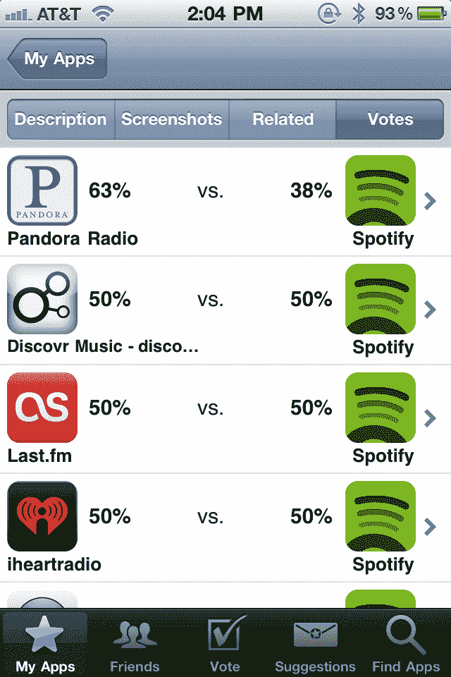
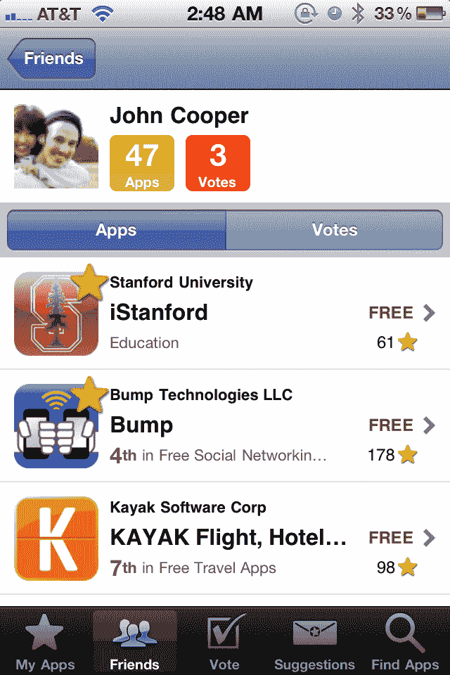

# AppGrooves:应用推荐引擎结合了社交和“热门与否”功能 TechCrunch

> 原文：<https://web.archive.org/web/http://techcrunch.com/2011/08/04/appgrooves-app-recommendation-engine-combines-social-with-hot-or-not-feature/>

# AppGrooves:应用推荐引擎结合了社交和“热门与否”功能

推出的移动应用越多，用户的发现问题就越大:例如，苹果最近[宣布](https://web.archive.org/web/20230204183149/https://techcrunch.com/2011/07/07/apples-app-store-crosses-15b-app-downloads-adds-1b-downloads-in-past-month/)他们在 App Store 中有 425，000 个应用。排名、平台提供商的推荐或搜索经常带来令人不满意的结果——一款名为[app grooves](https://web.archive.org/web/20230204183149/http://appgrooves.com/)[iTunes](https://web.archive.org/web/20230204183149/http://itunes.apple.com/us/app/id423085882?mt=8)上免费的 2.0 版本】的应用现在试图解决这一问题。

已经有相当多的推荐引擎出现了(即 [Chomp](https://web.archive.org/web/20230204183149/http://chomp.com/) 或 [Frenzapp](https://web.archive.org/web/20230204183149/http://www.frenzapp.com/) )，但 AppGrooves 走了一个不同的方向:其想法是将专有的推荐算法与“热门与否”功能和社交元素相结合，以发现未知的酷 iOS 应用。

它的工作方式是 AppGrooves 首先检测你在设备上安装了什么类型的应用。为了找到符合你口味的新应用，AppGrooves 会让你从你设备上的应用列表中以“热门与否”的方式(即“你更喜欢 Pandora 还是 Spotify？”).

 

有趣的是，AppGrooves 还允许你让你的脸书朋友对应用进行投票:在对两个应用进行投票后，你不仅可以分享你的决定，还可以问你的脸书朋友在特定情况下他们会选择哪个应用。AppGrooves 还收集所有使用该应用程序的朋友的投票，并积累这些社交投票，以便随着时间的推移产生更多个性化的推荐(你可以随时从 AppGrooves 内访问此社交热门列表)。如果你不喜欢社交，你也可以使用应用程序的搜索功能，从相似的用户那里找到相似描述的应用程序。

 

AppGrooves 是 2011 年夏季加速器计划的 [500 家创业公司](https://web.archive.org/web/20230204183149/http://www.500startups.com/) [之一。它的联合创始人(日本籍)柴田直树博士已经辞去了东京大学、斯坦福大学和日本最大的电子商务公司](https://web.archive.org/web/20230204183149/https://techcrunch.com/2011/06/09/500-startups-unveils-its-2nd-batch-from-foodspotting-for-fashion-to-iron-chef-in-your-livingroom/)乐天[的职务，搬到了硅谷。](https://web.archive.org/web/20230204183149/http://global.rakuten.com/en/)

柴田的目标是从第一天起就让他的公司全球化，他的计划显然正在发挥作用:AppGrooves 刚刚从美国和日本的一些知名人士那里获得了 36 万美元的天使轮投资，其中包括 500 家初创公司、[陈俊澎](https://web.archive.org/web/20230204183149/http://www.crunchbase.com/person/richard-chen-3)(angel pad 的创始合伙人)、Mochio Umeda([MUSE Associates](https://web.archive.org/web/20230204183149/http://www.museassoc.com/en/)的总裁)、乔雄·小泽和[宫泽将军](https://web.archive.org/web/20230204183149/http://www.crunchbase.com/person/gen-miyazawa)(两位日本天使投资人)。