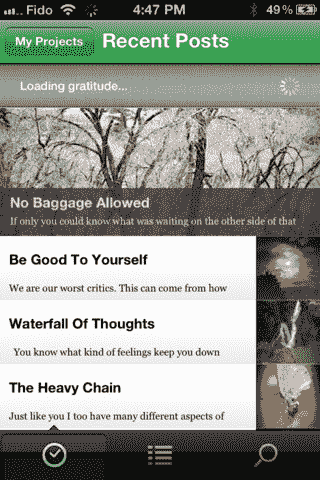

# Appifier 推出新服务，将 WordPress 网站转变为移动应用 TechCrunch

> 原文：<https://web.archive.org/web/https://techcrunch.com/2012/01/11/appifier-launches-new-service-that-turns-wordpress-sites-into-mobile-apps/>

Appifier 是一项新服务，之前处于测试阶段，将 WordPress 网站转变为移动应用。请注意，这不是移动*网站*，而是真实的移动*应用*，拥有推送通知、离线访问、Twitter 和脸书共享，以及原生的外观、感觉和速度。

与许多 DIY 应用程序创建者(确实有很多)不同，Appifier 没有提供免费增值服务。你可以免费测试你的应用，但如果你想在应用商店发布，就需要付费。

对于非编码人员/开发人员来说，[费用](https://web.archive.org/web/20221007020041/http://theappifier.com/pricing/)是合理的。你可以每月支付 39.99 美元，也可以硬着头皮支付 499.99 美元的“终身”费用。这些计划包括当天 iTunes 应用商店提交，无限推送通知，社交媒体共享功能，定制设计和品牌，以及分析。

联合创始人[迈克·戈佐](https://web.archive.org/web/20221007020041/http://ca.linkedin.com/in/mgozzo)(在他蒙特利尔的家庭办公室)说，他和另一位联合创始人[史蒂夫·帕内塔](https://web.archive.org/web/20221007020041/http://ca.linkedin.com/pub/stephen-panetta/3/656/681)认为他们有独特之处，因为其他 WordPress 应用程序开发者不帮助你进入应用程序商店和/或不创建本地应用程序。例如，想想[WP touch](https://web.archive.org/web/20221007020041/http://wordpress.org/extend/plugins/wptouch/)——非常流行的 WordPress 插件，用于将 WordPress 网站转变为移动网站。或者另一个众所周知的选择 [Weever Apps](https://web.archive.org/web/20221007020041/http://weeverapps.com/) 。但是，Gozzo 说，设计师不能将这些作品作为移动应用程序转售。因此，我们的目标是创造一种服务，他们——或者任何人——都可以用它来构建一些更加优雅和打包的东西。

虽然 Appifier 确实可能在 WordPress-to-app builder 人群中脱颖而出，但它不仅仅是在与他们竞争——它是在与所有移动应用开发者竞争。外面有很多这样的人。我的意思是，很多。一年前，我开始制作[电子表格](https://web.archive.org/web/20221007020041/https://docs.google.com/spreadsheet/ccc?key=0AtROtg3duDfzdFpxd29pVlRfVUtEQS1ZNzhIRy1raUE)(谷歌文档链接——不，你不能编辑它),来跟踪我能找到的所有服务，但不得不在 55 左右停止。那是一个拥挤的市场。但是移动应用生态系统也非常大，而且[还在增长。](https://web.archive.org/web/20221007020041/https://beta.techcrunch.com/2011/12/23/flurry-largest-addressable-markets-for-mobile-developers-in-2012-include-india-china-japan-u-s/)

Appifier 至少专注于一个非常受欢迎的垂直领域:WordPress 和非开发者。此外，应用程序的构建过程很短:该公司声称只需 60 秒。(见下面视频)。

虽然 iTunes 应用商店中还没有应用程序(这项服务今天推出)，但我可以测试一下 [Appifier 沙箱](https://web.archive.org/web/20221007020041/http://itunes.apple.com/app/appifier-sandbox/id492136954?mt=8)中的一些应用程序。这也是潜在客户在购买前会尝试的地方。应用程序在沙盒中的运行速度比它们在本地运行的速度要慢一些，但是你应该明白这一点。

这些应用程序很简单，有帖子、类别和搜索按钮，但由于支持图像、主题和其他定制，它们比 WPTouch 网站漂亮得多。(它也支持广告，如果你一定要的话)。Appifier 将很快升级这些定制选项，以便让设计师对 UI(用户界面)有更多的控制。所有现有用户都将免费升级。

因为这些应用是原生的，所以计划在下一次更新中增加对更多原生功能的支持，例如地理定位和文本到语音转换。

如果你想亲自试用 Appifier，你可以从这里[免费试用。](https://web.archive.org/web/20221007020041/http://theappifier.com/)

[YouTube http://www.youtube.com/watch?v=QkwDDB0I5_g]