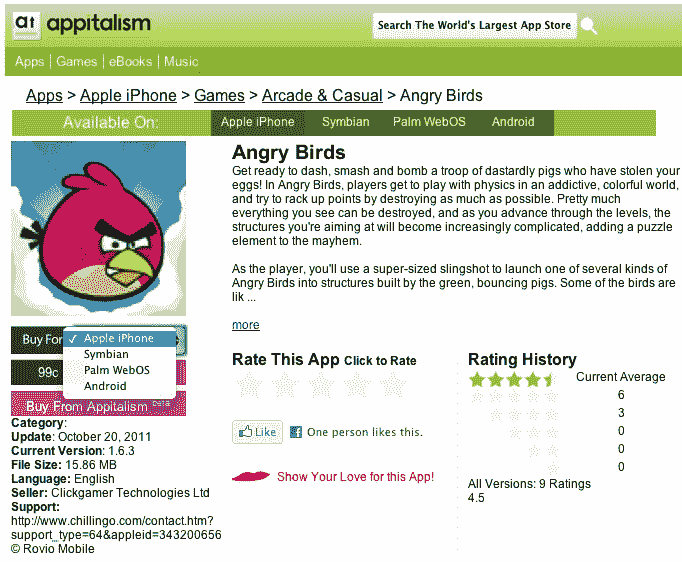
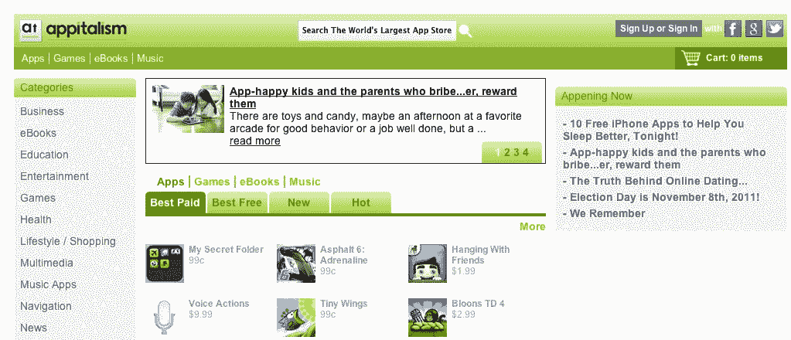

# Appitalism:一个干净明亮的应用场所 

> 原文：<https://web.archive.org/web/http://techcrunch.com/2011/11/10/appitalism-a-clean-well-lighted-place-for-apps/>

# Appitalism:一个干净明亮的应用场所

在美国这个古老的地方，我们很幸运。应用商店几乎是铁板一块，除了一些零星的散兵游勇，实际上只有一个地方可以找到每个平台的应用。然而，如果您的国家不支持某个应用程序商店，或者如果您想将您的朋友发送到某个应用程序，而知道他们每个人都有不同的手机，该怎么办？这就是意大利主义的用武之地。

由 ringtones.com[的创始人西蒙·白金汉创建的 Appitalism 是一个一站式应用商店。该系统允许你在一个地方购买每个主要平台的应用程序。例如，你可以为几乎任何手机购买愤怒的小鸟，包括 Symbian，WebOS 和 Android。该系统无缝地将您的订单提交到相关的官方应用商店，并在适用的情况下提供一个文件供侧装。](https://web.archive.org/web/20230203070842/http://ringtones.info/?sov=124044)

该服务还为新用户提供折扣，包括 50 美分的注册费用和几美元的连接脸书和 Twitter 流的费用，实际上允许你在登录时获得一些免费的应用程序。

虽然这在一个复杂的市场中似乎毫无用处，但对开发者和营销人员来说绝对是有帮助的。例如，该服务提供了一个链接缩短器，可以将你带到应用程序的单个页面，允许用户选择移植的应用程序，同时减少他们必须滚动才能找到正确应用程序的链接数量。Appitalism 也是许多国家的默认应用程序商店，他们的 Wings 程序允许开发者选择他们的应用程序将出现在哪里，包括世界各地运营商的商店。在中国这样的国家，大约有 70 个不同的应用商店，这无疑有助于减少混乱。

这项服务现已在 50 多个国家推出，几乎可以在任何手机上使用。还有一个脸书的“应用程序”,它重现了常规网站的大部分功能，但允许你与朋友分享喜欢的应用程序。

该公司是数字内容零售商 [Mobile Streams](https://web.archive.org/web/20230203070842/http://www.mobilestreams.com/) 的子公司。

【T2