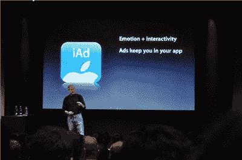

# 苹果发布 iAd 移动广告平台

> 原文：<https://web.archive.org/web/https://techcrunch.com/2010/04/08/apple-announces-iad-mobile-advertising-platform/>

今天，在 iPhone 4.0 开发者预览会上，史蒂夫·乔布斯宣布了苹果备受期待的移动广告平台 iAd。自从苹果[收购了](https://web.archive.org/web/20230316062325/https://techcrunch.com/2010/01/04/apple-acquires-quattro-wireless/)移动广告平台 Quattro Wireless，在 AdMob [被谷歌抢走](https://web.archive.org/web/20230316062325/https://techcrunch.com/2009/11/09/google-acquires-admob/)之后，这就在预料之中了(尽管联邦贸易委员会可能[建议](https://web.archive.org/web/20230316062325/https://techcrunch.com/2010/04/07/reuters-ftc-lawyers-to-recommend-blocking-google-admob-deal/)阻止该交易)。

苹果将销售和托管广告，将 60%的广告收入返还给开发者，乔布斯说开发者可以“在一个下午”将广告添加到他们的应用程序中。不像大多数移动广告，将用户踢出他们当前使用的应用程序，iAd 将用户留在同一个应用程序中。在展示一个广告时，乔布斯对 Flash 进行了抨击，他说:“哦，顺便说一下，所有这些都是在 HTML 5 中完成的。”

乔布斯在演示中展示的第一个广告是《玩具总动员 3》。它以 HTML 5 呈现，完全交互式，看起来类似于一个原生应用程序——它实际上集成了一个游戏。乔布斯说，“这是一种新型的移动广告。你见过这样的手机广告吗？有什么线索吗？"

第二，乔布斯展示了一个耐克的广告，展示了耐克广告的历史，并允许用户实际浏览该品牌鞋子的历史。Ads 将访问许多与“普通”本地应用相同的 APIs 它们将能够使用定位服务和加速度计。位置尤其重要——这将是超本地广告的福音(前提是苹果为本地企业提供一个在系统中获取广告的好方法)。

听起来，苹果不会对谁可以开发应用程序有太多限制:广告代理商将能够开发这些互动广告，应用程序开发商也是如此。尽管我认为他们必须经历一个类似于应用商店里的本地应用的审查过程。**更新:**在一次问答中&苹果公司表示将使用“轻触”方式，显然有些广告他们不想展示，就像电视网不想展示某些广告一样。

这个新平台的明显后果是，来自其他广告网络的广告很可能成为二等公民，也许不仅仅是从苹果的角度，而是从功能的角度来看。细节仍然很少，但如果 iAds 是 iPhone 上唯一可以访问 iPhone API 的广告，那么来自第三方网络的广告可能交互性较差，可能无法有效地确定用户的位置。假设开发者接受 iAds，iPhone 继续保持强劲增长，这可能会对谷歌未来的移动广告工作产生重大影响。

以下是乔布斯对发布会的看法(我们更新了我们的[现场笔记](https://web.archive.org/web/20230316062325/http://www.mobilecrunch.com/2010/04/08/apple-iphone-os-4-live-blog/)，其中一些可能是转述的):

> “(免费应用的)开发者需要找到开始赚钱的方法。许多开发商转向广告——我们认为目前的广告真的很烂。”
> “如果你在手机上看广告，它不像在桌面上。在桌面上，它是关于搜索的。在手机上，搜索还没有出现。人们不会在手机上搜索。人们花时间在应用程序上”
> 
> 普通用户每天花 30 分钟在应用上。如果我们每 3 分钟添加一次，那就是每天 10 个广告。
> 
> 在整个 iPhone 社区，每天有 10 亿次广告展示
> 
> 我们都见过网络上的互动广告。我们希望传递互动，也传递情感。
> “如果你现在点击添加，你会被拉出你的应用程序。因此，人们不会点击广告。”
> 
> “我们已经知道如何在不离开应用程序的情况下制作互动和视频内容”
> 
> 苹果将销售和托管广告，并将广告收入的 60%给开发者

