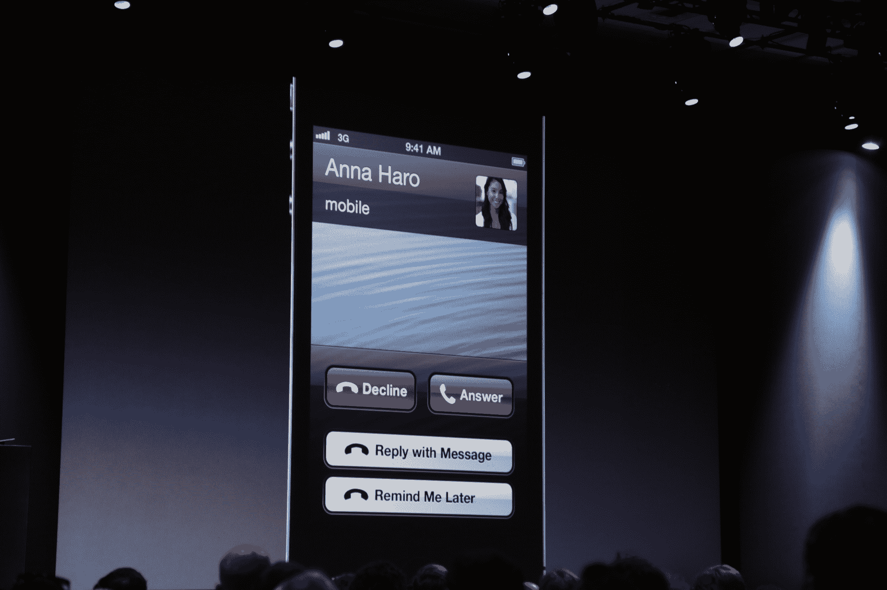
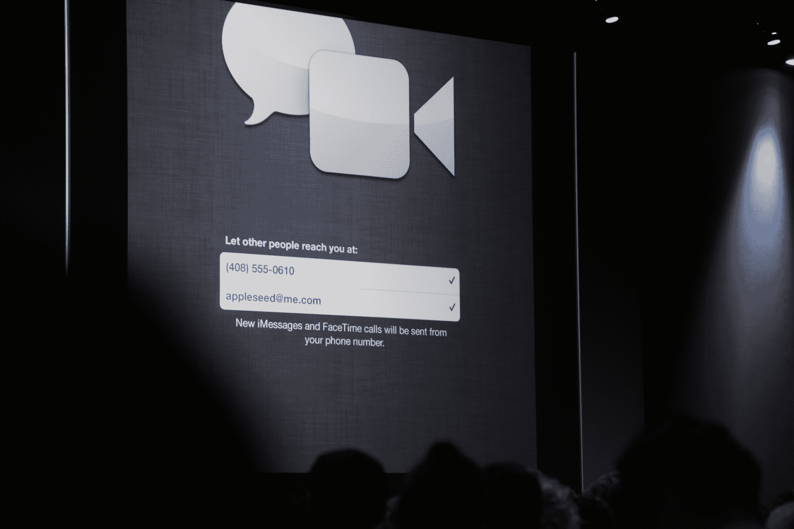
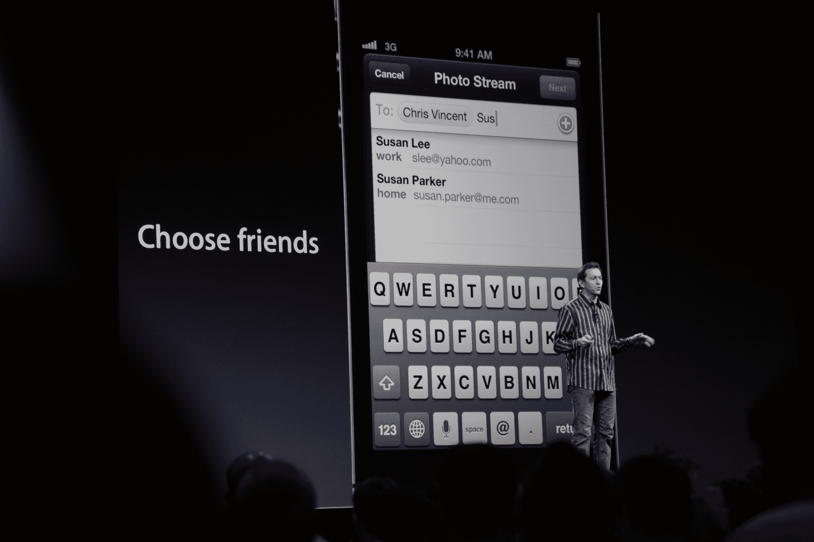
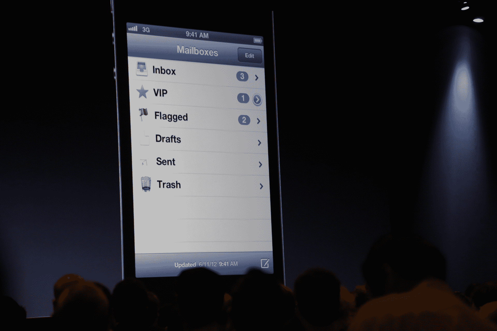

# 苹果将于今秋推出 iOS 6 

> 原文：<https://web.archive.org/web/https://techcrunch.com/2012/06/11/apple-announces-ios-6-wwdc/>

今天在[苹果的 WWDC 主题演讲](https://web.archive.org/web/20230207164321/https://techcrunch.com/tag/wwdc)上，毫无疑问，宣布的最令人兴奋的产品必须更新和补充移动操作系统。iOS 6 的日子即将到来，苹果推出的 200 项新功能足以让任何粉丝垂涎三尺。

到目前为止，我们已经吞下了一个[丰盛的谣言炖肉](https://web.archive.org/web/20230207164321/https://techcrunch.com/2012/06/10/wwdc-ios-6-rumors-what-to-expect-reject-and-wish-for/)，完整的可信来源声明，泄露的测试版网站，谣言，和纯粹的猜测。我们拥有超出预期的苹果地图、iCloud 功能和脸书集成，但谣言工厂让我们走得更远，希望有 Siri APIs、适用于 iPad 的 Siri，甚至更深层次的定制，以及与 Windows Phone 的 metro UI 中的 live tiles 类似的 live 应用程序。

那么哪些梦想实现了，哪些会留给软件的后代呢？

休息过后，我会及时更新，所以请务必点击“刷新”。

#### Siri 的新功能:

*   Siri 从雅虎获取体育信息，让你获得游戏更新。
*   运动包括足球、棒球、篮球，可能还有更多。那些是体育示范。
*   Siri 在餐厅/Yelp 整合方面也做得更好，提供了每个菜单项的平均价格、评论和 Yelp 评级。
*   Siri 还与 Open Table 合作，提供了一个预订标签，带你进入 Open Table 应用程序。
*   Siri 还与烂番茄合作观看预告片等。
*   你可以问“斯嘉丽·约翰逊的电影”或“在赫普 HERP 剧院上映的电影”。
*   我们期待已久的时刻到了:Siri 可以启动应用程序了。简单说一句“玩神庙逃亡。”
*   Siri 还可以让你通过语音发微博。
*   Siri 可能被很好地包装在一些汽车方向盘上的按钮里。品牌包括宝马、通用、路虎、奥迪和本田等等。
*   Siri 现在有英语、法语和德语版本。接下来将推出日语，西班牙语、意大利语、韩语、普通话和粤语紧随其后。

一些想法:Siri 正在开发其他应用程序，并且与 Twitter 配合得如此好，这一事实让我们相信 Siri APIs 已经不远了，即使苹果今天没有宣布它们。这显然是我们前进的方向。

#### 用于 iPad 的 Siri:

【T2

*   Siri 现在可以在 iPad 上使用了。
*   按住 iPad 上的主屏幕按钮可以访问 Siri。
*   Siri 只占了屏幕下半部分的一小部分，弹出来的是圆角，和 iPhone 版本一样的蓝色亚麻表面。

一些想法:我们一直都知道 Siri 会走向 iPad。我们只是不知道是什么时候。但是，唉，就是今天了。不幸的是，大多数用户[称【Siri 的主要任务是打电话或设置提醒。应该在 iPad 上派上用场的电子邮件似乎分成了两半，大约四分之一的用户说他们每天用 Siri 发邮件，另外 30%的用户说他们根本不用 Siri 发邮件。也就是说，观察人们如何在平板电脑上而不是手机上使用 Siri 应该会很有趣。](https://web.archive.org/web/20230207164321/http://blogs.wsj.com/digits/2012/03/26/apple%E2%80%99s-siri-gains-traction-for-some-things/)

#### 脸书集成:

*   脸书现在是 iOS 的一部分
*   只需通过设置登录一次，一切都设置好了
*   您可以共享照片、链接、地图、iTunes 链接和 Game Center 内容。
*   也许和回复的脸书事件会自动添加到日历中
*   生日也是。
*   电话号码将出现在联系人列表中。

一些想法:脸书和苹果一直保持着愉快的关系。但随着蒂姆·库克(Tim Cook)今年在 D10 的精彩演出《敬请期待》(stay tuned)，我们对这两家公司的联姻寄予了更高的期望。

考虑到将 Twitter 融入 iOS 5 [(注册人数是 iOS 5 的三倍)](https://web.archive.org/web/20230207164321/http://www.readwriteweb.com/archives/thanks_to_ios_5_twitter_has_tripled_its_daily_sign.php)是有益的，脸书肯定会享受其中的乐趣。

此外，脸书将不必在脸书应用上花费太多的时间、精力或资源，因为应用和操作系统的使用将会慢慢分开。为所有人赢得胜利。

#### 新手机应用程序:

【T2

*   该应用程序会设置提醒，如果你不想在别人打电话时接听，就给他们回电话。
*   你可以选择发信息而不是接电话。
*   地理围栏功能允许您在离开某个区域时被提醒给某人打电话。
*   免打扰功能:让你告诉你的手机不要打扰你的提醒或徽章。消息可以通过，但没有与之对应的警报。
*   有点像邮件 VIP，免打扰功能让您在免打扰模式下指定某些联系人通过。
*   在紧急情况下，连续两个电话将被接通。

#### 无线 FaceTime:

*   FaceTime 长期以来一直是只有 WiFi 的体验，但 iOS 6 将其带到了无线状态。
*   你将有一个统一的电话号码和苹果 ID，以及信息。
*   尚不清楚这项服务是否将适用于所有运营商。

#### Safari/iCloud 标签页:

*   iCloud 标签页只能在 Safari 中使用。(咄。)
*   该功能不会始终自动同步浏览器选项卡。相反，它提供了一个在所有设备上同步打开的标签列表。
*   该功能是 OS X Mountain Lion 和 iOS 6 独有的。
*   iOS 中的 Safari 会增加离线阅读列表。
*   你可以直接从 Safari 上传照片。
*   智能应用横幅会让人们知道你在应用商店的原生应用。

#### 照片流:

*   分享的照片流:“选择你想要分享的照片，选择你想要分享的朋友，然后你就大功告成了。”
*   注释是内置的。
*   可在 Mac、Apple TV 上使用，也可通过网络使用。

#### 邮件贵宾:

*   该功能本质上为您提供了一种方法，让您可以将联系最频繁的电子邮件联系人或“非常重要的人物”列为“明星”
*   您可以从“撰写”栏插入照片或视频。
*   重要邮件不会被放在最前面，而是按照时间顺序排列在收件箱的其他内容中。
*   邮件 VIP 将被钩入 iCloud，这意味着所有 VIP 联系人将跨设备同步。
*   你将有两个额外的收件箱:VIP 收件箱和标记收件箱。
*   Mail 还将支持打开受密码保护的 Office 文档。

#### 存折:

*   在一个地方获得您的所有通行证，包括登机牌、机票和优惠券。
*   它可以与其他应用程序配合使用，比如星巴克商店应用程序或各种购买电影票的应用程序。
*   品牌包括星巴克、Fandango、联合、美国国家铁路客运公司，当然还有苹果专卖店。
*   显示关口变化、账户余额等。作为锁定屏幕上的弹出窗口。

#### 引导式访问:

*   “引导式访问”允许您锁定正在使用的应用程序，以便其他控制不可访问。
*   苹果公司声称，许多自闭症儿童正涌向他们的设备。这使得他们可以在 iPad 或 iPhone 上学习，而不必在别处闲逛。
*   当引导式访问打开时，甚至连主屏幕按钮都不能退出应用程序。
*   非常适合课堂，确保学生在测试或学习，而不是用 Safari 玩游戏或作弊。

#### iOS 6 地图:

*   苹果已经放弃了谷歌地图，选择使用他们自己的内部系统。
*   地图一经推出就列出了超过 1 亿家本地企业。
*   该应用程序与 Yelp 集成，就像 Siri 一样！
*   苹果正在建立一项交通服务，以显示某个地区的事件和一般交通状况。
*   流量功能将使用来自 iOS 用户的匿名众包数据，以保持实时和最新。
*   万岁。逐步导航正在开发中。
*   由于众包交通信息，地图应用程序将提供实时的预计到达时间。
*   “地图”可以在锁屏状态下使用，与 Siri 配合也很好。
*   Siri 可以在你去某个地方的路上为你找到特定的地点，比如加油站，确保加油站在去你想要的最终目的地的路上。她还会回答每个父母最喜欢的问题:我们到了吗？
*   地图将有一个漂亮的 3D 模式，用户可以在应用程序中切换。
*   Flyover 可以让你悬停在预定路线上方，从飞机或直升机上观看。
*   你可以旋转和缩放，或者只是在 3D 模式下点击一个地方来了解它。
*   直接从 Siri 为您带来的即时路线导航语音。
*   地图应用程序的图标已经更改为 pin Apple 的 1 Infinite Loop headquarters，并且与原始应用程序图标的颜色略有不同。
*   苹果自己完成了所有的制图工作，这也解释了为什么它看起来如此时髦。

**一些想法:**对谷歌的巨大打击。巨大的。不仅仅是因为苹果将把 iOS 从搜索巨头的导航手中拉出来，还因为苹果可能会带走数百万开发者。内置地图系统总是比第三方系统更有吸引力。

用 MG 的[话说，谷歌地图可能会突然从庞然大物变得不堪一击。](https://web.archive.org/web/20230207164321/https://techcrunch.com/2012/05/11/ios-6-and-the-sundance-kid/)

#### 支持:

*   iPhone 4S、iPhone 4 和 iPhone 3GS 将支持 iOS 6。
*   iOS 6 将在 iPad 2 和新 iPad 上得到支持。
*   第四代 iPod touch 将支持 iOS 6。
*   苹果电视支持方面没有消息。
*   今秋上市。

