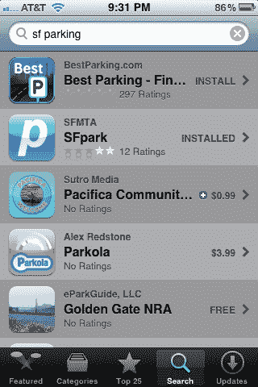
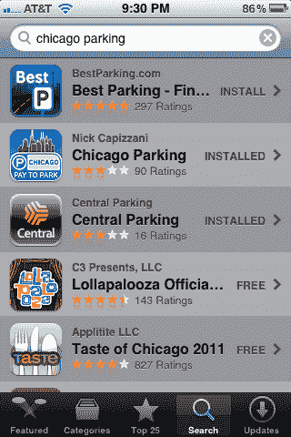

# 苹果在 App Store 搜索上啃咬？开发者看到搜索结果的转变 

> 原文：<https://web.archive.org/web/https://techcrunch.com/2012/06/23/apple-app-store-relevancy/>

苹果正在对 App Store 中的搜索算法进行潜在的重大改变，至少一些应用开发者是这样认为的。如果你是一个开发者或出版商，指望一个精心挑选的名字来帮助提高知名度，事情可能会变得更加困难。但是，如果你是一款受欢迎且广受好评的应用，情况可能会有所好转。

这可能是 App Store 搜索和发现整体改革的早期步骤，MG Siegler 在 2 月份宣布苹果收购了应用发现初创公司 Chomp T1 时就听说了这一消息。

基本上，看起来 App Store 搜索现在在其搜索结果中减少了应用名称和关键词的权重。以前，如果你在搜索类似“旧金山停车”的东西，名字中包含这些搜索词的应用会排名更高。或者，如果你搜索类似“交通”的东西，你会得到一堆游戏的名字，如交通高峰。现在，你更有可能看到不仅仅是简单的关键词匹配的应用。例如，在 traffic 中，你会看到更多实际的交通/导航应用——是的，也有一些游戏融入其中。

我们已经听到了关于为什么会这样的几种可能的解释。BestParking.com[、](https://web.archive.org/web/20221201163212/http://www.bestparking.com/)的创始人本·桑恩(Ben Sann)首先向我们透露了这一变化，因为他注意到，最佳停车应用突然跃居多项搜索的首位，包括“芝加哥停车”、“华盛顿停车”和“旧金山停车”，每次都排在与搜索词更接近的应用之前。桑恩的理论是:苹果现在更加重视应用程序下载，因此 BestParking 已经领先于那些名字更好(至少对于给定的搜索)但下载量更少的应用程序。如果 Sann 是正确的，这可能意味着那些针对不同搜索词开发本地化版本应用的开发者将会失败，而服务于多个地理区域的更通用的应用(如 BestParking)将会受益。

应用搜索和数据公司 [Xyologic](https://web.archive.org/web/20221201163212/http://www.xyologic.com/) 的联合创始人 matthus Krzykowski 有另一种解释。他表示，苹果将下载量纳入排名已经有一段时间了，他认为真正改变的是苹果在“话题检测”方面变得更好了。换句话说，现在当你键入一个搜索词时，它可以更好地推断出你在寻找什么，所以如果你键入“gas”这个词，你可能想要帮助你找到加油站或低油价的应用程序，而不是驱动标题中碰巧有 gas 这个词的游戏或应用程序(如屁应用程序)。他的团队还表示，搜索排名似乎也在关注受欢迎程度的其他指标，如评分和评论。

这个理论似乎得到了 [Chomp 对其技术](https://web.archive.org/web/20221201163212/http://chomp.com/us/about)的描述的支持:“Chomp 的专有算法学习应用程序的功能和主题，所以你可以根据应用程序做什么来搜索，而不仅仅是它们的名称。”换句话说，如果苹果在话题检测方面越来越好，Chomp 的技术可能发挥了作用。

这种变化似乎不会在每个国家都出现。很难对不同地区的苹果进行比较，因为他们有不同的应用程序和不同的语言，但我们的 Ingrid Lunden 表示，她在英国的应用程序商店搜索结果中看到了类似的变化。Krzykowski 还发来了在德国和波兰搜索“gas”或“benzin”(德语中 gas 的意思)的截图。他指出，在德国，结果包括更多的导航应用，而波兰的结果包括更多的随机游戏，这表明变化发生在德国，而不是波兰。

在其他类别中，变化似乎更加微妙。我与一位移动应用开发者交谈过，他说他的应用似乎在多个类别中排名更高，一些低质量的应用被从排名中删除，搜索结果现在与应用商店的排名更加匹配。然而，这种变化还不够剧烈，他无法确定。

我们已经联系了苹果公司，如果有回音，我们会及时更新。

