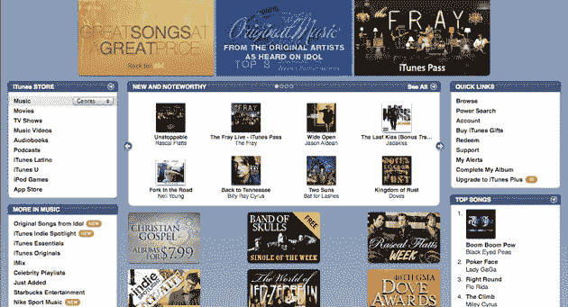

# 苹果开始在 iTunes 商店实行可变价格:一些歌曲现在每首 1.29 美元 

> 原文：<https://web.archive.org/web/https://techcrunch.com/2009/04/07/apple-begins-variable-pricing-on-itunes-store-some-songs-now-129-each/>

# 苹果开始在 iTunes 商店实行可变价格:一些歌曲现在每首 1.29 美元

你在购物中心听过 1000 遍的 Lady Gaga 歌曲《T2》(iTunes link)现在在 iTunes 上的价格是 1.29 美元。是的，苹果今天打开了可变定价的开关，这是唱片公司早就想要的东西。

概括一下:iTunes 商店现在有三个等级的音乐价格:底端 0.69 美元(老歌)；1.29 美元(当前单曲，流行音乐等。)在顶端；和 0.99 美元(几乎所有其他东西)。

iTunes 上的所有歌曲现在都是无数字版权管理的，你可能已经知道，这意味着你可以把文件放在任何可以播放 AAC 音频文件的设备上。过去几年发布的大多数手机应该可以毫无问题地播放它们。

没有真正的公式来计算什么歌曲什么价格。例如，酷玩乐队和其他乐队一样受欢迎，它仍然有歌曲【iTunes 链接】售价 0.99 美元。

请注意，[亚马逊](https://web.archive.org/web/20230122032447/http://www.amazon.com/MP3-Music-Download/b?ie=UTF8&node=163856011)仍然以神奇的 0.99 美元的价格出售所有歌曲。

不管合法与否，你们都是在线音乐消费的先锋。假设你喜欢现在售价 1.29 美元的音乐，新的定价结构会让你去别处寻找音乐吗？我只是偶尔从 iTunes 上购买音乐——上周在别处找不到之后，我买了一首克里斯·莱克的歌曲【iTunes 链接】——所以可以说，我在这场比赛中没有真正的筹码。