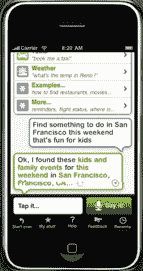

# 证实:苹果收购虚拟个人助理初创公司 Siri | TechCrunch

> 原文：<https://web.archive.org/web/https://techcrunch.com/2010/04/28/apple-buys-virtual-personal-assistant-startup-siri/>

# 证实:苹果收购虚拟个人助理初创公司 Siri

在苹果收购[芯片制造商 Intrinsity、](https://web.archive.org/web/20230321063918/https://techcrunch.com/2010/04/27/apple-intrinsity-a4-chip/)的报道之后，苹果似乎又进行了一次收购: [Siri](https://web.archive.org/web/20230321063918/http://siri.com/) ，iPhone 的个人助理。根据美国联邦贸易委员会发布的一份[合并前通知](https://web.archive.org/web/20230321063918/http://www.ftc.gov/bc/earlyterm/index.shtml)，以及由 Robert Scoble 最先注意到的[，该交易不会受到任何反垄断审查的阻碍。从苹果的角度来看，这笔交易可能很小。Siri 是一家小型创业公司，已经筹集了 2400 万美元的资金。Siri 董事会成员加里·摩根塔勒证实了这项交易。](https://web.archive.org/web/20230321063918/http://twitter.com/Scobleizer/status/13015365163)

Siri 为 iPhone 带来了一个对话界面，允许你要求它为你执行任务，例如在附近找到一家法国餐馆并预订一张桌子，查找电影列表，订购出租车，或者查找当地企业的电话号码和地址。你可以在这里阅读我们对这款应用[的完整评论。](https://web.archive.org/web/20230321063918/https://techcrunch.com/2010/02/04/siri-iphone-personal-assistant/)

正如我们过去所写的，Siri 结合了一系列令人印象深刻的技术，并将它们整合到 iPhone 上。这些包括自然语言处理和语义分析。这项基础技术是由 SRI 利用价值 2 亿美元的 Darpa 资助开发的。Siri 被剥离出来是为了将其商业化并带给消费者。它的最后一轮融资由香港亿万富翁李嘉诚(一个从未披露过的事实)牵头，李嘉诚也是脸书的投资者。

在某种程度上，Siri 是“所有混搭之母”。iPhone 应用程序是一个与 Siri 服务器在网络上的对话界面，它在发布时绑定了近 30 个不同的 API，更多 API 正在开发中。其中包括 OpenTable、TaxiMagic、MovieTikets.com、烂番茄、WeatherBug、Yahoo Local、Yahoo Boss、StubHub、Bing、Eventful Freebase、Citysearch、AllMenus.com、Gayot 和 Wolfram Alpha。

这项收购可能意味着两件事:苹果将把 Siri 作为未来 iPhones 和 iPads 的标准应用程序，或者它对底层的自然语言处理和语义搜索技术感兴趣，以便更广泛地整合到其应用程序中。第二种选择似乎更有可能。