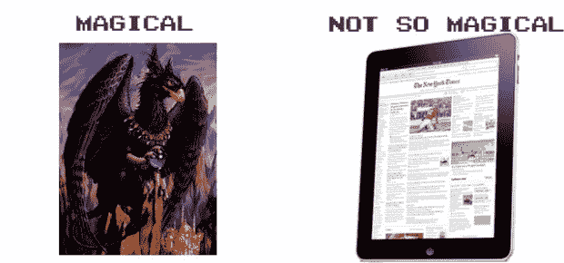

# 苹果:我们能不能不要再说“神奇”了？TechCrunch

> 原文：<https://web.archive.org/web/https://techcrunch.com/2010/05/03/apple-can-we-stop-with-the-magical-already/>

# 苹果:我们能不能不要再说“神奇”了？

纵观历史，有些东西可以称之为“神奇的和革命性的”产品。这些包括，但不限于，飞马，消毒牛奶，脊髓灰质炎疫苗，阿波罗 11 号，还有你在理发店把梳子放进去的蓝色东西。而且，尽管我很喜欢 [iPad](https://web.archive.org/web/20230206155735/http://crunchgear.com/tag/ipad) ，但我觉得苹果对“神奇”党路线的执着有点不真诚。

根据免费字典，神奇一词的定义是:

> 磁校准(mj-kl)
> 可调
> 1。魔法的、与魔法有关的或由魔法产生的。
> 2。妖娆；蛊惑:芭蕾舞的神奇表演。

根据这个定义，除了阿波罗 11 号的实际飞行(因为它可以被设定为轻快的古典乐曲，或者，除此之外，恩雅的作品)和/或飞马之外，以上列表中没有任何东西会被认为是神奇的。脊髓灰质炎疫苗和巴比妥酸盐是有用的，有些人会说是绝对必要的，但我确信，通过魔法的使用，邓布利多可以用魔杖轻轻一点就把它们取而代之。
 【YouTube http://www.youtube.com/watch?v=zGNryrsT7OI&HL = en _ US&fs = 1&

所以，苹果，我恳求你不要再称 iPad 神奇了。像共和党一样，苹果一直在所有提及产品的地方添加这个词，希望通过一遍又一遍地说，它会是这样的。也就是说，今天的公告让史蒂夫说:

> “需求继续超过供应，我们正在努力让这款神奇的产品进入更多顾客的手中。”

虽然前五十次还可以，但现在已经很烦人了。如果苹果公司向消费者运送 bugbear 的牙齿或袋子，也许他的说法是准确的。就目前情况来看，这有点夸张。毕竟，这是一个很好的石板，而不是一个包含魔法导弹符文的卷轴。

如果苹果公司被形容词难住了，我建议下面这些，在知识共享许可下可以免费使用。iPad 可以被描述为:

*   平的*   漂亮的*   无键盘*   乐趣*   没有湿狗的味道*   花式
    *   Slatish

    谢谢你的关注。

     
    iPad 描述作者[约翰·比格斯](https://web.archive.org/web/20230206155735/http://crunchgear.com/)获得[知识共享署名 3.0 美国许可证](https://web.archive.org/web/20230206155735/http://creativecommons.org/licenses/by/3.0/us/)的许可。

    狮鹫的形象(狮鹫？格里芬？)出自[奔驰走狗](https://web.archive.org/web/20230206155735/http://www.amazon.com/exec/obidos/ASIN/0886776430/)的《黑鹰头狮》(法师之战)

    更新了单词选择