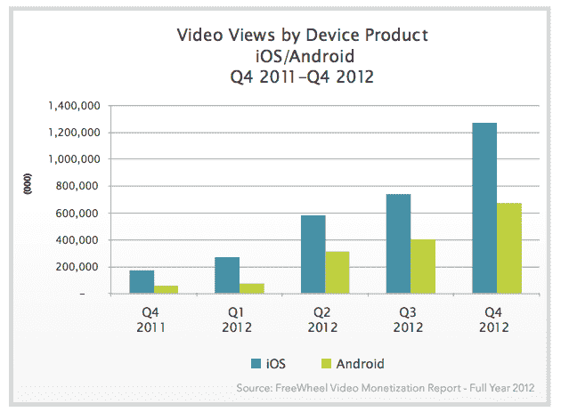

# 报告称，苹果继续主导移动视频观看，60%发生在 iOS 上，32%发生在 Android 上

> 原文：<https://web.archive.org/web/https://techcrunch.com/2013/02/12/apple-continues-to-dominate-mobile-video-viewing-with-60-occurring-on-ios-vs-32-on-android-report-says/>

# 报告称，苹果继续主导移动视频观看，60%发生在 iOS 上，32%发生在 Android 上

视频货币化公司 [FreeWheel](https://web.archive.org/web/20221006164502/http://www.freewheel.tv/theroundup/papers/reports/) 今天的一项新研究显示，移动视频市场从 2011 年的 2%增长到 2012 年在线视频观看总量的 12%。这是一个巨大的增长，而这一增长的主要受益者是苹果公司，其 iOS 移动操作系统在总移动视频观看量中的份额增长到 60%，相比之下，Android 占所有移动视频观看量的 32%。

就整体视频观看量而言，这两个平台都取得了可观的增长，仅在 2012 年第三季度和 2012 年第四季度之间，非 PC/Mac 设备上的在线视频观看量就增长了 30%。苹果的强劲领先是由于其在平板电脑市场的主导地位，FreeWheel 表示，Android 尚未出现一个真正能够削弱其整体份额的竞争对手。iPad 占 iOS 总份额的 24%，iPhone 占 30%，iPod touch 设备占剩余的 6%。FreeWheel 没有列出 Android 智能手机和平板电脑的流量，而是指出平板电脑的流量很小。

2012 年第三季度至第四季度，苹果大幅领先于安卓，这表明 iPhone 5 尤其对手机观看产生了巨大影响。苹果的增长还可能包括新 iPad mini 和 iPad 的流量峰值，尽管这些产品在 2012 年最后一个季度的大部分时间里供应有限，这意味着我们可能会在今年第一季度看到更多的份额增长，以反映 iPad 销售的持续强劲。

对于苹果来说，随着在平板电脑和智能手机上观看视频的趋势继续飙升，拥有移动视频观看的大部分份额意味着它对显示的内容和广告的类型有更大的影响力，这应该确保开发者首先为 iOS 量身定制这些体验，然后再为其他平台定制。这是苹果相对于其他竞争对手保持的另一个更微妙的平台优势，这通常很难量化，但会反映在用户体验中。

对谷歌来说，结果是显然有必要推出一款安卓平板电脑，从 iPad 那里赢得一些份额。虽然 Nexus 系列设备和 Kindle Fire HD 等最新硬件为改善 Android 平板电脑的体验做了很多工作，但从在线视频收视率来看，还没有什么能真正打破苹果在用户参与方面的垄断。