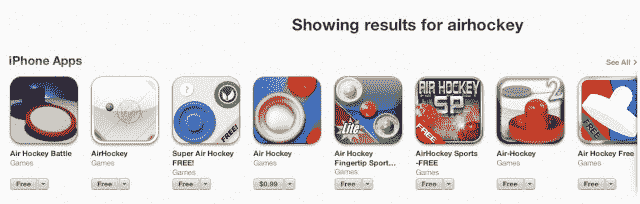

# 苹果在超级碗 TechCrunch 为开发者推出新的 AppStore.com 虚荣网址

> 原文：<https://web.archive.org/web/https://techcrunch.com/2013/02/03/apple-debuts-new-vanity-urls-for-app-store-developers-during-super-bowl-domain-name-land-grab-to-follow/>

看啊！苹果刚刚在超级碗期间发布了一款新产品。实际上，它是应用商店开发者的新产品——简短的“AppStore.com”虚荣心网址。该域名在新的《星际迷航》电影广告的结尾公开亮相，将观众引向 Appstore.com/StarTrekApp，而不是 Facebook.com/StarTrekMovie 或电影的主页，这种链接通常会在电视广告中占据首要位置。

CNET 是第一个发现这个广告的人，他指出“AppStore.com”域名是 2008 年 Salesforce 首席执行官马克·贝尼奥夫送给史蒂夫·乔布斯的个人礼物。

据[苹果开发者文档](https://web.archive.org/web/20221206153956/https://developer.apple.com/library/ios/#qa/qa1633/_index.html)称，开发者在向 iTunes App Store 或 Mac App Store 提交应用时，将会收到简短的 URL 名称，该文档于 1 月 31 日更新，提供了新 URL 的相关信息:

> 您还可以使用 App Store 短链接来创建易于阅读的应用链接，短链接使用 AppStore.com 基本 URL 加上应用或公司名称的特定形式。这为用户提供了一个简单的方法，让他们可以直接从你的网站或营销活动中找到你的应用。这些短链接非常适合用于平面广告、电视广告、应用程序预告片、广播广告和广告牌等离线通信材料。

苹果表示，域名也可以指向公司本身(例如 http://appstore.com/gameloft)或应用程序(例如 http://app store . com/where smyperry)。

这些新的虚荣心网址可能会很快成为拥挤的应用商店中的一块土地，现在仅在 iOS 应用商店中就有大约 80 万个移动应用程序。不过，苹果已经为这场竞争做好了准备。该公司表示，在名称冲突或其他错误的情况下，像 appstore.com/airhockey,这样有多个结果的网址会将用户导向一个搜索页面。开发人员被鼓励为他们的应用程序取一个独特的名字，以防止这个问题的发生。这可能就是《星际迷航》预告片指向“Star TrekApp”而不仅仅是“StarTrek”的原因(嗯，这也是因为所有的[营销实验](https://web.archive.org/web/20221206153956/http://www.prnewswire.com/news-releases/app-users-unlock-the-first-surprise-today----star-trek-into-darkness-will-open-in-theaters-two-days-early-at-800-pm-with-tickets-available-through-the-app-189591551.html)都发生在应用程序中。)

*注意:请参见下面的更新部分了解更多信息。*

【T2

目前，域名 www.appstore.com 将用户重定向到 Apple.com(在短暂的[复活节彩蛋](https://web.archive.org/web/20221206153956/http://www.reddit.com/r/apple/comments/17uabj/til_if_you_go_to_appstorecom_it_will_give_you_a/)之后！)，但没有“www”的 URL 会打开 iTunes 应用商店或 Mac 应用商店，具体取决于有问题的应用程序。以前，使用 itunes.com 网址可以获得短链接。在这种情况下，AppStore.com 将取代 itunes.com。

**更新:**在与几个应用商店开发者和苹果内部人士核实后，听起来新的虚荣心网址将*而不是*能够被配置成开发者希望他们阅读的任何内容，而是将由苹果代表开发者提供。这与 CNET 和我们最初对此事的报道相矛盾。这很令人困惑，因为目前开发者文档的阅读方式(例如，参见上面的摘录)。这篇文章已经更新，以反映这一信息。和往常一样，我们已经联系了苹果公司进行进一步的确认，如果有回音，我们会及时更新。

*形象荣登榜首，[CNET](https://web.archive.org/web/20221206153956/http://news.cnet.com/8301-13579_3-57567366-37/apples-appstore.com-makes-stealth-super-bowl-debut)；底部，[苹果](https://web.archive.org/web/20221206153956/http://www.apple.com/)*